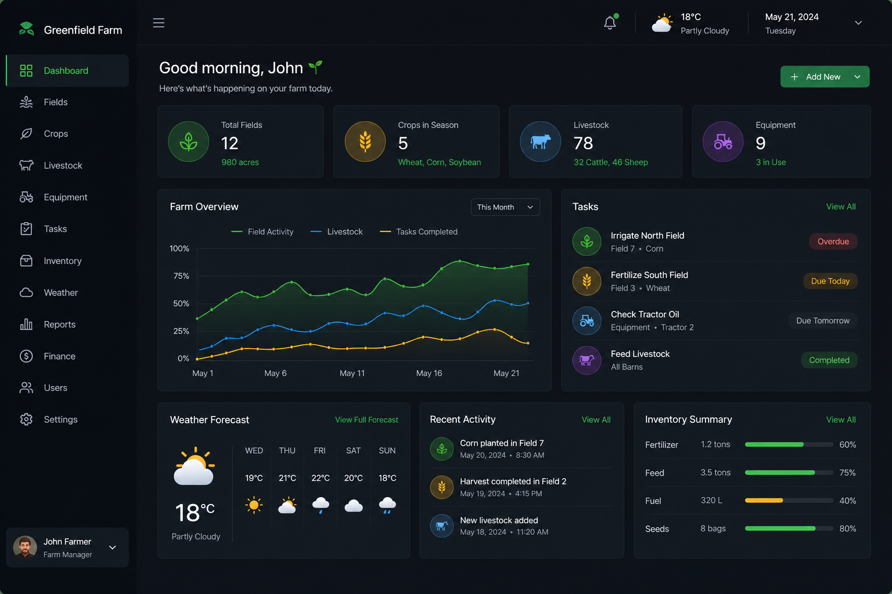
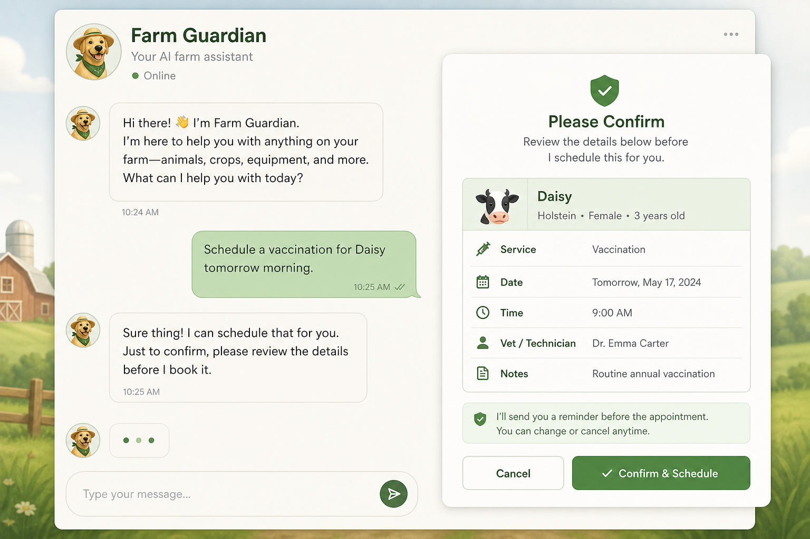
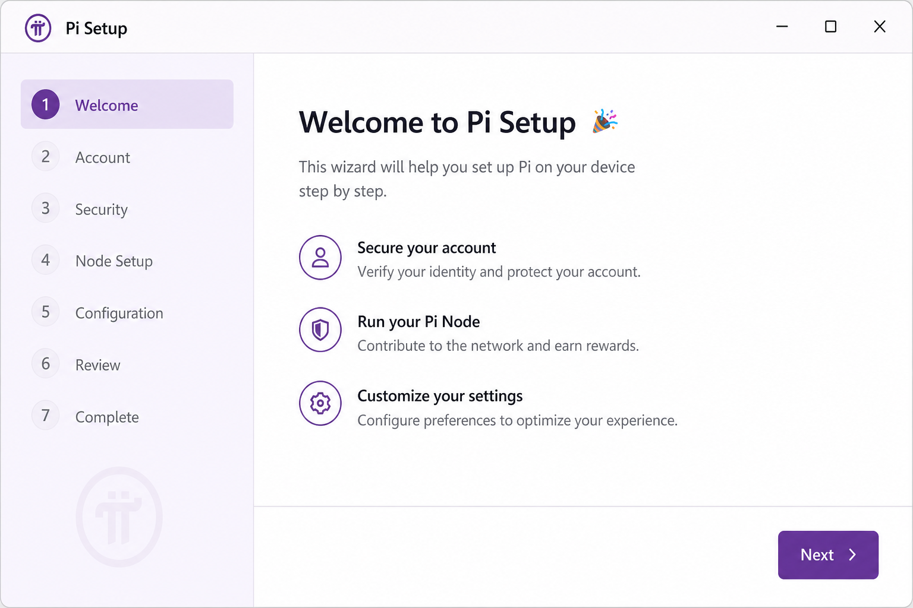
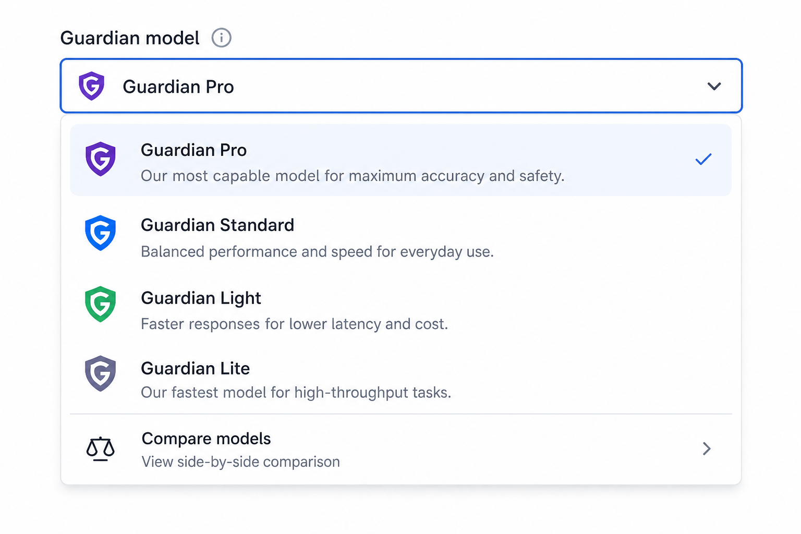

# gr33n 🌱

An open-source farm operating system — run it on your LAN, keep your data close, grow at your own pace.

[](https://www.gnu.org/licenses/agpl-3.0)
[](https://go.dev)
[](https://vuejs.org)
[](https://postgresql.org)

**Status:** Farmer UX (**40–67**), SPA workspaces (**68–81**), crop intelligence (**82–110**), Guardian model selection (**111–118**), hardening **113–115**, Virtual Pi wiring arc (**119–122**), Guardian eval (**122**), Today excellence (**173–177**), online weather (**178**), and the **2026-07 sit-in arc** — Guardian UX, Help Library, multi-turn PR smoke, task Refine chain (**179–187**) — are **shipped on `main`**. Docs refresh (**116**) and test depth (**117–118**) — see [phase index](docs/phase-14-operator-documentation.md).

**Start here:** [**What's in the box**](docs/current-state.md) · [First session after clone](docs/first-session-after-clone.md) · [Operator tour](docs/operator-tour.md) · [Upgrade guide](docs/upgrade-guide.md) · [CHANGELOG](CHANGELOG.md) · **Real grow?** [Guardian readiness](docs/guardian-real-grow-readiness.md) · **Offline/air-gap?** [Connectivity requirements](docs/connectivity-requirements.md)

---

## What You Can Do


🌡️ **Live Sensor Dashboards** — Temperature, humidity, light, EC, pH, CO₂, soil moisture. Real-time readings in your zones; historical graphs; automated alerts ("humidity above 75 %"). SSE live-stream stays current even offline.

📍 **Today — visual farm cockpit** — Open `/` to see your zones, operational pulse, and what needs attention first — not an AI launcher ([operator tour §7l](docs/operator-tour.md#7l-today-excellence-phases-173177--shipped)). Set **farm site coordinates** on Today or **Settings → Farm site**: paste from Google Maps (e.g. `40.8938° N, 81.4055° W`) — N/S/E/W set the sign automatically (west → negative longitude). Sunrise/sunset use those coords offline. Optional **live forecast** when `WEATHER_PROVIDER=openmeteo` and the farm opts in ([§7n](docs/operator-tour.md#7n-online-weather-forecast-phase-178--shipped)). In **Arrange** on the canvas, upload a layout background (JPEG/PNG/WebP, ≤8 MB).

🕹️ **Manual or Scheduled Control** — Turn fans, pumps, lights on/off manually via dashboard toggle, or set up cron-based schedules ("lights on 18:00, off 06:00"). Rules with thresholds ("if temp > 28°C, turn on exhaust fan"). All execution audited.

🧠 **Ask Farm Guardian** — Push-to-talk in the field (or type): *"Is my humidity high? What's this leaf discoloration?"* Guardian answers grounded on:
  - Your live farm snapshot (zones, current grows, unread alerts)  
  - ~46 crop profiles with EC/DLI/photoperiod targets  
  - Symptom catalog + field guides (if indexed)  
  - Citation chips open readable doc views in **Help → Library → Knowledge**; browse symptoms and guides without chat ([operator tour §7m](docs/operator-tour.md#7m-help-knowledge-surfaces-phase-180--shipped))  
  - **Symptoms for this crop** links from Plants and zone pages pre-filter the symptom guide ([Phase 183](docs/plans/phase_183_guardian_knowledge_and_revise_followups.plan.md))  
  - General agronomy reasoning from whichever local Ollama model you've selected (server default is a small, CPU-friendly model; swap in a larger one any time via the model picker below)  

⚡ **Guardian power states** — On solar, battery, or metered sites, control when the LLM uses RAM/CPU:
  - **Awaken now** / login warmup preloads the counsel model for morning checks  
  - **Rest now** (Settings) unloads the chat model between sessions — Guardian wakes on the next question  
  - **Auto-rest** after idle minutes (`GUARDIAN_AUTO_DORMANT_MINUTES` in `.env`)  
  - **Admin service stop** — `./scripts/guardian-power.sh sleep|wake` stops/starts the full Ollama process (not in the web API)  
  - **Readiness UI** — Settings card + chat awakening panel show state (`sleeping`, `stirring`, `ready`, `resting`, `unavailable`) with swappable hand-drawn druid art (`ui/public/assets/guardian/druid/`; placeholder SVGs ship until artists replace them)

✅ **Guardian Proposals** — Guardian suggests actions ("acknowledge this alert," "create a task," "start a flower run in Zone 3," "enqueue pump on for 30s"). You see a card, click **Confirm**, it executes. Nothing silent — all changes audit-logged. **Refine** sends corrections in the same session (title, zone, due date — [Phases 183–187](docs/current-state.md#sit-in-arc--guardian-ux--knowledge--task-revise-phases-179187--shipped)); multi-turn smoke: `make guardian-qa-change-requests-ui` ([Phase 184](docs/ci-guardian-qa.md)).

📱 **Offline-First Mobile** — Install as PWA in your browser. When wifi drops:
  - Dashboard still shows cached readings
  - Task creation queues locally  
  - Sensor readings and actuator commands buffer  
  - On reconnect, everything syncs automatically  

🧑‍🌾 **Easy Pi Setup** — **Phase 60 Pi Setup Wizard:** 6-step guided flow to wire a Relay HAT, assign pumps/fans to channels, test network, download config. **Virtual Pi** (`/virtual-pi`, Phases 119–123): graphical 40-pin board, interactive wiring, config export, drift detection, and **Notify Pi to reload** for platform-sync devices. See `http://localhost:5173/pi-setup-wizard`.

🤖 **Guardian model picker** — Choose and **pull** Ollama models in-app (Phases 111–112). No manual `ollama pull` on the server unless you prefer CLI.

💰 **Costs & Cycle Profitability** — Upload receipts (photos scanned for text), tag costs to crops. Export as CSV or GL ledger. Compare cycle-to-cycle costs/yield. See [Costs section](#costs-finance--receipts) in API docs.

🌾 **Natural Farming** — JADAM input batches (JMS, LAB, FPJ, FFJ, etc.), field application recipes with mixing ratios, batch tracking, farm notes. Starter inventory seeded from `master_seed.sql`.

🔐 **Role-Based Permissions** — Owner (full), Manager (ops + finance), Operator (field + Guardian actions), Viewer (read-only). Confirm gate prevents unauthorized writes.

🌐 **Data Commons** (Optional) — Opt-in to send coarse, pseudonymous aggregates to [Insert Commons](https://www.insercommons.org/) for collective learning. Your farm data never leaves your server without explicit approval.

| Feature | Offline? | Mobile? | Multi-user? | Automation? |
|---------|----------|---------|-------------|-------------|
| Sensors & alerts | ✅ (cached) | ✅ (PWA) | ✅ | ✅ (rules) |
| Guardian chat | ❌ (needs an LLM running — can be fully local, see below) | ✅ (browser voice) | ✅ (read-only) | ✅ (propose→confirm) |
| Guardian power (Rest / auto-rest) | ✅ (unload model; Ollama may stay running) | ✅ | ✅ (Operator+) | — |
| Tasks | ✅ (queued) | ✅ (PWA) | ✅ | — |
| Actuator control | ✅ (pending) | ✅ (PWA) | ✅ (RBAC) | ✅ (schedules) |
| Costs | ❌ | ✅ | ✅ | — |
| Crop cycles | ❌ | ✅ | ✅ | ✅ (stage auto-advance) |

"Offline" above means the **PWA queue** (works with wifi down but the API reachable later) — a different question from **needing the internet**. gr33n is local-first: sensors, alerts, tasks, actuator control, and Guardian chat against an already-installed model all run on your LAN with zero internet, including fully air-gapped. The only things that need the public internet are pulling a *new* Guardian model, the optional Data Commons opt-in, and software updates. Full breakdown: [connectivity-requirements.md](docs/connectivity-requirements.md).

After `git pull`, restart the API (`make dev-auth-test` or `make run-auth-test`) so new routes register. DB: `make migrate` on existing installs. See [upgrade guide](docs/upgrade-guide.md).

### Screenshots

| Dashboard (Today) | Farm Guardian + Confirm |
|-------------------|-------------------------|
|  |  |

| Pi setup wizard | Model selector |
|-----------------|----------------|
|  |  |

More walkthroughs: [operator tour](docs/operator-tour.md).

---

## What Is gr33n?

gr33n is a modular farm management system for homesteads, market gardens, and small commercial grows — whether you're on solar, a mesh network, or a rack in the barn.

Under the hood: PostgreSQL schemas, Go APIs, Vue dashboards, and Raspberry Pi edge clients.

The through-line is practical: **your farm data should stay with you** — inspectable, forkable, and runnable without a mandatory cloud account.

---

## Why gr33n Exists

Growers produce rich, useful records every day — sensor readings, feeding logs, crop notes, labor, recipes. Too often that work lives in software you cannot audit, on servers you do not control, under terms that can change without warning.

gr33n offers a different default:

- **Local-first** — core operation works on your network; internet is optional, not required.
- **Transparent** — AGPL source, documented schemas, no hidden check-in for day-to-day farm work.
- **Modular** — enable only the domains you need (crops, natural farming, animals, aquaponics, …).
- **Built for people who touch soil** — operators, tinkerers, and off-grid installs welcome.

### Product tiers

| Tier | What you get | Doc |
|------|----------------|-----|
| **Farmer** (default on `main`) | Single-farm grow, supplies batches, receipts, tasks, Pi edge, Guardian read tools | [operator tour](docs/operator-tour.md) |
| **Enterprise** (future — not shipping) | POs, METRC/traceability, multi-entity GL, WMS — explicitly **out of scope** for farmer UX | [enterprise-tier-boundary.md](docs/enterprise-tier-boundary.md) |

Phases **10–110** shipped on `main` (farmer UX, Guardian, SPA workspaces, crop catalog in Postgres). **Enterprise tier** (POs, traceability, multi-entity GL) is documented but not shipping — see [enterprise-tier-boundary.md](docs/enterprise-tier-boundary.md). Full phase ledger: [phase-14 operator index](docs/phase-14-operator-documentation.md). Accountant handoff today: cost **CSV export** only.

Two foundational milestones stay called out here because closure tests guard them:

- **Phase 45 — Farmer-ready v1** (shipped): farmer validation sit-in and whole-app polish. Dry-run results: [`docs/workstreams/sit-in-45-dry-run-log.md`](docs/workstreams/sit-in-45-dry-run-log.md); plan: [`docs/plans/phase_45_farmer_validation_whole_app_polish.plan.md`](docs/plans/phase_45_farmer_validation_whole_app_polish.plan.md).
- **Phase 46 — Guardian LLM tool proposals** (shipped, hybrid C): the LLM can open change-request cards behind the `GUARDIAN_LLM_PROPOSALS` flag. Plan: [`docs/plans/phase_46_guardian_llm_tool_proposals.plan.md`](docs/plans/phase_46_guardian_llm_tool_proposals.plan.md); guard: `ui/src/__tests__/phase-46-closure.test.js`.

### 🔌 What Does "Don't Call Home" Mean?

gr33n will never require a permanent internet connection, forced login, or hidden check-in with third-party servers. Whether you're on an island, a mountaintop, or a mesh-netted greenhouse, gr33n works where you live, without compromise.

### 🌿 Hooking up a real grow?

Demo seed ≠ your room. Before Guardian or automation touches live plants, read **[Guardian & real grows — readiness](docs/guardian-real-grow-readiness.md)** (Confirm gate, ingest checklist, 8B smokes → 70B, bench-first actuators). Guardian **writes** always go propose → **Confirm** — [change requests guide](docs/guardian-change-requests-guide.md).

### ⏰ Automation: Rules & Schedules

gr33n runs autonomous **schedules** and **rules** on a task worker. You define them once, they run forever (until you disable):

| Type | Example | Execution |
|------|---------|-----------|
| **Schedule** | "Turn lights on at 18:00, off at 06:00" | Runs daily; posts to `POST /schedules/{id}/actuator-events` at the specified time |
| **Rule** (threshold-based) | "If temp > 28°C, turn on exhaust fan" | Evaluated every poll (~1 min); triggers only once per state change (no spam) |
| **One-shot task** | "Water in 2 hours" (created manually) | Queued; executes once; task status updated to done |

All automation is **audited** (task worker logs every execution). You can pause/resume schedules and rules without deleting them. Actual GPIO execution happens on the Pi (`pi_client/gr33n_client.py` polls `GET /farms/:id/devices` for `pending_command` in device config, executes, and clears).

**Guardian integration:** Guardian can suggest pausing a rule ("Humidity is high; pause exhaust rule for now?") or creating a new schedule on the fly. You Confirm, it updates the automation, and schedules re-load automatically.

### 🌐 Offline-First: Work Anywhere

gr33n is designed for connectivity interruptions. Core workflows stay functional without internet:

| What | When Offline | When Back Online |
|-----|--------------|------------------|
| **Sensor readings** | Cached in-memory, shown on dashboard | Synced to Postgres; time-series rebuilt |
| **Tasks** | Create/status-update queued locally in SQLite (`offline_queue.db`) | Auto-synced; conflict resolution offered if edited elsewhere |
| **Actuator commands** | Queued locally on Pi as `pending_command` | Pi syncs, applies any new commands |
| **Guardian chat** | ❌ Unavailable (needs LLM / Ollama running) | Restored when Ollama is up; tap **Awaken now** in Settings |
| **Dashboard** | Shows last-known state + local queued actions | Real-time updates resume |

**PWA install:** Install gr33n from your browser (iOS/Android/desktop) — gives you offline persistence + icons + notification support. Queued writes are shown with a "⏳ pending sync" indicator until confirmed on the server.

**Phase 12 feature:** The offline queue is explicitly scoped to Tasks (create/status update). For sensors/actuators, the Pi client manages its own offline buffer (`pi_client/offline_queue.db` SQLite) and syncs on reconnect.

### 👥 Roles & Permissions (RBAC)

gr33n uses **farm-scoped roles**. Each user has one role per farm:

| Role | Permissions |
|------|-------------|
| **Owner** | Everything: settings, membership, costs, Guardian Confirm, farm deletion |
| **Manager** | Field ops, costs/finance, Guardian Confirm, Guardian read tools |
| **Operator** | Field ops (zones, sensors, actuators, tasks, schedules, automation), Guardian Confirm |
| **Viewer** | Read-only dashboards, Guardian chat (but NO Confirm capability — returns 403 when they try) |

**Guardian enforce:** Only Manager/Operator can Confirm proposals. Viewer can ask Guardian questions, but cannot click the Confirm button (disabled in UI + 403 on API if they bypass).

**Per-action caps:**  
- Viewing costs → anyone (Owner/Manager/Operator)  
- Exporting costs → Finance role (Owner/Manager)  
- Changing membership → Owner only  
- Changing farm settings → Owner/Manager  
- Creating/updating crop cycles → Operator+  
- Guardian Confirm → Operator+  

Exact checks live in `internal/farmauthz`. See [`docs/audit-events-operator-playbook.md`](docs/audit-events-operator-playbook.md) for audit trail details.

---

## Core Principles

- **Modularity** — Each ag domain (crops, animals, natural-farming inputs, IoT sensors) lives in its own schema. Use what you need, prune the rest. Enable modules per-farm via `gr33ncore.farm_active_modules`.

- **Connectivity Optional** — Works offline, intranet-only, or online. Supports Supabase or bare-metal Postgres with TimescaleDB/PostGIS.

- **Automation-Ready** — Schedule tasks, trigger actuators, run AI models — or run it all manually. Your tech, your tempo.

- **Insert Commons (farm-side sender)** — Per-farm opt-in in Settings; `POST /farms/{id}/insert-commons/sync` builds **coarse, pseudonymous aggregates** and optionally POSTs them to `INSERT_COMMONS_INGEST_URL` with optional `Authorization: Bearer <INSERT_COMMONS_SHARED_SECRET>`. Sync attempts are persisted (`GET /farms/{id}/insert-commons/sync-events`) with **idempotency keys**, **rate limits**, and **server-side backoff** after repeated delivery failures. A separate **farm audit trail** records sensitive actions (membership, opt-in, sync attempts, finance COA changes, cost exports, receipt access, and more) for owner/manager review via `GET /farms/{id}/audit-events` (see [`docs/audit-events-operator-playbook.md`](docs/audit-events-operator-playbook.md)). For self-hosted pilots, an optional **receiver** process (`cmd/insert-commons-receiver`, `make run-receiver`) validates payloads, enforces the shared secret, dedupes on payload hash, and stores rows in Postgres — see [`docs/insert-commons-receiver-playbook.md`](docs/insert-commons-receiver-playbook.md) and migration `db/migrations/20260417_phase13_insert_commons_receiver.sql`. Apply `db/migrations/20260415_phase11_rbac_receipts_commons.sql` and `db/migrations/20260416_phase12_insert_commons_federation.sql` on existing databases. **Custom clients** POSTing ingest JSON themselves must use the **exact** documented shape (only six top-level keys, complete `aggregates` children, boolean `includes_pii`) or validation returns **400** — see [`docs/insert-commons-pipeline-runbook.md`](docs/insert-commons-pipeline-runbook.md) (*Custom senders*).

---

## Tech Stack

| Layer | Technology |
|-------|-----------|
| API | Go 1.25 · `net/http` stdlib |
| Database | PostgreSQL 14+ · TimescaleDB · PostGIS |
| Query layer | sqlc (generated — do not edit `internal/db/`) |
| Frontend | Vue 3 · Vite · Pinia · Tailwind CSS |
| Pi client | Python 3 · RPi.GPIO / smbus2 |
| Auth | Supabase (hosted) / local peer auth (dev) |
| Schema | Multi-schema PostgreSQL — `gr33ncore` + `gr33nnaturalfarming` |

---

## Repository Layout

```
gr33n/
├── scripts/
│   ├── bootstrap-local.sh             # Schema, migrations, npm ci, .env from example
│   ├── setup-first-clone.sh           # First clone (+ optional --install-system-deps)
│   ├── install-system-deps-debian.sh # Debian/Ubuntu: sudo apt Postgres+Node (not Go)
│   └── install-pi-edge-deps.sh       # Raspberry Pi OS: sudo apt for pi_client (+ optional Docker)
├── cmd/api/
│   ├── main.go              # Entry point, DB pool, server startup
│   ├── routes.go            # All HTTP route registrations
│   └── cors.go              # CORS middleware
├── cmd/insert-commons-receiver/
│   └── main.go              # Optional pilot ingest service for Insert Commons (`POST /v1/ingest`, `GET /v1/stats`)
├── internal/
│   ├── db/                  # sqlc-generated query layer (DO NOT EDIT)
│   ├── handler/
│   │   ├── farm/            # GET /farms/:id
│   │   ├── zone/            # Zones CRUD
│   │   ├── sensor/          # Sensors CRUD + readings endpoints
│   │   ├── device/          # Devices CRUD + status toggle
│   │   └── task/            # Tasks list + status update
│   ├── httputil/            # WriteJSON / WriteError helpers
│   ├── insertcommonsreceiver/ # Optional Insert Commons ingest HTTP handler
│   └── platform/
│       └── commontypes/     # Shared enum types for sqlc
├── db/
│   ├── schema/
│   │   └── gr33n-schema-v2-FINAL.sql   # Full PostgreSQL schema (source of truth)
│   ├── seeds/
│   │   └── master_seed.sql             # Demo farm: natural-farming inventory + JADAM-style inputs (v1.005)
│   └── queries/             # sqlc SQL source files
├── ui/                      # Vue 3 frontend
│   └── src/
│       ├── views/           # Dashboard, Zones, Sensors, Actuators, Schedules, Inventory
│       ├── stores/farm.js   # Pinia store — all API state
│       ├── api/index.js     # Axios instance → localhost:8080
│       └── router/index.js  # Vue Router
├── pi_client/
│   ├── gr33n_client.py      # Sensor daemon — reads GPIO, POSTs readings to API
│   ├── config.yaml          # Per-node hardware mapping
│   ├── gr33n.service        # systemd unit for autostart
│   └── setup.sh             # One-time Pi bootstrap
├── sqlc.yaml
├── go.mod / go.sum
├── openapi.yaml             # Full API spec — browse at http://localhost:8080/openapi (dev) or see docs/api-quickstart.md
├── INSTALL.md
├── ARCHITECTURE.md
└── SECURITY.md
```

---

## Quick Start

**Start here:** [First session after clone](docs/first-session-after-clone.md) — ordered steps, verify checklist, common blockers (no fake “30 minute” promise).

**First time after `git clone`:** run **`./scripts/setup-first-clone.sh`** (or **`make first-clone`**) — it pulls Go deps, creates `.env` / `ui/.env` from examples, runs **`scripts/bootstrap-local.sh`** to load schema and `npm ci` in `ui/`. On **Debian/Ubuntu**, **`./scripts/setup-first-clone.sh --install-system-deps`** (`make first-clone-install-deps`) runs **`sudo apt`** first (Postgres 16 + extensions + Node 22; Go still from [go.dev/dl](https://go.dev/dl/)). Otherwise you must have Postgres with TimescaleDB, PostGIS, and pgvector available first (native), *or* use **`./scripts/setup-first-clone.sh --docker`** for the Compose database. Step-by-step: [docs/local-operator-bootstrap.md](docs/local-operator-bootstrap.md). How the database is actually defined (ignore stale ERDs): [docs/database-schema-overview.md](docs/database-schema-overview.md).

Full setup in [INSTALL.md](INSTALL.md). Short manual version:

```bash
# 1. Clone
git clone https://github.com/dgang0404/gr33n.git
cd gr33n

# 2. Create and migrate the database
sudo -u postgres psql -c "CREATE DATABASE gr33n;"
psql -d gr33n -f db/schema/gr33n-schema-v2-FINAL.sql

# 3. Seed demo data (natural farming + JADAM-style starter labels)
psql -d gr33n -f db/seeds/master_seed.sql

# 4. Run the API (from repo root)
cp .env.example .env   # once: edit .env with DATABASE_URL, JWT_SECRET, PI_API_KEY if using auth
# Or only: export DATABASE_URL="postgres://$(whoami)@/gr33n?host=/var/run/postgresql"
go run -tags dev ./cmd/api/

# 5. Run the frontend (separate terminal)
cd ui && npm install && npm run dev
```

API → `http://localhost:8080`
UI  → `http://localhost:5173`

### After a reboot (same machine, same Docker volume)

You do **not** need to re-clone or re-seed every time. From the repo root:

```bash
cd ~/gr33n-platform
make laptop-up   # DB + local Ollama + API + UI — one terminal after reboot
```

Same as `make restart-local-serve`. First cold `go run` after reboot can take several minutes — pre-build with `go build -tags dev -o ./bin/api ./cmd/api/` if you want faster restarts. `systemctl start ollama` alone works from any directory if you only need Ollama back.

Receipt storage defaults to local disk for development:

- `FILE_STORAGE_BACKEND=local`
- `FILE_STORAGE_DIR=./data/files`

Production deployments can switch receipts to S3-compatible object storage by setting:

- `FILE_STORAGE_BACKEND=s3`
- `S3_BUCKET=<bucket>`
- `S3_REGION=<region>`
- optional: `S3_ENDPOINT=<custom endpoint>` for MinIO / R2 / other S3-compatible providers
- optional: `S3_PREFIX=<key prefix>`
- optional: `S3_ACCESS_KEY_ID` and `S3_SECRET_ACCESS_KEY`
- optional: `S3_USE_PATH_STYLE=true`
- optional: `S3_DISABLE_HTTPS=true` for local/test endpoints only
- optional: `FILE_STORAGE_SIGNED_URL_TTL_SECONDS=300` for short-lived receipt download links

To backfill existing blobs from an old local `FILE_STORAGE_DIR` into the configured target backend before cutover:

```bash
# 1. Keep DATABASE_URL pointed at the live DB
# 2. Point the target backend env vars at the new storage location
# 3. Run a dry run first
go run ./cmd/filebackfill --source-dir /path/to/old/files --dry-run

# 4. Then copy all attachments (or only receipts)
go run ./cmd/filebackfill --source-dir /path/to/old/files
go run ./cmd/filebackfill --source-dir /path/to/old/files --file-type cost_receipt
```

The backfill preserves each attachment's existing `storage_path`, so DB rows do not change. After the copy is complete, switch the API to the new `FILE_STORAGE_BACKEND` and verify a few receipt downloads before removing the old local storage.

For backup, restore, and receipt storage cutover, see [docs/backup-restore-runbook.md](docs/backup-restore-runbook.md) (summary) and [docs/receipt-storage-cutover-runbook.md](docs/receipt-storage-cutover-runbook.md) (full cutover).

### PWA install + offline task writes

Phase 12 adds an offline write queue for the Tasks workflow (`create task` and `advance status`):

- when offline (or on retryable network failure), task writes are queued locally
- queued items are marked in the Tasks UI
- each queued item can be retried or discarded
- queued writes auto-sync on reconnect, and manual `Sync now` is available
- non-retryable server failures are shown as stale/conflict items for operator review

Install/offline notes:

- install the app from your browser for field use (PWA)
- keep one online sync checkpoint before long offline sessions
- after reconnect, verify queued writes drained before ending a shift

For **Play Store / App Store / MDM** distribution without replacing the PWA, use the optional Capacitor scaffold in `ui/` (`npm run build:cap`, `cap:sync`, platform add/open). See [`docs/mobile-distribution.md`](docs/mobile-distribution.md).

---

## API Endpoints

Base URL: `http://localhost:8080` — authoritative request/response schemas in [openapi.yaml](openapi.yaml). **Browse interactively:** `http://localhost:8080/openapi` on dev builds (`-tags dev`) or set `OPENAPI_UI=true`. Curl examples: [docs/api-quickstart.md](docs/api-quickstart.md).

### Public

| Method | Path | Description |
|--------|------|-------------|
| GET | `/health` | API + DB health check |
| POST | `/auth/login` | Authenticate & receive JWT |
| POST | `/auth/register` | Register a new account or set password for an **invited** user (existing email with no password yet) |
| GET | `/auth/mode` | Current auth mode (dev / production / auth_test) |
| GET | `/capabilities` | Feature flags — `{"ai_enabled": bool}`. Read by the UI at startup to gate Farm Guardian / Knowledge Ask-LLM. |

### Pi routes (API key)

Header: `X-API-Key: <PI_API_KEY>` (see env configuration for the API process).

| Method | Path | Description |
|--------|------|-------------|
| POST | `/sensors/:id/readings` | Pi posts a sensor reading |
| PATCH | `/devices/:id/status` | Pi heartbeat / status update |
| POST | `/actuators/:id/events` | Pi reports executed command |
| DELETE | `/devices/:id/pending-command` | Pi clears pending command after execution |

### Insert Commons receiver (optional separate process)

Farm API POSTs JSON to `INSERT_COMMONS_INGEST_URL`; this repo’s **pilot receiver** (`go run ./cmd/insert-commons-receiver/` or `make run-receiver`) listens on `INSERT_COMMONS_RECEIVER_LISTEN` (default **`:8765`**) and implements:

| Method | Path | Description |
|--------|------|-------------|
| GET | `/health` | Process liveness |
| GET | `/v1/stats` | Pilot aggregate counts (pseudonyms, daily ingests, retention) — same Bearer auth as ingest |
| POST | `/v1/ingest` | Validate payload, optional `Authorization: Bearer <INSERT_COMMONS_SHARED_SECRET>`, optional `Gr33n-Idempotency-Key` (forwarded from farm sync), persist idempotently |

Details, migration, and retention: [`docs/insert-commons-receiver-playbook.md`](docs/insert-commons-receiver-playbook.md). If you build or forward JSON manually, match the farm API’s ingest schema (no extra top-level fields; full `aggregates`; `privacy.includes_pii` as JSON boolean); `GET /farms/:id/insert-commons/preview` returns a valid example body — full rules in [`docs/insert-commons-pipeline-runbook.md`](docs/insert-commons-pipeline-runbook.md).

### Dashboard routes (JWT)

Header: `Authorization: Bearer <JWT>` (SSE also supports `?token=` on the stream URL where documented).

**Farm access:** most `/farms/:id/...` routes require the user to be the farm **owner** or a **member** (`gr33ncore.farm_memberships`). **Role caps** apply per area (for example *view* vs *edit* costs, *operate* for field workflows, *admin* for farm settings and membership). Exact checks live in `internal/farmauthz` and in [openapi.yaml](openapi.yaml) per route.

Integration tests under `cmd/api/` (`TestMain` in [`cmd/api/smoke_test.go`](cmd/api/smoke_test.go)) spin up an `httptest` server with **`AUTH_MODE=auth_test`** and a real JWT login flow. They need **Postgres** at **`DATABASE_URL`** (schema + migrations; **master seed** recommended). Env, CI behavior, and data-dependent skips: [`docs/local-operator-bootstrap.md`](docs/local-operator-bootstrap.md#api-integration-smoke-tests).

#### Auth, profile, units

| Method | Path | Description |
|--------|------|-------------|
| PATCH | `/auth/password` | Change password (must be logged in) |
| GET | `/profile` | Current user profile |
| PUT | `/profile` | Update current user profile |
| GET | `/units` | List all measurement units |

#### Farms

| Method | Path | Description |
|--------|------|-------------|
| GET | `/farms` | List farms; use `?user_id=<uuid>` to restrict to that user’s farms (recommended for UIs). If omitted, lists **all** farms — use only in trusted operator contexts. |
| POST | `/farms` | Create farm |
| GET | `/farms/:id` | Farm detail (member or owner) |
| PUT | `/farms/:id` | Update farm record (**admin**: owner or manager) |
| DELETE | `/farms/:id` | Soft-delete farm (**admin**) |
| POST | `/farms/:id/bootstrap-template` | Apply a starter template to an existing farm (**admin**; idempotent) |

#### Farm members (**admin**: owner or manager)

| Method | Path | Description |
|--------|------|-------------|
| GET | `/farms/:id/members` | List members and roles |
| POST | `/farms/:id/members` | Invite or add member (`email`, `role_in_farm`, optional `full_name`) |
| PATCH | `/farms/:id/members/:uid/role` | Change member role (`:uid` = user UUID) |
| DELETE | `/farms/:id/members/:uid` | Remove member from farm |

#### Insert Commons & audit

| Method | Path | Description |
|--------|------|-------------|
| PATCH | `/farms/:id/insert-commons/opt-in` | Toggle Insert Commons aggregate sharing (**admin**) |
| GET | `/farms/:id/insert-commons/preview` | Preview validated ingest JSON only — no sync, no history (**admin**) |
| POST | `/farms/:id/insert-commons/sync` | Build aggregates and POST to `INSERT_COMMONS_INGEST_URL` when set (**admin** or **finance**) |
| GET | `/farms/:id/insert-commons/sync-events` | Paginated sync attempt history (**admin** or **finance** / anyone with cost **view**) |
| GET | `/farms/:id/audit-events` | Sensitive-action audit log (**admin** only; query `limit`, `offset`) |

#### Zones

| Method | Path | Description |
|--------|------|-------------|
| GET | `/farms/:id/zones` | List zones for farm |
| GET | `/zones/:id` | Zone detail |
| POST | `/farms/:id/zones` | Create zone |
| PUT | `/zones/:id` | Update zone |
| DELETE | `/zones/:id` | Delete zone |

#### Devices & actuators

| Method | Path | Description |
|--------|------|-------------|
| GET | `/farms/:id/devices` | List devices |
| GET | `/devices/:id` | Device detail |
| POST | `/farms/:id/devices` | Create device |
| DELETE | `/devices/:id` | Delete device |
| GET | `/farms/:id/actuators` | List actuators for farm |
| PATCH | `/actuators/:id/state` | Update actuator state (dashboard) |
| GET | `/actuators/:id/events` | Actuator event history |

#### Sensors & live stream

| Method | Path | Description |
|--------|------|-------------|
| GET | `/farms/:id/sensors` | List sensors |
| GET | `/farms/:id/sensors/stream` | **SSE** live sensor readings (JWT may be passed as query `token`) |
| GET | `/sensors/:id` | Sensor detail |
| POST | `/farms/:id/sensors` | Create sensor |
| DELETE | `/sensors/:id` | Delete sensor |
| GET | `/sensors/:id/readings/latest` | Latest reading (JSON `null` when none yet) |
| GET | `/sensors/:id/readings` | List readings (`since`, `until`, `limit`, …) |
| GET | `/sensors/:id/readings/stats` | Aggregate stats for a time range |

#### Automation (schedules & runs)

| Method | Path | Description |
|--------|------|-------------|
| GET | `/farms/:id/schedules` | List schedules |
| PATCH | `/schedules/:id/active` | Toggle schedule active |
| GET | `/farms/:id/automation/runs` | List automation runs for farm |
| GET | `/schedules/:id/actuator-events` | Actuator events triggered by schedule |
| GET | `/automation/worker/health` | Automation worker health |

#### Tasks

| Method | Path | Description |
|--------|------|-------------|
| GET | `/farms/:id/tasks` | List tasks |
| POST | `/farms/:id/tasks` | Create task |
| PATCH | `/tasks/:id/status` | Update task status |

#### Fertigation

| Method | Path | Description |
|--------|------|-------------|
| GET | `/farms/:id/fertigation/reservoirs` | List reservoirs |
| POST | `/farms/:id/fertigation/reservoirs` | Create reservoir |
| PATCH | `/fertigation/reservoirs/:rid` | Update reservoir |
| DELETE | `/fertigation/reservoirs/:rid` | Delete reservoir |
| GET | `/farms/:id/fertigation/ec-targets` | List EC targets |
| POST | `/farms/:id/fertigation/ec-targets` | Create EC target |
| GET | `/farms/:id/fertigation/programs` | List programs |
| POST | `/farms/:id/fertigation/programs` | Create program |
| PATCH | `/fertigation/programs/:rid` | Update program |
| DELETE | `/fertigation/programs/:rid` | Delete program |
| GET | `/farms/:id/fertigation/events` | List fertigation events (`?crop_cycle_id=` optional) |
| POST | `/farms/:id/fertigation/events` | Create fertigation event (optional `crop_cycle_id`) |

#### Plants & crop knowledge (Phases 84–87, JWT)

Catalog data lives in **`gr33ncrops`** (seeded from [`data/crop_library.yaml`](data/crop_library.yaml) via migrations — not read from the YAML at runtime).

| Method | Path | Description |
|--------|------|-------------|
| GET | `/farms/{id}/crop-library/picker` | Grouped crop picker (~46 profiles with EC/DLI targets) for UI dropdowns |
| GET | `/farms/{id}/crop-profiles` | List effective crop profiles for the farm |
| GET | `/farms/{id}/crop-profiles/{crop_key}` | Profile + stage targets by crop key |
| GET | `/crop-profiles/{id}` | Profile detail by id |
| GET | `/farms/{id}/plants` | Farm plants (catalog-bound via `crop_key`) |
| POST | `/farms/{id}/plants` | Create plant from catalog |
| GET | `/plants/{id}` | Plant detail |
| PUT | `/plants/{id}` | Update plant |
| DELETE | `/plants/{id}` | Delete plant |

Runbook: [`crop-knowledge-operator-runbook.md`](docs/crop-knowledge-operator-runbook.md) · cutover: [`crop-catalog-db-cutover-runbook.md`](docs/crop-catalog-db-cutover-runbook.md)

#### Crop cycles

| Method | Path | Description |
|--------|------|-------------|
| GET | `/farms/:id/crop-cycles` | List crop cycles |
| POST | `/farms/:id/crop-cycles` | Create crop cycle |
| GET | `/crop-cycles/:id` | Get crop cycle |
| PUT | `/crop-cycles/:id` | Update crop cycle |
| DELETE | `/crop-cycles/:id` | Deactivate crop cycle |
| PATCH | `/crop-cycles/:id/stage` | Update growth stage |

#### Costs, finance & receipts

| Method | Path | Description |
|--------|------|-------------|
| GET | `/farms/:id/costs/summary` | Cost totals (income, expenses, net) |
| GET | `/farms/:id/costs` | List cost transactions (`limit`, `offset`, …) |
| GET | `/farms/:id/costs/export` | Download CSV (`format=csv` or `format=gl_csv`) |
| GET | `/farms/:id/finance/coa-mappings` | List COA mappings for GL export |
| PUT | `/farms/:id/finance/coa-mappings` | Save COA mapping overrides |
| DELETE | `/farms/:id/finance/coa-mappings` | Reset all COA overrides |
| DELETE | `/farms/:id/finance/coa-mappings/:category` | Reset one category override |
| POST | `/farms/:id/costs` | Create cost transaction |
| PUT | `/costs/:id` | Update cost transaction |
| DELETE | `/costs/:id` | Delete cost transaction |
| POST | `/farms/:id/cost-receipts` | Upload cost receipt (**multipart**: `file`, optional `cost_transaction_id`) |
| GET | `/file-attachments/:id/content` | Inline file bytes (cost receipt when linked) |
| GET | `/file-attachments/:id/download` | Presigned or proxied download URL JSON (backend-dependent) |

#### Alerts

| Method | Path | Description |
|--------|------|-------------|
| GET | `/farms/:id/alerts` | List alerts for farm |
| GET | `/farms/:id/alerts/unread-count` | Unread count |
| PATCH | `/alerts/:id/read` | Mark alert read |
| PATCH | `/alerts/:id/acknowledge` | Acknowledge alert |

#### Farm Guardian chat (Phase 27–30, JWT)

`AI_ENABLED=true` required; `LLM_BASE_URL` + `LLM_MODEL` required for the chat endpoint. `POST /v1/chat` returns **503** in Lite mode and **429** when rolling-window cost guards fire (`CHAT_COST_MAX_TOKENS_PER_USER` / `CHAT_COST_MAX_TOKENS_PER_FARM`).

| Method | Path | Description |
|--------|------|-------------|
| GET | `/v1/chat/health` | Guardian awakening readiness — model loaded, RAG corpus, `awakening.state`, auto-rest countdown (`?farm_id=`, `?mode=farm_counsel`). Settings card + chat panel poll this. |
| POST | `/guardian/warmup` | Preload counsel model (**Awaken now**). Body: `{"farm_id": N, "mode": "farm_counsel"}`. |
| POST | `/guardian/dormant` | Unload chat model (**Rest now**). Body: `{"farm_id": N, "mode": "farm_counsel"}`. |
| POST | `/v1/chat` | Send a message to Farm Guardian. Optional `farm_id` → RAG grounding + live snapshot. Optional `session_id` (UUID) for multi-turn context replay. Optional `context_ref` (alert / crop cycle / zone / route from **Ask Guardian**). Optional `setup_mode` or `?setup=1` for onboarding persona. Optional `attachment_ids` for zone photos (vision). Optional `"stream": true` for SSE streaming. Response includes `answer`, `grounded`, `citations`, `proposals[]`, `session_id`, `turn_index`, `prompt_tokens`, `completion_tokens`. |
| POST | `/v1/chat/confirm` | Execute a frozen change request (`{"proposal_id": "..."}`). Requires Operate role for write tools. |
| GET | `/v1/chat/proposals` | Pending change-request inbox (`?farm_id=`, `?status=pending`, pagination). Same queue as `/guardian/requests`. |
| GET | `/v1/chat/sessions` | List recent conversation sessions (up to 50, latest-first). |
| GET | `/v1/chat/sessions/:id` | Full ordered turn history for a session. |
| PATCH | `/v1/chat/sessions/:id` | Rename session (`{"title": "..."}`, empty string clears). |
| DELETE | `/v1/chat/sessions/:id` | Delete session and all its turns. |
| GET | `/v1/chat/usage` | Rolling-window token budget dashboard (per-user; optional `?farm_id=` for per-farm). Settings → **Guardian usage** card. |

#### Crop cycle analytics (Phase 28 WS1, JWT)

| Method | Path | Description |
|--------|------|-------------|
| GET | `/crop-cycles/:id/summary` | Per-cycle fertigation + cost + yield + stage history (JSON). |
| GET | `/crop-cycles/:id/summary.csv` | Same data, flat CSV row. |
| GET | `/farms/:id/crop-cycles/compare?ids=1,2,3` | Side-by-side compare (up to 5 cycles). |
| GET | `/farms/:id/crop-cycles/compare.csv` | Compare as CSV (one row per cycle). |

#### RAG — farm knowledge (Phase 24–25, JWT)

`pgvector` + embeddings required for search; `AI_ENABLED=true` + LLM configured required for answer synthesis.

| Method | Path | Description |
|--------|------|-------------|
| POST | `/farms/:id/rag/search` | Semantic nearest-neighbour search over farm knowledge chunks. |
| POST | `/farms/:id/rag/answer` | Retrieve top-K chunks then synthesise an LLM answer (Lite mode: 503 for synthesis; search still works). |

#### Natural farming — inputs & batches

| Method | Path | Description |
|--------|------|-------------|
| GET | `/farms/:id/naturalfarming/inputs` | List input definitions |
| POST | `/farms/:id/naturalfarming/inputs` | Create input definition |
| PUT | `/naturalfarming/inputs/:id` | Update input definition |
| DELETE | `/naturalfarming/inputs/:id` | Delete input definition |
| GET | `/farms/:id/naturalfarming/batches` | List input batches |
| POST | `/farms/:id/naturalfarming/batches` | Create input batch |
| PUT | `/naturalfarming/batches/:id` | Update input batch |
| DELETE | `/naturalfarming/batches/:id` | Delete input batch |

#### Natural farming — recipes & components

| Method | Path | Description |
|--------|------|-------------|
| GET | `/farms/:id/naturalfarming/recipes` | List application recipes |
| POST | `/farms/:id/naturalfarming/recipes` | Create recipe |
| GET | `/naturalfarming/recipes/:id` | Get recipe |
| PUT | `/naturalfarming/recipes/:id` | Update recipe |
| DELETE | `/naturalfarming/recipes/:id` | Delete recipe |
| GET | `/naturalfarming/recipes/:id/components` | List recipe components |
| POST | `/naturalfarming/recipes/:id/components` | Add component |
| DELETE | `/naturalfarming/recipes/:id/components/:iid` | Remove component (`:iid` = component row id) |

---

## Seed Data (v1.005)

The master seed loads a **demo farm** (`farm_id = 1`, **gr33n Demo Farm**) with natural-farming inventory and **JADAM**-style input names (JMS, JLF, …), photoperiod schedules, fertigation events, crop cycles, and automation — verified clean against the live schema:

| Table | Rows | Contents |
|-------|------|----------|
| `farms` | 1 | gr33n Demo Farm |
| `zones` | 3 | Veg Room, Flower Room, Outdoor Garden |
| `crop_cycles` | 3 | Veg canopy (18/6), Flower run (12/12), Outdoor raised beds |
| `sensors` | 10 | PAR, lux, temp, humidity, EC, pH, CO2, soil moisture |
| `input_definitions` | 15 | JMS, LAB, FPJ, FFJ, OHN, JHS, WCA, WCS, JWA, JS, JLF variants, compost tea |
| `application_recipes` | 14 | Soil drenches, foliar sprays, pest control, fungicide |
| `recipe_components` | 20 | Input-to-recipe links with dilution ratios |
| `schedules` | 14 | Light (24/0, 18/6, 16/8, 12/12) + watering programs per grow stage |
| `automation_rules` | 7 | Automated light on/off rules per grow stage |

Apply once: `make seed` or `psql -d gr33n -f db/seeds/master_seed.sql`.

**Farm Guardian needs a RAG corpus too.** The seed loads operational rows (zones, cycles, NF inputs, …) but **does not** pre-populate `gr33ncore.rag_embedding_chunks`. After seeding, run **`make rag-ingest-demo`** (or **`make dev-stack-fresh-rag`** for wipe + seed + ingest):

```bash
make rag-ingest-demo   # needs EMBEDDING_API_KEY in .env; skips cleanly if unset
# or one-shot fresh demo with embeddings:
make dev-stack-fresh-rag
```

See [`docs/farm-guardian-architecture.md`](docs/farm-guardian-architecture.md) for the three knowledge layers (Llama weights + RAG corpus + live snapshot).

**Smoke-test pollution:** Running `make test` against a long-lived dev DB accumulates junk rows. For a clean Guardian demo, use **`make dev-stack-fresh`** or **`make dev-stack-fresh-rag`**. For day-to-day migration updates on an existing DB, **`make dev-stack`** is idempotent.

---

## Make Commands

```bash
make help       # Show all targets
make bootstrap-local  # Guided DB + env + UI deps (see docs/local-operator-bootstrap.md)
make bootstrap-local-docker  # Same, but start stack with docker compose
make compose-db-up   # Postgres only — docker-compose db (Timescale + pgvector); pair .env DATABASE_URL with INSTALL.md §2 / .env.example
make dev-stack       # Idempotent: migrations + seed on existing DB (auto-skips schema)
make dev-stack-fresh # Wipe Compose volume + full bootstrap + seed (clean Guardian demo)
make dev-stack-fresh-rag  # Same + rag-ingest demo farm when EMBEDDING_API_KEY is set
make edge-smoke-help # Phase 31 WS1 — print laptop stub loop (pi_client → Live Sensors)
# Pi field checklist (Phase 31 WS2): docs/pi-integration-guide.md §8
make run-auth-test # API with AUTH_MODE=auth_test (JWT + PI_API_KEY; restart after git pull)
make rag-ingest-demo   # Index farm_id=1 only (skip message if no embedding key)
make rag-ingest-platform-docs  # Curated operator docs (tour, playbooks, phase guides) for Guardian RAG
make local-up        # dev-stack then API + UI (same as ./scripts/dev-stack.sh --serve)
make laptop-up       # Laptop one-liner: DB + local Ollama + API + UI (after reboot)
make restart-local   # After reboot: Compose db + wait + sanity report (no migrations)
make restart-local-serve  # same as laptop-up
# Admin Ollama service stop/start (solar sites): ./scripts/guardian-power.sh sleep|wake|status
make check-stack     # Verify DATABASE_URL + pgvector + optional API /health (see docs/local-operator-bootstrap.md)
make run        # Run the API server
make run-receiver # Run optional Insert Commons receiver (see docs/insert-commons-receiver-playbook.md)
make dev        # Run API + UI dev server in parallel
make ui         # Run the Vue dev server
make build      # Build the Go binary
make build-ui   # Build the Vue frontend for production
make test       # Run Go tests (-tags dev, ./...)
make lint       # Run go vet (-tags dev, ./...)
make audit-openapi  # OpenAPI ↔ cmd/api/routes.go shell diff + Go parity test in cmd/api/openapi_parity_test.go
make audit-env      # Environment variables ↔ docs/environment-variables.md
make sqlc       # Regenerate sqlc Go code from SQL queries
make seed       # Apply seed data to the database
make schema     # Apply the schema to the database
make up         # Start Docker Compose services
make down       # Stop Docker Compose services
make logs       # Tail Docker Compose logs
make clean      # Remove build artifacts
```

**Today setup after a fresh seed:** open `/`, use **Paste from Google Maps** under farm site coordinates, save, then run **`make rag-ingest-field-guides`** so Farm Guardian has crop field-guide memories. Restart the API after pulling (`make dev-auth-test` or `make local-up`) so file uploads and zone layout saves pick up the latest CORS/routes.

**Phase 23 / pre-merge gate (local):** `make test`, `make lint`, `make audit-openapi`, `make audit-env`, `python3 -m pytest pi_client/test_gr33n_client.py pi_client/test_mqtt_telemetry_bridge.py -q`, and `npm --prefix ui run build`. **`make test`** expects a reachable **`DATABASE_URL`** (see [bootstrap — smoke tests](docs/local-operator-bootstrap.md#api-integration-smoke-tests)) so `cmd/api` integration tests actually run.

**Contributing:** [CONTRIBUTING.md](CONTRIBUTING.md) · **Changes:** [CHANGELOG.md](CHANGELOG.md)

---

## Raspberry Pi Client

The Pi daemon runs four threads concurrently:

- **sensor-loop** — reads each GPIO/I2C sensor at its configured interval, POSTs to `POST /sensors/:id/readings`
- **heartbeat-loop** — PATCHes device status every 30s so the dashboard shows "online"
- **schedule-loop** — polls `GET /farms/:id/devices` for `pending_command` in device config JSONB, executes via GPIO, reports via `POST /actuators/:id/events`, then clears via `DELETE /devices/:id/pending-command`
- **flush-loop** — drains the offline SQLite queue when API becomes reachable

Configure sensors, actuators (with `device_id`), and GPIO pins in `pi_client/config.yaml`. Install as a systemd service with `pi_client/setup.sh` so it starts automatically on boot.

**Deployments:** Edge-only Pis vs running **Postgres + API + UI on the Pi**, and how setups scale to split DB/API/UI — see **[`docs/raspberry-pi-and-deployment-topology.md`](docs/raspberry-pi-and-deployment-topology.md)**. Minimal Pi OS apt packages before `setup.sh`: `./scripts/install-pi-edge-deps.sh` (`make install-pi-edge-deps`).

---

### MQTT telemetry bridge (microcontrollers)

MCUs can publish to an on-farm **MQTT broker**; a **bridge** process subscribes and forwards to **`POST /sensors/readings/batch`** using `X-API-Key` (same server `PI_API_KEY` as the Pi daemon). Reference implementation: [`pi_client/mqtt_telemetry_bridge.py`](pi_client/mqtt_telemetry_bridge.py). Topics, TLS, ACLs, and tasking: [`docs/mqtt-edge-operator-playbook.md`](docs/mqtt-edge-operator-playbook.md).

---

## 🔄 AI Augmentation with Consent

gr33n's AI layer runs **fully on your intranet** — no data leaves the LAN in Full mode. Knowledge is never sent to cloud APIs.

**Farm Guardian** (Phase 27+) is a conversational assistant powered by **Llama** (e.g. `llama3.1:8b` on a laptop or **70B Q4** on a GPU box) via [Ollama](https://ollama.ai). It layers three knowledge sources:

1. **Llama weights** — general agricultural, scientific, and world knowledge baked in during training.
2. **Your farm's RAG corpus** — anything you've ingested into `POST /farms/{id}/rag/ingest` (sensor notes, crop logs, manuals, etc.) retrieved at query time via pgvector similarity search.
3. **Live farm-state snapshot** — zones, active crop cycles, and unread alerts pulled from the DB at the start of every grounded turn so answers reflect _right now_, not a stale index.

The AI features are gated by `AI_ENABLED` (default on) and degrade gracefully: in **Lite mode** (no LLM configured) `POST /v1/chat` returns 503 and the "Ask (LLM)" button in the Knowledge UI is disabled with an explanation. In **Full mode**, Guardian is available from the **global slide-out drawer** on any page (sidebar, TopBar ✨, right-edge tab) and at `/chat`.

### Guardian Tool Registry (What Guardian Can Actually Do)

**Read-only tools** (Guardian looks things up for you):
- **Zone/plant/alert lookup** — List active zones, plants in cycle, unread alerts, crop profiles  
- **`summarize_zone_lighting`** — Active photoperiod schedules (18-6 veg, 12-12 flower, etc.) for a zone  
- **`summarize_zone_greenhouse_climate`** — Shade/vent/fan profiles, recent events, linked actuators  

**Write tools** (propose→confirm — you approve, nothing happens automatically):

| Action | Guardian suggests | You confirm | Result |
|--------|------------------|-------------|--------|
| Alert mgmt | Acknowledge humidity alarm | ✅ | Alert moved to acknowledged; audit log |
| Task creation | "Create task: Check dehumidifier drain" | ✅ | Task queued (syncs offline) |
| Crop setup | "Start OG Kush in Flower Room, 12-12 schedule" | ✅ | Plant + cycle + program created atomically (Phase 32) |
| Fertigation | "Increase EC target to 1.8 mS/cm" | ✅ | Program updated; next feed uses new target |
| Scheduling | "Pause the 18-6 light schedule" | ✅ | Schedule toggled; rule paused in audit log |
| Automation | "Bump exhaust rule threshold to 28°C" | ✅ | Rule updated; will trigger at new setpoint |
| Lighting | "Create 12-12 flower schedule for Flower Room" | ✅ | ON/OFF schedules created and linked (Phase 35) |
| Climate control | "Deploy greenhouse shade now" | ✅ | Actuator command queued to Pi `pending_command` (Phase 36) |
| Actuators | "Turn main pump on for 30 seconds" | ✅ | Relay command queued to Pi; executes when pi_client polls |

**Example workflow:**
```
9 AM — Operator in the field with phone
  Q: "Is this leaf discoloration a problem?"
  A: Guardian retrieves zone photo + crop profile (OG Kush, Day 32 flower)
     "I see possible early magnesium deficiency (purple stems at EC 1.8).
      Recommend foliar Mg sulfate or nutrient rebalance.
      [Confirm] to create a task for this."
     ✅ Operator: Confirms
     → Task created: "Apply Mg foliar or rebalance nutrients (photo attached)"
     → Logged in audit: guardian_tool_executed / create_task / operator_id
```

**What Guardian does today (Phase 27–67, 129, 163):** conversational Q&A grounded on your farm snapshot, optional **RAG** (farm rows + curated platform docs via `make rag-ingest-platform-docs`; **field guides** via `make rag-ingest-field-guides`), and **read tools** (zones, alerts, fertigation, lighting, greenhouse climate, plant lookup). **Awakening (129):** login triggers background model warmup; Settings **Farm Guardian readiness** shows loaded models, corpus counts, and **Awaken now**. **Power states (163):** **Rest now** and optional **auto-rest** unload the chat model between sessions; `./scripts/guardian-power.sh` stops the Ollama service for deeper savings on remote sites. **Offline field mode (37):** guided procedures (`start procedure …`), safety hard-stops, static print checklists, graceful degrade when Ollama is down — see [§6d](docs/operator-tour.md#6d-first-field-install-with-guardian-offline-phase-37). **Hands-free field (67):** push-to-talk mic + optional voice readback so you can ask questions while carrying water or pruning. **Writes** always use propose→**Confirm** — nothing hits the DB until you approve.

**Safety & governance:**
- ✅ **Audit logged** — every confirmed tool execution is recorded with user, timestamp, tool ID, arguments  
- ✅ **RBAC-gated** — Operator role required to Confirm; Viewer can chat but cannot execute  
- ✅ **Never autonomous** — Guardian proposes; you approve; nothing is silent  
- ✅ **Reversible** — Edit a proposal in-session before Confirm (Phase 34)  

Automation **rules/alerts** still run without chat — Guardian PRs are intentional, reviewed changes only. Architecture: [`docs/farm-guardian-architecture.md`](docs/farm-guardian-architecture.md). Operator walkthrough: [`docs/operator-tour.md`](docs/operator-tour.md) · [`docs/phase-14-operator-documentation.md`](docs/phase-14-operator-documentation.md).

All AI calls remain inside your farm's intranet:

```
Pi clients ──HTTPS──▶ Go API
                        ├──▶ Postgres + pgvector  (farm data + RAG corpus)
                        └──▶ Ollama  (local LLM, e.g. llama3.1:8b on laptop or 70B on GPU box)

Browser ──HTTPS──▶ Vue UI ──▶ Go API  (same as Pi)
```

See [`docs/farm-guardian-architecture.md`](docs/farm-guardian-architecture.md) for the request flow + three-knowledge-layer breakdown, [`docs/farm-guardian-ollama-setup.md`](docs/farm-guardian-ollama-setup.md) for install/setup, and [`INSTALL.md`](INSTALL.md) for all `AI_*` / `LLM_*` / `CHAT_*` env vars.

- AI is modular and never mandatory — `AI_ENABLED=false` produces a clean Lite deployment.
- No cloud calls, no training on your data, no opt-in required for basic operation.
- Cost guards (`CHAT_COST_MAX_TOKENS_PER_USER` / `_PER_FARM`) prevent runaway token usage on shared deployments.

---

## Roadmap & history

All numbered phases through **110** are **shipped**. The README no longer lists every phase row-by-row — use these indexes instead:

| Doc | Contents |
|-----|----------|
| [`docs/phase-14-operator-documentation.md`](docs/phase-14-operator-documentation.md) | Master operator index — phases 14–110, runbooks, closure links |
| [`docs/plans/phase_84_100_master_roadmap.plan.md`](docs/plans/phase_84_100_master_roadmap.plan.md) | Crop / intelligence arc (84–110) |
| [`docs/plans/phase_68_73_spa_workspace_roadmap.plan.md`](docs/plans/phase_68_73_spa_workspace_roadmap.plan.md) | SPA workspace arc (68–81) |
| [`docs/plans/farmer_ux_roadmap_40_plus.plan.md`](docs/plans/farmer_ux_roadmap_40_plus.plan.md) | Farmer UX arc (40–67) |
| [`docs/plans/product_backlog_operator_runtime.plan.md`](docs/plans/product_backlog_operator_runtime.plan.md) | Documented backlog (not phase-gated) |

**Local dev gates:** `make test` · `make lint` · `make audit-openapi` · `make check-ui-domain-parity` · UI `npm run build` — see [Make Commands](#make-commands).

---

## Contribute

- Fork this repo
- Join the insert-sharing network (coming soon in gr33n_inserts)
- Help build bridges between sensors, dashboards, and soil
- Translate docs, test offline installs, or write a better knf_notes parser

---

## Built for the Commons

The commons is shared knowledge, shared code, and shared resilience — the village well and the seed bank, carried into software.

gr33n is meant to stay **free to use, fork, and rebuild** under AGPL. If you run it as a service, modifications flow back to the community — that keeps the tool trustworthy for the people who depend on it.

---

## License

**GNU Affero General Public License v3.0 (AGPL-3.0)**

Use it. Fork it. Share it.
If you run it as a service — cloud, SaaS, or otherwise — you must release your modifications back to the community.

Built by farmers, hackers, and friends — for soil, sunlight, and tools that stay yours.
