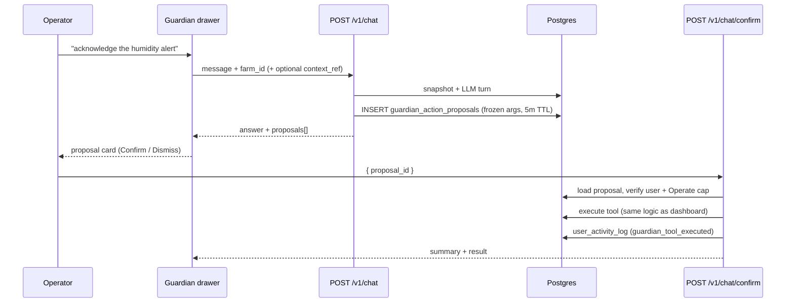

# Farm Guardian — Architecture & request flow

**Audience:** Developers, operators, and anyone curious about *how* Farm Guardian actually answers a chat message.

**Companion docs:**
- [`recommended-hardware-and-sizing.md`](recommended-hardware-and-sizing.md) — GPU/RAM profiles; when chat will feel laggy.
- [`farm-guardian-ollama-setup.md`](farm-guardian-ollama-setup.md) — operator install runbook for the inference host (Ollama).
- [`rag-scope-and-threat-model.md`](rag-scope-and-threat-model.md) — privacy & scope boundaries (what RAG indexes, what it doesn't).
- [`guardian-real-grow-readiness.md`](guardian-real-grow-readiness.md) — before live plants: ingest, Confirm, bench actuators, 8B smokes.
- [`plans/phase_27_farm_guardian_ai_layer.md`](plans/phase_27_farm_guardian_ai_layer.md) — the calendar plan that shipped the chat layer.
- [`plans/phase_29_guardian_agent_layer.md`](plans/phase_29_guardian_agent_layer.md) — confirmed agent actions (propose → confirm).
- [`plans/phase_30_guardian_change_requests.plan.md`](plans/phase_30_guardian_change_requests.plan.md) — PR queue (config tools, risk tiers, zone photos, actuator enqueue).
- [`plans/phase_32_guardian_grow_setup_prs.plan.md`](plans/phase_32_guardian_grow_setup_prs.plan.md) — grow setup PR bundle (plant + cycle + program).
- [`farm-guardian-persona-platform-context.md`](farm-guardian-persona-platform-context.md) — operator mirror of what Guardian is told about gr33n (WS9).
- [`audit-events-operator-playbook.md`](audit-events-operator-playbook.md) — `guardian_tool_executed` audit rows after Confirm.

---

## 1. The 30-second mental model

Farm Guardian is a conversational AI assistant that runs **entirely on your intranet**. It combines three knowledge sources on every grounded turn:

| Layer | Source | What it gives the model |
|-------|--------|-------------------------|
| **General agronomy** | Llama 3.1 70B Q4 training weights | "What does high humidity do to bud-rot risk?" type knowledge baked in. |
| **Platform operator docs** | `gr33ncore.rag_embedding_chunks` with `source_type=platform_doc` | How gr33n works — Guardian PR inbox, Pi setup, fertigation workflows, troubleshooting — from curated `docs/` markdown ingested via `./scripts/rag-ingest-platform-docs.sh`. |
| **Per-farm RAG corpus** | Same table — operational `source_type` rows (tasks, cycles, alerts, …) | Operator notes and farm DB text ingested via `rag-ingest` / demo script for THIS farm. |
| **Live farm-state snapshot** | DB query at request time (zones, active cycles, plants, programs, unread alerts) | "Right now" context — never stale, never indexed. |

The first layer is universal; platform docs and per-farm RAG are private indexed text; the snapshot reflects the database the moment the request fires. The handler combines them into a single system prompt before streaming to Ollama.

---

## 2. End-to-end request flow

What happens when an operator types **"how is my flower room cycle going?"** in the `/chat` UI:

```
1. UI (Vue: FarmGuardianChat.vue)
   ↓ POST /v1/chat { message, farm_id?, session_id?, stream: true }

2. internal/handler/chat (Go) — the orchestrator
   ├── Auth gate         JWT required (route wiring); farm-member if farm_id is set
   ├── Cost guard        Have you blown your token budget? → 429 with Retry-After
   ├── If farm_id set → grounded path:
   │   ├── Embed the question     (OpenAI-compat embedding model)
   │   ├── pgvector kNN search    (over farm_knowledge_chunks)
   │   ├── Build live snapshot    (zones / active cycles / unread alerts)
   │   ├── Read-tool enrichment   (Phase 31/33: list_unread_alerts, summarize_zone when intent matches)
   │   └── Compose prompt         persona + snapshot + RAG instructions
   ├── Else (no farm_id) → plain path: persona only
   ├── Replay prior turns         from conversation_turns (multi-turn context)
   └── Stream to LLM

3. internal/rag/llm (Go HTTP client → Ollama)
   ├── POST /v1/chat/completions  (OpenAI-compat, stream:true,
   │                               stream_options.include_usage:true)
   ├── Retry on transient errors  (HTTP 5xx, 429, 408, network errors)
   └── Parse SSE chunks → emit text deltas back to the handler

4. Back through the handler
   ├── Stream deltas to UI        as SSE events ("delta", "done")
   ├── On 'done':
   │   ├── Persist the turn       to conversation_turns (with prompt/completion tokens)
   │   ├── Rule-assisted proposals (Phase 29) when grounded + ack/read intent
   │   └── Update session         conversation_sessions.updated_at → sidebar reorder
   └── Log structured             slog "farm guardian chat streamed" with usage

**Phase 29 UI:** operators open Guardian from any page via the **slide-out drawer** (sidebar ✨, TopBar pill, or right-edge tab) — `/chat` remains the full-page view. **Ask Guardian** buttons on Alerts, crop-cycle summary, and zone cards prefill the drawer with contextual prompts.
```

No step in this flow touches the public internet in Full mode. The model lives on the intranet GPU box; the embeddings live in your local Postgres; the snapshot is a local DB query.

---

## 3. The three knowledge layers in detail

### 3.1 Layer 1 — General agronomy (the LLM weights)

Llama 3.1 70B Q4 was trained on the open internet, so it knows the basics of nutrient deficiency symptoms, EC ranges per stage, common pest patterns, IPM, and so on. This layer answers "**what does** high humidity do?" without ever looking at your farm.

You don't manage this layer — it's frozen in the model weights. To upgrade it, swap `LLM_MODEL` to a newer model.

### 3.2 Layer 2 — RAG corpus (platform docs + farm operational text)

All embeddings live in **`gr33ncore.rag_embedding_chunks`** (pgvector). When the chat request includes `farm_id`, the handler:

1. Sends the user's question to the **embedding model** (OpenAI-compat embeddings endpoint via `internal/rag/embed`).
2. Receives back a vector (typically 1536 floats).
3. Runs a pgvector **nearest-neighbour search** against chunks for that `farm_id`, pulling the top-K most semantically similar rows. Default `K = 8` (`farmguardian.RAGTopK`).
4. Injects those chunks into the prompt with citation markers `[1]`, `[2]`, etc.

#### 3.2.1 Platform operator docs (`platform_doc`)

**Phase 32 WS8** adds a curated manifest — [`docs/rag/platform-doc-manifest.yaml`](rag/platform-doc-manifest.yaml) — listing operator-facing markdown (architecture, operator tour, Pi guide, Guardian playbooks, …). Ingest:

```bash
./scripts/rag-ingest-platform-docs.sh          # farm_id=1 default
./scripts/rag-ingest-platform-docs.sh --dry-run
make rag-ingest-platform-docs
```

Chunks use `source_type=platform_doc` and metadata `module=platform_doc` + `doc_path`. Re-run is **idempotent** per doc path (delete + re-upsert chunks for that source). Guardian prefers these sources for **how-to / troubleshooting** when they appear in retrieval; the **live snapshot still wins** for "right now" sensor and row counts.

**Production note:** ingest platform docs once per farm (typical: demo farm **1** in dev; each production farm that uses Guardian, or a shared template farm — operator choice).

#### 3.2.2 Farm operational text (tasks, cycles, alerts, …)

Demo / cron ingest via [`scripts/rag-ingest-demo.sh`](../scripts/rag-ingest-demo.sh) indexes **operational DB rows** for a farm — cycle notes, tasks, schedules, alert text, etc. — not the static `docs/` tree.

This layer answers "**what did *I* note** about my last flower run?" It only contains content you've ingested via `go run ./cmd/rag-ingest …` or the demo script.

What ingest covers vs what it deliberately excludes is documented in [`rag-scope-and-threat-model.md` §9](rag-scope-and-threat-model.md). The short version: cycle notes, sensor narratives, recipe notes, alert resolutions — yes. Operational logs, raw sensor readings, user PII — no.

### 3.3 Layer 3 — Live farm-state snapshot

The RAG corpus is a point-in-time index — yesterday's notes may already be stale. To keep Guardian honest about "right now", every grounded turn pulls a fresh DB snapshot of:

- Total zone count + zone names (capped at 12 names to bound the prompt).
- Active crop cycles (capped at 8) with name, strain, current stage, started_at.
- Plant catalog summary — count + display names (capped) so setup proposals skip duplicates.
- Active fertigation program names per zone (capped) for grow-context questions.
- Count of unread alerts (so Guardian can say "you have 3 open alerts").

This is built by `internal/farmguardian/snapshot.go` → `BuildSnapshot()` → `PromptBlock()`. Failures here never block the chat turn (best-effort, logged at WARN).

A grounded turn's system prompt ends up structured like:

```
{persona}

═══════════ LIVE FARM STATE ═══════════
Zones: Flower Room, Veg Room, Outdoor
Active cycles: 1 (OG Kush — Run 3, late_flower, started 2026-03-01)
Unread alerts: 2
═══════════════════════════════════════

You are answering based on retrieved context. Cite chunks as [n].

[1] {chunk content}
[2] {chunk content}
...
```

The model sees persona → snapshot → RAG instructions in that order, then the conversation history, then the user's question.

---

## 4. The cost guard explained

The **cost guard** is a rolling-window cap on accumulated token usage that prevents runaway LLM compute. Configured via three env vars:

| Env var | Default | Purpose |
|---------|---------|---------|
| `CHAT_COST_WINDOW_HOURS` | `1` | Rolling-window length (clamp 1..168). |
| `CHAT_COST_MAX_TOKENS_PER_USER` | `0` (disabled) | Max tokens per user across all their sessions in the window. |
| `CHAT_COST_MAX_TOKENS_PER_FARM` | `0` (disabled) | Max tokens per farm across all users (only enforced on grounded turns with farm_id). |

**How it works on each `POST /v1/chat`:**

1. Auth resolves the `user_id` (and optional `farm_id` for grounded turns).
2. Cost guard runs **before** any LLM work — sums `prompt_tokens + completion_tokens` from `conversation_turns` where `created_at >= NOW() - window`.
3. If either dimension's total exceeds its cap, return **HTTP 429** with:
   - `Retry-After: <window_seconds>` header.
   - JSON body `{error, reason: "per_user"|"per_farm", used_tokens, max_tokens, window_seconds, retry_after_seconds}`.
4. Per-user dimension takes precedence over per-farm so a single runaway user can't hide behind a quiet farm.

**Key safety properties:**

- **Rejected requests cost zero tokens** — the guard runs before embedding, snapshot, or LLM calls.
- **Fails open on DB errors** — if the SUM query itself errors, the request proceeds (logged at WARN). A transient Postgres outage doesn't take chat offline.
- **Defaults are disabled** — a single-operator home farm doesn't need budget gates. Turn them on for shared / multi-tenant deployments where a buggy script could blow out compute.

**When to set caps:**

- Single farm, single operator → leave both at 0.
- Small team (3–10 staff sharing one Ollama box) → consider `CHAT_COST_MAX_TOKENS_PER_USER=20000` to catch scripted abuse.
- Multi-farm shared deployment → also set `CHAT_COST_MAX_TOKENS_PER_FARM` so one farm's runaway can't starve the others.

**Operator visibility (Phase 28 WS5):** `GET /v1/chat/usage` returns the caller's rolling-window totals + remaining budget; `?farm_id=N` adds per-farm totals (farm-member-gated). The **Settings → Guardian usage** card renders two-tier progress bars and shifts to amber at 80 %, red at 100 %. Crossing 80 % of the per-user cap fires a one-shot `chat_budget_warning` alert into `gr33ncore.alerts_notifications` (debounced once per window) so the warning surfaces through the existing alert channel without operators having to poll the usage endpoint.

The full table of token-related env vars (LLM timeouts, retry, chat history TTL, cost guards) lives in [`INSTALL.md`](../INSTALL.md).

---

## 5. Code map — what lives where

For the developer reader, here's the actual module layout:

### Backend (Go)

| Module / file | Role |
|---------------|------|
| `cmd/api/main.go` | Loads `ai.Config`, verifies LLM reachability on boot, spawns the prune loop goroutine. |
| `cmd/api/routes.go` | Registers `/v1/chat`, `/v1/chat/proposals`, `/v1/chat/confirm`, `/v1/chat/sessions[/{id}]`, zone photo routes, `/capabilities`, RAG endpoints. |
| `internal/ai/config.go` | Parses `AI_ENABLED`, runs the startup LLM reachability check. |
| `internal/handler/chat/handler.go` | The orchestrator — receives `POST /v1/chat`, runs every step in §2 above. |
| `internal/handler/chat/confirm.go` | `POST /v1/chat/confirm` — replays frozen proposals, RBAC, audit (Phase 29). |
| `internal/farmguardian/persona.go` | The system prompt that defines Guardian's voice + constraints. |
| `internal/farmguardian/snapshot.go` | Live farm-state snapshot builder (zones / cycles / alerts). |
| `internal/farmguardian/readtools.go` | Read-only tools (`list_unread_alerts`, `summarize_zone`, `list_plants`, `summarize_zone_fertigation`) — intent-matched prompt enrichment before LLM (Phase 31/32/33). |
| `internal/farmguardian/proposals_setup_pack.go` | Rule-assisted `apply_grow_setup_pack` intent matcher (Phase 32 WS4). |
| `internal/farmguardian/context_ref.go` | Contextual focus block from `context_ref` (Ask Guardian entry points, Phase 29 WS6). |
| `internal/farmguardian/proposals.go` | Rule-assisted proposal builder + `gr33ncore.guardian_action_proposals` insert. |
| `internal/farmguardian/proposals_config.go` | Rule-assisted config/task proposals (Phase 30 WS3). |
| `internal/farmguardian/platform_context.go` | Platform self-knowledge block appended to system prompt (WS9). |
| `internal/farmguardian/tools/` | In-process tool registry; all writes executed on Confirm. |
| `internal/handler/chat/proposals.go` | `GET /v1/chat/proposals` inbox API (WS1). |
| `internal/handler/fileattach/zone_photos.go` | Zone reference photo upload/list/delete (WS5). |
| `internal/farmguardian/cost_guard.go` | Rolling-window token cap → 429 decision. |
| `internal/farmguardian/prune.go` | Background goroutine that TTL-prunes old chat sessions. |
| `internal/rag/llm/chat.go` | HTTP client to Ollama (streaming SSE, retries, usage capture). |
| `internal/rag/llm/retry.go` | Transient-error classifier + exponential backoff with jitter. |
| `internal/rag/embed/` | OpenAI-compatible embedding client (vectorises the question). |
| `internal/rag/synthesis/` | RAG-grounded prompt builder (citations, system instructions). |
| `internal/db/conversation_turns.sql.go` | Hand-written sqlc bindings for chat history (per-turn insert + listing + pruning + cost sums). |

### Frontend (Vue 3 + Pinia)

| File | Role |
|------|------|
| `ui/src/views/FarmGuardianChat.vue` | Full-page `/chat` — session sidebar, multi-turn transcript, streaming. |
| `ui/src/components/GuardianDrawer.vue` | Global slide-out panel on every route (Phase 29 WS1). |
| `ui/src/components/GuardianChatPanel.vue` | Shared chat body (drawer + full page); proposal cards inline. |
| `ui/src/components/GuardianActionProposal.vue` | Confirm / Dismiss card; risk-tier warnings (Phase 30 WS2). |
| `ui/src/components/SetupPackProposalCard.vue` | Numbered bundle diff for `apply_grow_setup_pack` (Phase 32 WS5). |
| `ui/src/components/GuardianRequestsInbox.vue` | Pending PR list + `/guardian/requests` (WS1). |
| `ui/src/components/AskGuardianButton.vue` | Contextual entry points — Alerts, cycles, zones (Phase 29 WS6). |
| `ui/src/stores/guardianPanel.js` | Drawer open/close, prefilled prompts, `contextRef`, active session. |
| `ui/src/views/FarmKnowledge.vue` | The `/farm-knowledge` page — RAG search + Ask-LLM (synthesis). |
| `ui/src/stores/capabilities.js` | Loads `/capabilities` at app start; gates AI UI in Lite mode. |
| `ui/src/components/SideNav.vue` | "Guardian" + "Knowledge" entries under Monitor. |

### Database

| Table | Phase | What it stores |
|-------|-------|----------------|
| `gr33ncore.rag_embedding_chunks` | 24 | Per-chunk content + `embedding vector(1536)` for kNN (`platform_doc` + operational source types). |
| `gr33ncore.conversation_sessions` | 27 | Chat session metadata (title, owner, timestamps). |
| `gr33ncore.conversation_turns` | 27 | Each user/assistant exchange (messages, citations, token usage, grounded flag). |
| `gr33ncore.guardian_action_proposals` | 29 | Frozen propose→confirm payloads (tool, args, TTL, status, result). |

---

## 7. Agent actions (Phase 29) — propose → confirm

Phase 27–28 shipped Guardian as **read-only** Q&A. Phase 29 adds **confirmed writes** — Guardian never mutates farm state silently.

### 7.0 Live read tools (Phase 31 / 33 — Confirm N/A)

Before the LLM call on grounded turns, [`readtools.go`](../../internal/farmguardian/readtools.go) may inject a **Live read-tool results** block when the operator question matches:

| Tool | When it runs | What it adds |
|------|----------------|---------------|
| `list_unread_alerts` | List/show alert intent (not ack/read/count-only) | Up to 20 unread alerts with severity + age |
| `summarize_zone` | Humidity/temp/sensor/zone-status intent + resolved zone name | Latest sensor readings + active cycles for that zone |
| `list_plants` | List/show plant catalog intent | Up to 20 plant rows (display name, variety) |
| `summarize_zone_fertigation` | Fertigation/feeding/program intent + resolved zone | Active programs, EC/pH triggers, linked cycle hints for that zone |
| `summarize_farm_low_stock` | Low-stock / restock intent (not plant catalog) | Batches below threshold via `ListLowStockBatchesByFarm` — input name, remaining, threshold |
| `restock_priority` | “Restock first” / priority reorder intent | Same query, sorted by remaining/threshold ratio; footer points to Supplies UI |
| `summarize_cycle_cost` | Grow/room/cycle cost intent + resolved `crop_cycle_id` | `GetCostTotalsByCropCycle` — total spent, top categories, cost/gram when yield logged |
| `summarize_farm_spending` | Month/category spend intent | `GetCostCategoryTotalsByFarmForYear` for current calendar month |
| `summarize_active_grows` | “What’s growing” / active cycles intent | `ListCropCyclesByFarm` filtered `is_active`, zone names |
| `summarize_zone_lighting` | Light/photoperiod/18-6/12-12 intent + resolved zone (optional) | Active `lighting_programs`, ON/OFF hours, anchor times, linked schedule ids |
| `summarize_zone_greenhouse_climate` | Shade/deploy/greenhouse/vent/fan intent + `zone_id` | `greenhouse_climate` profile, linked actuator states, active `GH —` rules, recent shade/fan events (48 h) |

These are **not** proposal tools — no Confirm card. Alert **write** intents (`ack_alert`, `mark_alert_read`) and alert-list questions skip `summarize_zone` (Phase 33 WS1). Write tools remain in [§7.1](#71-operator-mental-model).

### 7.0b Grow environment stack (Phase 35 lighting)

Operators configure photoperiod through **`lighting_programs`** (UI: `/lighting`), not orphan schedule pairs:

| Layer | Operator-facing | Execution |
|-------|-----------------|-----------|
| **Lighting program** | Preset (18/6, 12/12, …) + PhotoperiodClockEditor | Generates paired ON/OFF `schedules` + `control_actuator` actions |
| **Worker** | Fires at local wall clock | Honors `schedules.timezone` (Phase 35 WS4) |
| **Actuator** | Grow light relay (`actuator_type=light`) | Existing `pending_command` / Pi path unchanged |

Guardian **`summarize_zone_lighting`** ([`tools/lighting.go`](../../internal/farmguardian/tools/lighting.go)) answers “what’s the light schedule?” without proposing changes. Optional **`create_lighting_program`** propose tool remains deferred — use Lighting UI or grow-setup PRs for writes.

**Legacy:** pre-Phase-35 farms may still have inactive **Light ON/OFF** orphan schedules; **`lighting_programs`** is the canonical model for new setup and bootstrap (see [operator-tour §5](operator-tour.md#5-set-up-186-vegetative-lights-phase-35)).

### 7.0c Grow environment stack (Phase 36 greenhouse climate)

Operators manage **blocking sun / heat / vents** separately from supplemental light:

| Layer | Operator-facing | Execution |
|-------|-----------------|-----------|
| **Zone profile** | `zone_type=greenhouse` + `meta_data.greenhouse_climate` (cover type, actuator refs, `automation_policy`) | Validated on zone PUT/POST |
| **Typed actuators** | `shade_screen`, `ridge_vent`, `exhaust_fan`, `circulation_fan` | `control_actuator` + existing `pending_command` / Pi path |
| **Rules** | High lux → deploy shade; high temp → fan; night retract (temp proxy or cron later) | Worker predicates; bootstrap + `POST .../rule-templates/greenhouse` |

Guardian **`summarize_zone_greenhouse_climate`** ([`tools/greenhouse.go`](../../internal/farmguardian/tools/greenhouse.go)) answers “is shade deployed?” / “what’s the GH profile?” without proposing changes. Manual motor control uses **`enqueue_actuator_command`** with `deploy` / `retract` / `open` / `close` / `stop` (Confirm tier) — same pending_command path as lights.

**Block sun ≠ add light:** on the same zone, use **lighting_programs** (Phase 35) for photoperiod and **greenhouse_climate** (Phase 36) for shade and ventilation. Operator walkthrough: [operator-tour §5b](operator-tour.md#5b-greenhouse-shade-vents-and-fans-phase-36). OpenAPI: `GreenhouseClimate`, `POST /farms/{id}/actuators`, `POST .../rule-templates/greenhouse`.

### 7.0d Plant-needs UI + pulse (Phase 38)

Operators navigate by **what the plant needs**, not by database table names:

| Need | Where in UI | Guardian guidance |
|------|-------------|-------------------|
| **Water & feeding** | **Zones → Water** tab; `/fertigation` for programs | Prefer **`summarize_zone_fertigation`** + zone Water tab over scattering Schedules/Sensors links |
| **Light** | **Zones → Light** tab; `/lighting` | **`summarize_zone_lighting`** for photoperiod |
| **Air & climate** | **Zones → Climate** tab (greenhouse profile inside when `zone_type=greenhouse`) | **`summarize_zone_greenhouse_climate`** for shade/fans; do not conflate with lighting |

Sidebar **Advanced** (Rules, Setpoints, Controls, Sensors) remains for power users and debugging.

**Timed pump pulse (shipped):** `POST /actuators/{id}/command` may include **`duration_seconds`** (pumps/relays) — Pi runs **on → wait → off**. Fertigation programs can pass **`run_duration_seconds`** on automated `on` when simulation is off.

**Not shipped (do not tell operators it works today):**

- **Device command queue (Phase 39)** — FIFO **`device_commands`** per device; **`mix_batch`** then **pulse** for fertigation programs. Legacy **`pending_command`** mirrors queue head one release.
- **Automated Pi mixing (Phase 39)** — cloud **`MixPlan`** + queue **`mix_batch`**; operators without hardware still log via **`POST …/mixing-events`**. Guardian should not promise mix until reservoir **base EC** is set.

When answering “how do I run my room?”, direct operators to **Zones → Water / Light / Climate** first, then Advanced pages. Operator walkthrough: [operator-tour §4a](operator-tour.md#4a-plant-needs-per-zone-phase-38).

### 7.0f Zone cockpit (Phase 40)

**Shipped.** Plan: [`plans/phase_40_unified_farmer_ux_zone_cockpit.plan.md`](plans/phase_40_unified_farmer_ux_zone_cockpit.plan.md). Operator walkthrough: [operator-tour §4b](operator-tour.md#4b-zone-cockpit-walkthrough-phase-40).

| Surface | Operator intent | Guardian behavior |
|---------|-----------------|-------------------|
| **Overview → Today strip** | “What matters in this room now?” | Cite next schedule, active rule count, unread zone alerts, queue depth, tasks due — from zone snapshot tools (`summarize_zone_*`) before farm-wide lists |
| **Comfort targets** (need tabs) | “Fix humidity band here” | Prefer **`patch_setpoint`** / inline comfort-target language; do **not** default to “open Setpoints page” on grow routes |
| **Zone alerts panel** | “Clear this room’s alert” | Ack/mark-read in zone; link farm-wide Alerts only for history |
| **What runs when** | “What automations apply here?” | Zone-filtered schedules + rules; Confirm paths for `patch_schedule` / `patch_rule` when operator asks in plain language |
| **Water grow story** | “When did we last feed? What’s queued?” | Use fertigation summary + queue depth; after Phase 39, reference **mix then pulse** order — not legacy `pending_command` only |
| **Ask gr33n starters** | Contextual one-tap questions | Starters are **zone + tab aware** (Overview / Water / Light / Climate); avoid generic “what’s my farm status?” on zone pages |
| **Power settings hint** | Escape hatch to Advanced | OK to link `/setpoints`, `/automation`, `/schedules` for expression editing — secondary to zone cockpit |

**Nav:** sidebar leads with **My rooms** and **Ask gr33n**; **Advanced** stays collapsed for power users ([`navGroups.js`](../ui/src/lib/navGroups.js)).

**Not in Phase 40:** replacing farm-wide Setpoints/Automation/Schedules CRUD; autonomous zone changes without Confirm; merging fertigation EC matrix into the zone card (zone shows **active** program story only).

### 7.0g Farm hub coherence (Phase 41)

**Shipped.** Plan: [`plans/phase_41_farm_hub_coherence.plan.md`](plans/phase_41_farm_hub_coherence.plan.md). Operator walkthrough: [operator-tour §3b](operator-tour.md#3b-farm-hub--morning-path-phase-41).

| Surface | Operator intent | Guardian behavior |
|---------|-----------------|-------------------|
| **Dashboard morning strip** | “What should I do first on the farm?” | Cite tasks due, unread alerts, next schedule, offline devices, queue depth before sending operators to six sidebar pages |
| **`?zone_id=` on farm routes** | “I came from Flower Room — keep that lens” | Honor zone filter on Tasks, Alerts, Schedules, Automation, Fertigation, Lighting; breadcrumb back to zone tab |
| **Why-empty hints** | “Why is this list blank?” | One sentence + action link (`no_data`, `no_telemetry`, `no_setpoint`, `automation_off`) — not apologetic boilerplate |
| **Fertigation hub** | “Details for this room’s water” | Zone banner + back to **Zones → Water**; events filtered; programs highlighted for zone |

**Not Phase 41:** merging fertigation tabs into one route; replacing Tasks Kanban; new notification types; enterprise multi-site dashboard.

When answering “what should I do first?”, prefer **Dashboard → Tasks → Alerts** over scattering links across Advanced nav.

### 7.0y Morning walkthrough (Phase 60 — shipped)

**Shipped.** One-tap Guardian daily check — aggregates unacknowledged alerts, today's feed schedules, offline Pis, comfort band breaches, and low stock into ranked `walk_farm` findings. Skips empty categories; all-clear farms get a positive summary.

| Layer | Artifact |
|-------|----------|
| Read tool | `walk_farm` in `readtools_walk.go` |
| Persona | `WalkFarmPersonaRule`; `guardian_mode: morning_walkthrough` on `context_ref` |
| Starters | Dashboard **Morning check** chip; `/chat` **Morning walkthrough** chip |
| Smart skip | No "Alerts: none" laundry list — only actionable findings |

**OC-60** via `phase-60-closure.test.js` · **Go smoke:** `TestPhase60_WalkFarmReadToolRegistered`.

Plan: [`plans/phase_60_guardian_morning_walkthrough.plan.md`](plans/phase_60_guardian_morning_walkthrough.plan.md).

### 7.0z Proactive nudges (Phase 61 — shipped)

**Shipped.** Rule-based shoulder-tap — at most one nudge per farm per page load, priority-ordered (critical alert → feed missed → comfort breach → Pi stale → low stock). Not push notifications; not LLM-generated until the operator taps **Review**.

| Layer | Artifact |
|-------|----------|
| API | `GET /farms/{id}/guardian-nudge` → `NudgePayload` or 204 (`nudge.go`, `handler/guardian`) |
| UI | Amber dot on ✨ edge tab + TopBar **Ask gr33n**; `GuardianNudgeStrip` above starters |
| Session | `snoozedNudgeCategories` in `guardianPanel` Pinia store — dismiss until reload |
| Context | `nudge_category` + `nudge_id` on `context_ref`; `NudgeContextBlock` skips pleasantries |

**OC-61** via `phase-61-closure.test.js` · **Go smoke:** `TestPhase61_GuardianNudgeEnginePresent`.

Plan: [`plans/phase_61_guardian_proactive_nudges.plan.md`](plans/phase_61_guardian_proactive_nudges.plan.md).

### 7.0aa Session memory (Phase 63 — shipped)

**Shipped.** Farm-scoped, operator-visible session summaries — not a silent profile. Closing a session (`POST /v1/chat/sessions/{id}/close`) stores a 2–3 sentence recap + topic tags in `session_summaries`. Tag overlap injects `[Prior session context]` into the system prompt on the next related turn.

| Layer | Artifact |
|-------|----------|
| Storage | `gr33ncore.session_summaries` — `session_id`, `farm_id`, `user_id`, `summary_text`, `topics[]` |
| Close | UI calls close when starting/switching sessions; LLM summary with keyword fallback |
| UI | Topic chips on session list; `GuardianRecentTopicChip` when route matches prior topics |
| Control | Delete session drops summary; Settings **Clear all memory** + **Export summaries** |

**OC-63** via `phase-63-closure.test.js` · **Go smoke:** `TestPhase63_SessionMemoryTopicsPresent`.

Plan: [`plans/phase_63_guardian_session_memory.plan.md`](plans/phase_63_guardian_session_memory.plan.md).

### 7.0ab Task consumptions & operator runtime (Phase 58 — shipped)

**Shipped (WS1–WS4).** Plan: [`plans/phase_58_task_consumptions_runtime.plan.md`](plans/phase_58_task_consumptions_runtime.plan.md).

| Surface | Operator job | Implementation |
|---------|--------------|----------------|
| **Task complete** | Optionally log batch drawdown when marking done | `TaskCompleteSheet.vue`, `POST /tasks/{id}/consumptions`, client qty validation |
| **Farm history** | See consumptions across tasks | `GET /farms/{id}/task-consumptions` |
| **Templates** | Refill / check-sensor / review-feed tasks from Supplies & Alerts | `taskTemplates.js` |
| **Runtime** | Do-next + overdue chips on dashboard / zone strip | `farmGrowSummary.js`, `zoneGrowSummary.js` |

Operator: [operator-tour §7c.1](operator-tour.md#7c1-task-consumptions--operator-runtime-phase-58--shipped).

**OC-58** via `phase-58-closure.test.js` · **Go smoke:** `TestPhase58_TaskConsumptionRouteRegistered`.

### 7.0ac Weather & site context (Phase 66 — shipped)

**Shipped (WS1–WS6).** Offline-first outdoor reality for Guardian and dashboard chips. Plan: [`plans/phase_66_weather_site_context.plan.md`](plans/phase_66_weather_site_context.plan.md).

| Tier | Source | Internet? | Data |
|------|--------|-----------|------|
| **1 — Solar math** | `location_gis` + date | **None** | Sunrise, sunset, daylength, clear-sky DLI |
| **2 — Local** | Manual entry / outdoor sensor | **LAN only** | Temp, RH, cloud cover |
| **3 — Forecast** | Optional provider (future flag) | Optional | Cached forecast; degrades to Tier 1+2 |

| API / tool | Role |
|------------|------|
| `PATCH /farms/{id}/site` | Set lat/long + `meta_data.elevation_m` |
| `GET /farms/{id}/site-weather` | Solar + latest `weather_data` row |
| `POST /farms/{id}/weather/manual` | Quick outdoor log |
| **`site_weather`** read tool | Guardian grounding; states which tier answered |

**Supplemental light:** `site_weather` compares clear-sky DLI (cloud-adjusted when readings exist) to crop profile DLI target from Phase 64.

Operator: [operator-tour §8a](operator-tour.md#8a-farm-site--daylight-phase-66--shipped).

**OC-66** via `phase-66-closure.test.js` · **Go smoke:** `TestPhase66_SiteWeatherRouteRegistered`.

### 7.0ad Hands-free field assistant (Phase 67 — shipped)

**Shipped (WS1–WS7).** Capstone — voice + vision in the grow room. Plan: [`plans/phase_67_guardian_field_assistant.plan.md`](plans/phase_67_guardian_field_assistant.plan.md).

| Surface | Operator job | Implementation |
|---------|--------------|----------------|
| **Push-to-talk** | Dictate with wet gloves | `GuardianChatPanel` mic → browser `SpeechRecognition` |
| **Read aloud** | Hands-free answers | Settings toggle → `SpeechSynthesis` |
| **Camera everywhere** | Leaf / canopy photos on `/chat` | Zone picker when context missing; `capture=environment` |
| **Crop-grounded vision** | Deficiency hypotheses tied to profile | `VisionContextBlock` + `FieldPhotoCropGroundingBlock` (Phase 64) |
| **Local STT** | Fully offline LAN farms | `POST /v1/chat/stt` → `STT_BASE_URL` (whisper.cpp) |

Operator: [operator-tour §6n](operator-tour.md#6n-hands-free-field-assistant-phase-67--shipped).

**OC-67** via `phase-67-closure.test.js` · **Go smoke:** `TestPhase67_FieldAssistantRoutesAndVision`.

### 7.0h Comfort targets & automation (Phase 42 — shipped)

Plans: [`plans/phase_42_comfort_targets_automation_plain_language.plan.md`](plans/phase_42_comfort_targets_automation_plain_language.plan.md) · Guardian PR slice: [`plans/phase_42_guardian_pr_spec.md`](plans/phase_42_guardian_pr_spec.md).

- **Grow → Targets & schedules** (`/comfort-targets`) — comfort bands, humanized schedules, one-line rules with toggles. **Advanced** keeps raw `/setpoints`, `/automation`, `/schedules` with `PowerUserBanner` escape hatch.
- **ComfortBandEditor** shared with zone Climate tab (too low / just right / too high).
- Guardian **conversation starters** on all three tabs (`buildComfortHubStarters`, `buildSchedulesFarmerStarters`, `buildRulesFarmerStarters`).
- **Rule-assisted matchers:** `matchComfortAutomationIntent` (patch_rule, lights schedule, EC) after `matchFeedingProgramIntent` and config matchers in `matchFreshProposal`.
- **Not Phase 46:** NL→PR when matchers miss remains [Phase 46](plans/phase_46_guardian_llm_tool_proposals.plan.md).

Operator walkthrough: [operator-tour §5c](operator-tour.md#5c-comfort-bands--what-runs-when-phase-42--shipped) · Guardian: [operator-tour §6e](operator-tour.md#6e-guardian-on-comfort--automation-phase-42--shipped).

### 7.0i Operations hub — supplies, feeding, money (Phase 43)

**Shipped (WS1–WS7).** Plans: [`plans/phase_43_operations_stock_feeding_finance.plan.md`](plans/phase_43_operations_stock_feeding_finance.plan.md) · Guardian PR slice: [`plans/phase_43_guardian_pr_spec.md`](plans/phase_43_guardian_pr_spec.md).

| Surface | Operator job | Implementation |
|---------|--------------|----------------|
| **Supplies** (`/operations/supplies`) | What is on hand / running low; log a mix | `SuppliesHub.vue`, `suppliesHub.js`; low-stock from batches API; banner + Dashboard chip |
| **Feeding (details)** (`/operations/feeding`) | Programs, tanks, EC targets (farm-wide admin) | `FeedingAdminHub.vue`, `feedingAdminHub.js`; `?zone_id=` filter; mixing → `/fertigation?tab=mixing` |
| **Money** (`/operations/money`) | Month spend; save receipt | `MoneyHub.vue`, `moneyHub.js`; full editor → `/costs` |
| **Advanced** | GL mapping, exports, six-tab fertigation | `/inventory`, `/costs`, `/fertigation` unchanged |

**Guardian (WS6 shipped; WS8 pending):**

- Persona + route `context_ref` prefer **Supplies / Feeding (details) / Money** — not Inventory / Fertigation / Costs ([`platform_context.go`](../internal/farmguardian/platform_context.go), [`context_ref.go`](../internal/farmguardian/context_ref.go)).
- **`create_task_from_alert`** for `inventory_low_stock` — refill task impact cites input name; no new stock write tools.
- **WS8 (shipped):** **`summarize_farm_low_stock`** read enrichment + hub **conversation starters** on Supplies / Feeding (details) / Money / Dashboard — spec §2–§3.
- Stock/cost **writes via chat** when matchers miss → [Phase 46](plans/phase_46_guardian_llm_tool_proposals.plan.md).

Operator walkthrough: [operator-tour §7](operator-tour.md#7-supplies-feeding--money-phase-43) · Guardian: [operator-tour §6f](operator-tour.md#6f-guardian-on-supplies--money-phase-43--shipped).

### 7.0j Getting started & edge wizards (Phase 44)

**Shipped (WS1–WS6).** Plans: [`plans/phase_44_getting_started_edge_wizard.plan.md`](plans/phase_44_getting_started_edge_wizard.plan.md) · Guardian: [`plans/phase_44_guardian_pr_spec.md`](plans/phase_44_guardian_pr_spec.md).

| Surface | Operator job | Implementation |
|---------|--------------|----------------|
| **Farm setup** (`/farms/{id}/setup`) | Blank vs template cards, preview, apply bootstrap | `FarmSetupWizard.vue`, `farmSetupWizard.js` → `POST /farms/{id}/bootstrap-template` |
| **Add grow room** (`/farms/{id}/zones/new`) | Name, type, greenhouse profile, lighting preset | `ZoneSetupWizard.vue`, `zoneSetupWizard.js` |
| **Edge device** (`/farms/{id}/devices/new`) | Register Pi, config snippet, poll online, actuators | `DeviceSetupWizard.vue`, `deviceSetupWizard.js`, `PI_FIELD_CHECKLIST` |
| **First-run checklist** (Dashboard) | Zone → device → comfort → schedule | `GettingStartedChecklist.vue`, `firstRunChecklist.js` |

**Guardian (WS4–WS8 shipped):**

- **Setup-mode persona** when `zone_count == 0`, `setup_mode` on `POST /v1/chat`, or `?setup=1` — [`setup_mode.go`](../internal/farmguardian/setup_mode.go).
- **Starters** on checklist, wizard footers, drawer, and **empty zone cockpit** (`empty_zone_grow`) — `buildSetupStarters` in [`guardianStarters.js`](../ui/src/lib/guardianStarters.js); wizards own writes, not chips.
- **`apply_grow_setup_pack`** — rule-assisted Confirm unchanged (Phase 32); grow-setup starter sends matcher-friendly phrase.
- **`apply_bootstrap_template`** — wizard `POST` only (admin RBAC); not promoted in starter chips.
- Route `context_ref` hints for setup wizard paths — [`context_ref.go`](../internal/farmguardian/context_ref.go).

Operator: [operator-tour §8](operator-tour.md#8-getting-started--edge-install-phase-44--shipped) · Guardian: [§6g](operator-tour.md#6g-guardian-during-setup-phase-44--shipped).

### 7.0k Farmer sit-in & PR validation (Phase 45 — shipped)

**Shipped:** sit-in protocol; **Vocabulary v2**; module shells; Guardian a11y; PWA mobile path; WS2/WS8 dry-run ([`sit-in-45-dry-run-log.md`](workstreams/sit-in-45-dry-run-log.md)); **OC-45** via `phase-45-closure.test.js`.

Plans: [`plans/phase_45_farmer_validation_whole_app_polish.plan.md`](plans/phase_45_farmer_validation_whole_app_polish.plan.md) · Guardian: [`plans/phase_45_guardian_pr_spec.md`](plans/phase_45_guardian_pr_spec.md) · Protocol: [`workstreams/farmer-sit-in-protocol.md`](workstreams/farmer-sit-in-protocol.md) · Dry-run: [`workstreams/sit-in-45-dry-run-log.md`](workstreams/sit-in-45-dry-run-log.md).

- **`ack_alert`**, **`apply_grow_setup_pack`**, and **Dismiss** validated (Vitest + Go matchers + facilitator dry-run).
- Matcher misses: none in dry-run; file Phase 46 backlog if external sit-in finds gaps.

Operator: [operator-tour §9](operator-tour.md#9-farmer-validation-sit-in-phase-45--shipped) · modules [§10a](operator-tour.md#10a-livestock-modules-phase-45-ws5--shipped) · a11y [§10b](operator-tour.md#10b-light-accessibility-phase-45-ws6--shipped) · mobile [§10c](operator-tour.md#10c-mobile-distribution-phase-45-ws4--shipped).

### 7.0l LLM tool proposals (Phase 46 — shipped)

**Shipped:** `proposals_llm.go` + `proposals_llm_validate.go` + `proposals_observability.go` + chat `attachProposals` + safety smokes — feature flag (`GUARDIAN_LLM_PROPOSALS`), write-intent gate, allowlist, per-tool schema, farm ID binding, structured `slog` metrics, handler hook after LLM turn; **OC-46** via `phase-46-closure.test.js`.

Plan: [`plans/phase_46_guardian_llm_tool_proposals.plan.md`](plans/phase_46_guardian_llm_tool_proposals.plan.md) · Operator guide: [`guardian-change-requests-guide.md` §3.3](guardian-change-requests-guide.md#33-when-the-llm-opens-a-card-phase-46--shipped).

- **Hybrid C:** matchers first (`BuildRuleAssistedProposals`); on miss + write intent + Operate + flag, `TryBuildLLMProposalsFromAssistant` parses assistant JSON and inserts validated proposal (`confirm.go` → SSE `proposals[]`).
- Same Confirm / frozen args / audit — `meta.llm_sourced` on proposal row; high-tier impact lines unchanged.
- Setup pack and bootstrap **excluded** from LLM allowlist v1.

Operator: [operator-tour §6h](operator-tour.md#6h-when-guardian-opens-a-card-from-your-words-phase-46--shipped).

### 7.0n Dev seed profiles (Phase 48 — shipped)

**Shipped:** `docs/dev-farm-profiles.md` — `small_indoor` vs `demo_showcase` profiles on `farms.meta_data.dev_seed_profile`; idempotent `master_seed.sql`; `scripts/dev-reset-farm.sh`; extended `db-sanity-report`; optional Timescale retention (`apply-dev-retention.sh`). **OC-48** via `phase-48-closure.test.js`.

Plan: [`plans/phase_48_dev_seed_and_small_farm_profiles.plan.md`](plans/phase_48_dev_seed_and_small_farm_profiles.plan.md) · Bootstrap: [`local-operator-bootstrap.md`](local-operator-bootstrap.md#slow-ui-and-dev-db-hygiene).

### 7.0o Hardware wiring visibility (Phase 50 — shipped)

**Shipped.** Structured Pi wiring metadata in `sensors.config.wiring` / `actuators.config.wiring`; read + PATCH API; UI badges on **Sensors** and **Controls**; **Hardware wiring** editor on sensor detail; relay HAT channel assignment via `hardware_identifier`; **`GET /devices/{id}/pi-config`** generator in the edge device wizard.

| Layer | Artifact |
|-------|----------|
| Model + validation | `internal/hardware/wiring.go`, `conflict.go`, `piconfig.go` |
| API | `PATCH /sensors\|actuators/{id}/wiring`, `PATCH /actuators/{id}/assign`, `GET /devices/{id}/pi-config` |
| UI | `HardwareWiringBadge.vue`, `HardwareWiringPanel.vue`, `ActuatorWiringPanel.vue`, `hardwareWiring.js` |
| Hygiene | `db-sanity-report` GPIO/I2C conflict exit; demo backfill migration |
| Docs | [`pi-integration-guide.md`](pi-integration-guide.md) §2a DB-first path |

**OC-50** via `phase-50-closure.test.js`. Plan: [`plans/phase_50_hardware_wiring_visibility.plan.md`](plans/phase_50_hardware_wiring_visibility.plan.md).

### 7.0p Pi config platform sync (Phase 51 — shipped)

**Shipped.** Closes the loop between dashboard wiring edits and Pi runtime — no SSH to change GPIO after initial bootstrap.

```
Operator (UI)                    Platform (API)                 Pi (gr33n_client.py)
     │                                │                                │
     │ PATCH sensors/{id}/wiring      │                                │
     ├───────────────────────────────►│ devices.config_version++       │
     │                                │                                │
     │                                │◄──── GET …/config/version ─────┤ schedule loop (~30s)
     │                                │──── config_version ───────────►│
     │                                │◄──── GET …/config (on change) ─┤
     │                                │──── sensors[], actuators[] ───►│ hot-reload readers
     │                                │◄──── PATCH status + last_fetch ┤ staleness badge
```

| Layer | Artifact |
|-------|----------|
| API | `GET /devices/by-uid/{uid}/config`, `/config/version`; `config_version` column + triggers |
| Pi client | `load_bootstrap`, `fetch_remote_config`, `~/.gr33n/config-cache.json`, `_reload_config` |
| Migration | `import_config_to_platform.py` — JWT import from legacy YAML |
| UI | `deviceConfigSync.js`, **Config synced / stale** on `ActuatorCard` |
| Docs | [`pi-integration-guide.md`](pi-integration-guide.md) §2 platform sync, §2b legacy opt-out |

**OC-51** via `phase-51-closure.test.js`. Plan: [`plans/phase_51_pi_config_sync.plan.md`](plans/phase_51_pi_config_sync.plan.md).

### 7.0q Grow + stock + money closure (Phase 53 — shipped)

**Shipped (WS1–WS6).** No new migrations — UI wiring on existing crop cycle, NF batch, and cost APIs. Plan: [`plans/phase_53_grow_stock_money_closure.plan.md`](plans/phase_53_grow_stock_money_closure.plan.md).

| Surface | Operator job | Implementation |
|---------|--------------|----------------|
| **Zone Overview** | What's growing; start / harvest | `ZoneCurrentGrowStrip.vue`, `StartGrowWizard.vue`, `HarvestWeighIn.vue`, `PostHarvestScreen.vue` |
| **Plants** (`/plants`) | Strain catalog → start grow | `EmptyStateHint`, wizard with strain pre-fill |
| **Supplies** | Restock on hand | `+ Add qty`, quick batch, unit cost, refill task — `suppliesHub.js` |
| **Money** | Tag receipt to grow; month spend | `crop_cycle_id` on `createCost`, autolog vs manual rows, Dashboard spend chip |
| **Zone Water** | Grow → feed → cost chain | `ZoneGrowConnectionLine.vue`, `ZoneGrowCostPeek.vue` |

**Cross-links (WS4):** `v-nav-hint` on harvest, restock, receipt, compare CTAs; `navRelations` links **Plants** ↔ **Zones** ↔ **Comfort targets**; optional getting-started rows in `firstRunChecklist.js`.

**Guardian (WS5 — starters only; read-tool depth in Phase 55):**

| Surface | Starter | Backend today |
|---------|---------|---------------|
| Zone grow strip | Room cost so far; compare to last cycle | Chat + `crop_cycle_id` context; compare route hint |
| Supplies hub | What should I restock first? | **`summarize_farm_low_stock`** (existing read tool) |
| Money hub | Spending by category | Grounded answer from cost list; dedicated read tool in [Phase 55](plans/phase_55_guardian_ops_grow_money.plan.md) |
| Harvest weigh-in | Last run yield | Prior cycle summary via chat context |

**Deferred:** NL stock/receipt writes → [Phase 46](plans/phase_46_guardian_llm_tool_proposals.plan.md). **`plant_id` FK shipped in [Phase 56](plans/phase_56_grow_schema_harvest_analytics.plan.md).** **Task consumptions UI shipped in [Phase 58](plans/phase_58_task_consumptions_runtime.plan.md).**

Operator: [operator-tour §7c](operator-tour.md#7c-grow--stock--money-closure-phase-53) · Guardian: [§6i](operator-tour.md#6i-guardian-on-grow-closure-phase-53--shipped).

**OC-53** via `phase-53-closure.test.js`.

### 7.0r Zone connection nav (Phase 54 — shipped)

**Shipped (WS1–WS4).** Completes the “see how it all connects” affordance from Phases 49/52/53. Plan: [`plans/phase_54_zone_connection_nav.plan.md`](plans/phase_54_zone_connection_nav.plan.md).

| Surface | Operator job | Implementation |
|---------|--------------|----------------|
| **Zone tabs** | Understand reading → target → automation → actuator → device | `ZoneConnectionPipeline.vue`, `zoneConnectionPipeline.js` — each segment is a `v-nav-hint` hover target |
| **Zone overview** | Same chain on the cockpit landing tab | `ZoneDetail.vue` overview strip |
| **Orphan links** | Zone names, Details, history, automation edit | `v-nav-hint` on Tasks, Actuators, connection cards, water story, rules panel |
| **Sidebar ripple** | Related routes highlight together | Expanded `navRelations.js` — tasks↔zones, fertigation↔feeding hubs |

**Guardian (WS4):** zone `context_ref` with `tab=water` appends the connection-chain hint in [`context_ref.go`](../internal/farmguardian/context_ref.go) so grounded answers reference the same pipeline language.

Operator: [operator-tour §7d](operator-tour.md#7d-zone-connection-pipeline-phase-54).

**OC-54** via `phase-54-closure.test.js`.

### 7.0s Guardian ops read depth (Phase 55 — shipped)

**Shipped (WS1–WS5).** Deepens Guardian for grow/stock/money jobs shipped in Phases 43 and 53. Plan: [`plans/phase_55_guardian_ops_grow_money.plan.md`](plans/phase_55_guardian_ops_grow_money.plan.md) · Spec: [`plans/phase_55_guardian_pr_spec.md`](plans/phase_55_guardian_pr_spec.md).

| Read tool | Operator question | Implementation |
|-----------|-------------------|----------------|
| `summarize_cycle_cost` | What did this room cost? | [`readtools_ops.go`](../internal/farmguardian/readtools_ops.go) + `crop_cycle_id` on zone starters |
| `summarize_farm_spending` | Spending this month by category | Month window category rollup |
| `restock_priority` | What should I restock first? | Sorted low-stock batches (replaces generic low-stock block on same turn) |
| `summarize_active_grows` | What's growing where? | Active cycles per zone |

**Starters:** Supplies restock-first, Money tag-receipt + spending-by-category, grow strip stage advice, post-harvest compare/cost-per-gram, dashboard open-supplies.

**No new Confirm tools** — restock, receipt, harvest stay hub UI ([spec §4](plans/phase_55_guardian_pr_spec.md)).

**OC-55** via `phase-55-closure.test.js`.

### 7.0t Grow schema + harvest analytics (Phase 56 — shipped)

**Shipped (WS1–WS5).** Plants, cycles, and harvest numbers share one coherent story. Plan: [`plans/phase_56_grow_schema_harvest_analytics.plan.md`](plans/phase_56_grow_schema_harvest_analytics.plan.md).

| Surface | Operator job | Implementation |
|---------|--------------|----------------|
| **Start grow** | Pick strain from Plants catalog | `crop_cycles.plant_id` FK; wizard sends `plant_id` |
| **Plants page** | See grows tied to a strain | List cycles per plant; link to summary |
| **Cycle summary** | Stage timeline + economics | `crop_cycle_stage_events` on stage PATCH; net banner when income tagged |
| **Compare** | Side-by-side vs last harvest | `/farms/{id}/crop-cycles/compare?ids=` pre-selected from summary + post-harvest |
| **Money hub** | Income for this grow | `GET /farms/{id}/costs?crop_cycle_id=` + `?cycle_id=` deep link |

**Guardian:** post-harvest and grow-strip starters carry `compare_ids` for the compare route.

**OC-56** via `phase-56-closure.test.js`.

### 7.0u Per-device Pi API keys (Phase 57 — shipped)

**Shipped (WS1–WS5).** Each edge Pi authenticates with its own scoped credential; revoke one device without rotating the farm. Plan: [`plans/phase_57_pi_device_api_keys.plan.md`](plans/phase_57_pi_device_api_keys.plan.md).

| Surface | Operator job | Implementation |
|---------|--------------|----------------|
| **Device wizard** | Issue key, copy once to Pi | `POST /devices/{id}/api-keys`; `DeviceApiKeyPanel` show-once |
| **Controls card** | Rotate / revoke per device | `GET/POST …/api-keys`, `POST …/{key_id}/revoke`; legacy badge when no active key |
| **Pi client** | Send device credential | `GR33N_DEVICE_API_KEY` or `/etc/gr33n/device.key`; `X-Device-Key` header |
| **Edge auth** | Scope to device_id in URL | `authenticatePiEdge`; `RequirePiEdgeDeviceScope` on status, config, commands |
| **Storage** | No plaintext in DB | `device_api_keys.key_hash` (bcrypt); `gdev_{deviceID}_{secret}` shown once |

**Legacy:** shared `PI_API_KEY` / `X-API-Key` still accepted during migration (logged deprecation on Pi).

**OC-57** via `phase-57-closure.test.js` · **Go smoke:** `TestPhase57_DeviceAPIKeyIssueAuthRevoke`.

### 7.0w Crop knowledge base (Phase 64 — shipped)

**Shipped.** Structured per-crop, per-stage targets (EC mS/cm, pH, VPD, temp, RH, DLI, photoperiod) in `gr33ncrops.crop_profiles` + `crop_profile_stages`. Seven built-in profiles ship offline in migration seed. Guardian **never invents** numeric targets — `lookup_crop_targets` read tool + persona hard rule.

| Layer | Artifact |
|-------|----------|
| Schema + seed | `db/migrations/20260610_phase64_crop_knowledge_base.sql` |
| API | `GET /farms/{id}/crop-profiles`, `GET /crop-profiles/{id}`, clone/export/import |
| Plants link | `plants.crop_profile_id` — set in Start grow wizard |
| Read tool | `lookup_crop_targets` in `readtools_crop.go` |
| UI | Start grow profile picker; zone grow strip EC target chip; `/crop-profiles/:id` detail |
| RAG narrative | `docs/field-guides/crop-*.md` in field-guide manifest |

**OC-64** via `phase-64-closure.test.js` · **Go smoke:** `TestPhase64_CropProfilesListAndCannabisFlowerEC`.

Plan: [`plans/phase_64_crop_knowledge_base.plan.md`](plans/phase_64_crop_knowledge_base.plan.md). **Prerequisite for Phase 62** grow advisor.

### 7.0x Grow advisor (Phase 62 — shipped)

**Shipped.** Guardian grow science grounded in active cycles, crop profile stage targets (Phase 64), zone comfort bands, and live temp/RH readings. VPD is computed server-side (Tetens); DLI is estimated when PPFD/PAR exists.

| Layer | Artifact |
|-------|----------|
| Read tool | `grow_advisor` in `readtools_grow.go` — cycle, targets, comfort bands, VPD, DLI estimate, flip/harvest hints |
| Targets | Reuses `lookup_crop_targets` / `GetCropProfileStage` — never invents EC/VPD/DLI |
| Persona | `GrowAdvisorPersonaRule` in platform context; `growAdvisorBriefLine` on zone/cycle `context_ref` |
| Starters | Zone grow strip: VPD, flip, harvest, light hours, summarize grow; post-harvest: "What to change next run?" |
| Vocabulary | "flip", "light hours", "harvest window" — see [`farmer-vocabulary.md`](farmer-vocabulary.md) grow-advisor addendum |

**OC-62** via `phase-62-closure.test.js` · **Go smoke:** `TestPhase62_GrowAdvisorReadToolRegistered`.

Plan: [`plans/phase_62_guardian_grow_advisor.plan.md`](plans/phase_62_guardian_grow_advisor.plan.md).

### 7.0v Guardian Pi & hardware diagnostics (Phase 65 — shipped)

**Shipped.** Guardian reads structured platform wiring (Phase 50/51/57) via `summarize_device_health` — Pi heartbeat, config sync age, sensor GPIO/source with reading staleness, actuator relay channels, and GPIO pin sharing flags.

| Surface | Operator job | Implementation |
|---------|--------------|----------------|
| **Read tool** | "Why is temp stuck?" / "Pi offline?" | `summarize_device_health` in `readtools_device.go` |
| **Intent** | Wiring / gpio / channel / relay / stuck sensor | Regex + auto-fire on `/pi-setup`, `/sensors`, `/actuators` routes |
| **Grounding** | Platform wiring is queryable | `fieldGuideGrounding`, `field_assistant.go`, `DeviceHealthGroundingRule` |
| **Context** | Sensors/actuators/Pi setup pages | `context_ref.go` route hints cite `summarize_device_health` |
| **Procedures** | Hands-on steps when LLM is down | Phase 37 procedures remain; Phase 65 adds live read depth |

**OC-65** via `phase-65-closure.test.js` · **Go smoke:** `TestPhase65_SummarizeDeviceHealthReadToolRegistered`.

Plan: [`plans/phase_65_guardian_pi_diagnostics.plan.md`](plans/phase_65_guardian_pi_diagnostics.plan.md).

### 7.0m Feeding & water plain language (Phase 47)

**Shipped.** Plan: [`plans/phase_47_feeding_water_plain_language.plan.md`](plans/phase_47_feeding_water_plain_language.plan.md) · Vocabulary: [`farmer-vocabulary.md`](farmer-vocabulary.md).

| Surface | Operator job | Guardian / API |
|---------|--------------|----------------|
| **Zone Water tab** | Last/next feed, feeding plan edit, Run now, pulse, reservoir chip | `summarize_zone_fertigation` when question is feeding-related; zone `context_ref.tab=water` hints feeding language |
| **Feed & water hub** (`/feeding`) | Farm-wide room cards; Dashboard + nav entry | Route `context_ref`; starters mirror Water tab |
| **Feeding (technical)** | Programs, reservoirs, EC targets, mixing log | Advanced escape hatch; Phase 43 farm-wide admin |
| **Water only** (39b) | Plain irrigation badge; no mix preview | `irrigation_only` on program; worker skips `mix_batch` |

**Write matchers (WS6):** plain-language phrases can open Confirm cards for `patch_fertigation_program` (volume, pause, water-only) and `patch_schedule` (pause/enable) — same frozen-args Confirm path as other Guardian tools.

**Grow-path vocabulary (WS5):** Vitest ban-list on zone templates + `plantNeeds.js` — no raw cron, “Fertigation program”, or Setpoints → on grow routes.

Operator: [operator-tour §7b](operator-tour.md#7b-feeding--water-for-this-room-phase-47).

### 7.0e Offline field assistant (Phase 37)

Physical install guidance for **non-IT operators** at sites with **no WAN** (or local-only LLM). Knowledge layers:

| Layer | Source | Used for |
|-------|--------|----------|
| **field_guide RAG** | `docs/field-guides/*.md` ingested (`source_type=field_guide`) | Pi wiring, relays, sensors, plumbing basics, electrical safety boundaries |
| **Guided procedures** | `docs/field-guides/procedures/*.yaml` | One step at a time: `start procedure <id>`, operator replies `done` / `help` / `stop procedure` |
| **Safety gating** | Authored tiers + chat intercept | Hard stop on mains AC / pressurized water asks; `qualified_person_required` steps halt the procedure |
| **Static print** | `GET /v1/field-guides/procedures/{id}/print` | Markdown checklist when the screen is off or the LLM is down |

**Session state:** active procedure progress lives in `conversation_sessions.meta.active_procedure` (`id`, `step_n`, `status`).

**WS1 degrade:** when `LLM_BASE_URL` is LAN/loopback and the model is unreachable, field-related chat returns **procedure + print path** (`field_degraded: true`, `llm_model: field-degrade`) instead of HTTP 502. Procedure-only turns use `llm_model: field-procedure`. RAG retrieval failure on local endpoints does **not** block chat (snapshot + procedures still work).

**Health:** `GET /v1/chat/health?farm_id=` — `field_assistant.field_mode`, `llm_reachable`, chunk counts.

Operator walkthrough: [operator-tour §6d](operator-tour.md#6d-first-field-install-with-guardian-offline-phase-37). Deploy notes: [offline-or-intranet-deployment.md](offline-or-intranet-deployment.md#field-assistant-mode-phase-37).

### 7.1 Operator mental model

| Layer | Who acts | Example |
|-------|----------|---------|
| **Chat advice** | Guardian (read-only) | "Humidity is high — check dehumidifier drain." |
| **Automation rules** | System (autonomous) | Rule fires → alert or actuator command per schedule. |
| **Guardian proposals** | Operator confirms | Card: "Acknowledge humidity alert" → **Confirm** → DB write + audit row. |

Guardian **proposes**; the operator **confirms**. Viewers may chat and see proposal cards but **Confirm is disabled** (403 server-side if they bypass the UI). Confirmed actions require `FarmCaps.Operate` (operator / worker / agronomist / manager / owner).

**Confirmed write tools** (registry in `internal/farmguardian/tools/registry.go`):

| Tool ID | Risk tier | Effect (summary) |
|---------|-----------|------------------|
| `ack_alert` | low | Acknowledge alert |
| `mark_alert_read` | low | Mark alert read |
| `create_task` | medium | Create a farm task |
| `create_task_from_alert` | medium | Create task from alert |
| `update_cycle_stage` | medium | Patch crop cycle growth stage |
| `patch_schedule` | medium | Patch schedule name, cron, or active flag |
| `patch_fertigation_program` | medium | Patch program EC target, volume, or active |
| `patch_rule` | medium (high if disabling) | Patch rule active flag or threshold |
| `create_plant` | medium | Add a row to the farm plant catalog |
| `create_crop_cycle` | medium | Start an active crop cycle in a zone (rejects busy zones) |
| `create_fertigation_program` | medium | Create a fertigation program for a zone |
| `apply_bootstrap_template` | high | Apply farm bootstrap template (admin only) |
| `enqueue_actuator_command` | high | Enqueue **`device_commands`** (and mirror `pending_command`); optional `duration_seconds` pulse for pumps |
| `apply_grow_setup_pack` | high | **Transactional bundle:** optional plant + active cycle + program + optional monitor task |

Every tool still runs only after **Confirm** — same frozen-args, TTL, and audit path as Phase 29. **Guardian cannot silently add plants, cycles, or programs** — chat may *propose* them; database rows appear only after the operator Confirms. See [§7.3](#73-phase-30--change-request-pr-inbox), [§7.6](#76-grow-setup-prs-phase-32), and [§8](#8-operator-expectations-at-phase-30-ship).

### 7.2 Request flow (propose → confirm)



**Safety properties:**

- **Frozen args** — Confirm body accepts only `proposal_id`; args come from the DB row at propose time (no client tampering).
- **TTL** — Default 5 minutes; expired proposals return **410 Gone**.
- **Idempotency** — Second Confirm on an already-confirmed proposal returns **200** with cached result.
- **Audit** — Every successful confirm writes `action_type: guardian_tool_executed` with `details.tool_id`, `details.proposal_id`, frozen `details.args`. See [`audit-events-operator-playbook.md`](audit-events-operator-playbook.md).

**Proposal detection (v1):** rule-assisted — when a grounded turn mentions ack/read intent and the snapshot lists unread alerts, the handler templates a proposal without relying on the LLM to emit valid JSON.

**Contextual entry points (WS6):** Alerts, crop-cycle summary, and zone views expose **✨ Ask Guardian**, which opens the drawer with a prefilled question and optional `context_ref` for a focused prompt block.

OpenAPI: **`openapi.yaml` 0.4.4** documents `proposals[]` (with `risk_tier`), grow setup schemas (`GuardianGrowSetupPackArgs`), `GET /v1/chat/proposals`, zone photo routes, vision `attachment_ids`, `vision_chat_enabled` on `/capabilities`, and `POST /v1/chat/confirm`.

### 7.3 Phase 30 — Change request (PR) inbox

Phase 30 treats every Guardian write like a **pull request**: propose in chat → review in an inbox → Confirm or Dismiss → audit row.

| Surface | Route / API | Purpose |
|---------|-------------|---------|
| **Inline cards** | Chat drawer / `/chat` transcript | Proposal appears after a grounded turn; **Confirm** / **Dismiss** on the card |
| **Pending tab** | Guardian drawer → **Pending** | Same list scoped to open proposals for the selected farm |
| **Full inbox** | `/guardian/requests` | Paginated pending (and optional status filter) via `GET /v1/chat/proposals` |
| **TopBar badge** | Any page | Count of pending proposals for the active farm |

**Workflow:**

1. Operator asks Guardian to change something (or accepts a rule-assisted proposal after ack/read intent).
2. Handler inserts `gr33ncore.guardian_action_proposals` with **frozen args**, `risk_tier`, and a short **summary** (default TTL 5 minutes).
3. Proposal stays **pending** until Confirm, Dismiss, or expiry (**410 Gone** on stale Confirm).
4. **Confirm** replays args from the DB row only (`proposal_id` in body — no client-side arg tampering).
5. **Dismiss** marks the proposal dismissed without executing the tool.

High-tier cards (actuator enqueue, bootstrap template, disabling a rule) show stronger UI warnings; medium-tier cards can show a frozen-args diff. Operators need **Operate** capability to Confirm; viewers may chat but Confirm is disabled server-side.

### 7.4 Zone reference photos (Phase 30 WS5)

Operators attach **walkthrough / reference photos** per zone (`POST /zones/{id}/photos`). Attachment IDs live in `zones.meta_data.photo_attachment_ids`. The live snapshot and zone **Ask Guardian** context mention that photos exist and the latest attachment id — Guardian can discuss them in prose without claiming pixel-level diagnosis unless a vision model is configured (WS6, optional).

### 7.5 Actuator commands vs automation (Phase 30 WS4 → Phase 31)

`enqueue_actuator_command` does **not** flip GPIO from the API process. Confirm writes a JSON **`pending_command`** on the device row; the **Pi / edge client** is responsible for executing it and logging `actuator_events`. That matches the safety model: Guardian is a **configuration agent**, not an autopilot.

**Phase 31** ([`plans/phase_31_field_validation_and_edge.plan.md`](plans/phase_31_field_validation_and_edge.plan.md)) documents breadboard validation, safe relay tests, and proving that confirmed PRs actually reach hardware — software-only installs stop at `pending_command` in the DB.

### 7.6 Grow setup PRs (Phase 32)

Phase 32 adds **conversational grow onboarding** — still the same propose → Confirm safety model. Guardian can help an operator stand up a new grow in one reviewed change request instead of clicking through Plants, Crop cycles, and Fertigation separately.

#### Three ways to stand up a grow

| Path | Who drives it | Best for | Writes without Confirm? |
|------|---------------|----------|-------------------------|
| **Manual UI** | Operator | Full control, edits mid-flow | No — each form save is explicit |
| **Bootstrap template** (`apply_bootstrap_template`) | Farm admin via Guardian PR | Blank farm seeding (zones, demo data) | No — high-tier Confirm, admin only |
| **Grow setup pack** (`apply_grow_setup_pack`) | Operator via Guardian PR | One plant + zone + feeding program from chat | **No** — high-tier Confirm; nothing hits the DB until approved |

The setup pack is **not** a second autopilot. It is one frozen **bundle** the operator reviews on a card (`SetupPackProposalCard.vue`) showing plant name, zone, cycle stage, program EC/pH/volume, and optional monitor task before Confirm.

#### What the setup pack creates (one transaction)

On Confirm, `apply_grow_setup_pack` runs in a single database transaction:

1. **`create_plant`** (optional) — farm-scoped catalog row when the bundle includes a plant section.
2. **`create_crop_cycle`** — active cycle in the target zone (rejects zones that already have an active cycle).
3. **`create_fertigation_program`** — program scoped to the same zone.
4. **Link** — sets `crop_cycles.primary_program_id` to the new program.
5. **`create_task`** (optional) — e.g. "Monitor new {plant} — first two weeks".

Individual **medium-tier** tools (`create_plant`, `create_crop_cycle`, `create_fertigation_program`) remain available for step-by-step PRs when the operator asks for one piece at a time.

#### Rule-assisted proposal (v1)

When a grounded chat message matches grow-setup intent (add/create/set up + plant/fertigation keywords) **and** the live snapshot resolves a zone name with no active cycle and no duplicate plant name, the handler inserts one pending `apply_grow_setup_pack` proposal — same rule-assisted path as alert ack/read. Examples:

- *"add my philodendron to Living Room with a light fertigation program"*
- *"set up basil in Veg Room with a feeding program"*

If the zone name is unknown, the zone already has an active cycle, or the plant name already exists on the farm, **no setup pack is proposed** — Guardian should explain what is available from the snapshot instead of guessing.

#### Product conventions operators should know

- **Plants are not FK-linked to crop cycles** in the schema today — the setup pack uses matching display names / cycle strain for human traceability; hard linkage would be a future migration.
- **One active cycle per zone** — enforced at propose validation and again at Confirm.
- **Profiles** (`house_plant` vs `commercial_zone`) tune default program volume and EC/pH templates; the UI card shows which profile was frozen.

Operator walkthrough: [`operator-tour.md` §6b](operator-tour.md#6b-grow-setup-via-guardian-phase-32).

---

### 7.7 PR iteration & blind-spot facts (Phase 34)

A Guardian proposal is no longer single-shot. Within a chat **session**, a correction turn against the live draft **revises** it instead of forcing a Dismiss + re-ask — and the operator can supply ground truth Guardian cannot sense. The Confirm gate is untouched: every revision is still a new **frozen, server-replayed, audited** row; only the latest pending revision is confirmable.

#### Revise / supersede loop

```
"add philodendron to Tent A with a light feed"   → propose P1 (revision 1, pending)
"no, use 0.3 L not 0.5"                           → P1 → superseded; propose P2 (revision 2,
                                                     supersedes P1, program.total_volume_liters = 0.3)
"no humidity sensor in Tent A — assume RH ~60%"   → P2 → superseded; propose P3 (revision 3,
                                                     meta.operator_provided += {rh_pct: 60})
Confirm P1  → 410 Gone { live_proposal_id: P3 }    (only the latest live draft is confirmable)
Confirm P3  → 200; audit records revision + root_proposal_id + operator_provided
```

- **One live draft per session** — `guardian_action_proposals.supersedes_proposal_id` + `revision` form the chain; `SupersedeProposal` flips the prior to `superseded` and the successor inherits scope with a **refreshed TTL** so a long refine conversation can't expire mid-thread.
- **Detection** — `tryReviseActiveProposal` ([`internal/farmguardian/proposals_revise.go`](../internal/farmguardian/proposals_revise.go)) runs before fresh matching when `GetLatestPendingProposalBySession` returns a live draft. It delta-merges only the corrected fields onto the prior frozen args (volume, EC, pH range, stage; per-section for setup-pack bundles) and re-uses the same tool validation. A turn with no extractable delta or fact falls through — **no silent wrong revise**.
- **Bounded chains** — `MaxProposalRevisions` (8) caps a chain; beyond it Guardian asks the operator to start a fresh request.
- **Confirm safety** — [`confirm.go`](../internal/handler/chat/confirm.go) rejects a `superseded` proposal with **410 Gone** + `live_proposal_id`/`live_revision`; confirming the latest records `revision` and `root_proposal_id` in the `guardian_tool_executed` audit details.

#### Operator-supplied (blind-spot) facts

Guardian reads sensed + DB state; it **cannot** sense hardware that isn't installed. The operator holds that ground truth. Assertions like *"no humidity sensor — assume RH ~60%"* or *"water source is well water"* are parsed into `meta.operator_provided[]` = `{field, value, basis: "operator_stated", label}` and surfaced everywhere as **operator-stated, not measured** — on the card, and in the confirm audit. They are **never** merged into a field that implies a live measurement, so the audit trail never confuses an assertion with a sensor reading.

#### Impact explanation ("if you Confirm, this will…")

Every card answers *what happens if I accept this?* in plain language, scaled by risk tier. The backend builds an ordered `impact_summary` per tool ([`internal/farmguardian/impact.go`](../internal/farmguardian/impact.go)); the UI renders it ([`ui/src/lib/guardianImpact.js`](../ui/src/lib/guardianImpact.js), generalized from the Phase 32 setup-pack formatter) and leads high-tier cards with the most impactful/irreversible step. Example: a `patch_fertigation_program` card reads *"Update fertigation program: volume → 0.3L (no run triggered now)"*.

The card ([`GuardianActionProposal.vue`](../ui/src/components/GuardianActionProposal.vue)) shows a **Revision N** badge, a **Refine** affordance, a **diff vs the previous revision**, and renders superseded drafts muted with Confirm disabled. Viewers can read revisions and impact but cannot Confirm or Refine into a write (server-enforced Operate cap).

Operator walkthrough: [`operator-tour.md` §6c](operator-tour.md#6c-refine-a-guardian-request-phase-34).

**Hard invariant preserved:** nothing writes to the database until **Confirm**, and **Guardian cannot silently write** — iteration only changes *which* frozen draft is live.

---

## 8. Operator expectations at Phase 30 ship

This section is the operator-facing contract: what to expect from Guardian on a real farm, and what **not** to treat it as.

### 8.1 Three layers — copilot, actor, automation

| Layer | Who decides | What happens | Example |
|-------|-------------|--------------|---------|
| **Copilot (chat)** | Operator reads; Guardian suggests | Q&A, explanations, walkthroughs, **proposals** — no silent DB writes | "Why is Flower Room RH high?" |
| **Actor (confirmed PRs)** | Operator taps **Confirm** | One frozen change per proposal: task, schedule patch, alert ack, `pending_command`, … | Card: "Create task: check dehumidifier drain" → Confirm |
| **Automation (rules & alerts)** | System (your configured rules) | Worker evaluates sensors/schedules; fires alerts or actuation **without** chat | Rule: RH &lt; 40% → mist valve ON |

Guardian **never** replaces the automation worker. Rules and alerts stay the **always-on safety layer**. Guardian PRs are **intentional, reviewed changes** — closer to approving a pull request than to autopilot.

### 8.2 What Guardian is / isn't

| Guardian **is** | Guardian **is not** |
|-----------------|---------------------|
| On-prem copilot tied to **your** farm snapshot + optional RAG | A separate cloud SaaS product or subscription chatbot |
| PR author for config, tasks, grow setup bundles, and Pi **enqueue** (after Confirm) | Autonomous scheduler or silent GPIO driver |
| Able to **propose** plant + cycle + program setup packs | Able to **silently** insert plants or start cycles without Confirm |
| Able to **revise** a pending proposal before Confirm and use **operator-stated** facts it can't sense (labeled, never as measurements) | Able to write any revision silently — every revision is a new frozen, Confirm-gated row |
| Steward voice: practical guidance + metaphors | Certified agronomist, IPM authority, or legal compliance sign-off |
| Helper for **human work** (defoliation, plumbing, harvest) via chat + optional `create_task` PRs | A robot that performs physical work |
| Aware of zone reference photos on file (WS5) | Guaranteed vision diagnosis without a multimodal model (WS6) |

### 8.3 Platform self-knowledge (WS9)

Guardian's system prompt includes a **platform context block** (`internal/farmguardian/platform_context.go`) so local models do not hallucinate cloud pricing, mandatory internet, or SaaS accounts. Operator-readable mirror: [`farm-guardian-persona-platform-context.md`](farm-guardian-persona-platform-context.md).

In chat, Guardian should correctly say, among other things:

- It runs as part of **gr33n on your network** (Full vs Lite, optional LAN-only LLM).
- **No Guardian subscription** — cost is your hardware/power; optional token budget caps exist.
- **Propose → Confirm** only for writes; tool IDs come from the live registry.
- **Rules/alerts automate**; Guardian does not silently run schedules or GPIO.

### 8.4 Vision and zone photos — limits

| Capability | Phase 30 ship | Notes |
|------------|---------------|-------|
| Store & show zone photos | Yes (WS5) | Zone detail gallery; snapshot lists zones with photos |
| Guardian knows photos exist | Yes | Snapshot + zone context; prose about walkthroughs |
| Pixel-level "what's wrong with these leaves?" | Optional (WS6) | Needs multimodal model (`LLM_VISION_*` or Ollama vision tag) |
| Auto rule/program change from an image | No | Even with vision, destructive changes should go through **Confirm** |

Treat vision output as **hypotheses** — good for flags ("possible wilting — check irrigation"), not as sole authority. Prefer a **`create_task`** PR over silent config changes when an image raises concern.

### 8.5 PR inbox — operator checklist

1. Select the correct **farm** (proposals are farm-scoped).
2. Open Guardian → **Pending** tab or `/guardian/requests` when you did not Confirm inline.
3. Read **summary**, **risk tier**, and frozen args (medium/high).
4. **Confirm** only if you intend the change; **Dismiss** if the proposal is wrong or stale.
5. For **high** tier (actuator, bootstrap, grow setup pack, disable rule): verify device/zone names and bundle contents match intent before Confirm.
6. After Confirm, check **Alerts**, **Tasks**, or **Devices** as appropriate; audit shows `guardian_tool_executed`.
7. For actuator PRs: confirm `pending_command` on the device; **Phase 31** covers Pi actually executing it on hardware.

### 8.6 Phase 31 — field validation

Software on a laptop can prove propose→confirm→`pending_command`. **Phase 31** proves the edge story: Pi posts readings, dashboard Live Sensors update, confirmed PR or rule → relay → `actuator_events`, and documented E-stop / safe-test checklists. See [`plans/phase_31_field_validation_and_edge.plan.md`](plans/phase_31_field_validation_and_edge.plan.md).

### 8.7 What Guardian knows (Phase 32 WS8)

| Source | How it is loaded | Use for |
|--------|------------------|---------|
| **LLM weights** | Always | General agronomy, reasoning |
| **Live snapshot + read tools** | Every grounded turn (DB) | Right now — zones, cycles, plants, programs, alerts, zone sensors |
| **Platform doc RAG** | After `rag-ingest-platform-docs` | How gr33n works — Confirm workflow, Pi setup, operator tour |
| **Farm operational RAG** | After `rag-ingest-demo` / cron | Your farm's indexed tasks, cycles, alert text, … |

Guardian **never** silently applies doc text as live data. Citations from `platform_doc` explain procedure; snapshot and read tools answer "what is happening on my farm today."

---

## 9. Why this design (vs alternatives)

A few common questions:

**"Why not fine-tune Llama on the farm's data?"**  
RAG is cheap, traceable, and updates instantly when you add a note. Fine-tuning costs hours of GPU time per refresh, loses citation accuracy ("which note led to this answer?"), and requires re-training when the schema or your domain shifts. For per-farm knowledge that changes daily, RAG is the right tool.

**"Why a live snapshot AND a RAG corpus?"**  
The corpus is a *historical index* — what was true when you wrote that cycle note three weeks ago. The snapshot is *right now*. If the model only had the corpus, it'd hallucinate stale facts about which cycles are active.

**"Why does the cost guard default to 0?"**  
The platform assumes a sovereign single-operator install by default. Operators on shared deployments opt into the caps because that's where one bad script can blow up your compute budget. Defaults shouldn't punish the home-farm case.

**"What if Ollama goes down mid-chat?"**  
The retry logic in `internal/rag/llm/retry.go` covers transient blips (5xx, 429, 408, network errors) with exponential backoff. Persistent outages return HTTP 502 from `/v1/chat`; mid-stream errors close the SSE with a `done` event that contains the error. The UI surfaces the error inline and the half-finished turn is **not** persisted to `conversation_turns` (no orphan rows).

**"Can a Guardian reply leak data across farms?"**  
No. The RAG search is hard-filtered by `farm_id` at the SQL level. The snapshot is built from a single `farm_id` query path. The chat persistence is scoped by `user_id` + `session_id` so listing sessions only returns the caller's own.

---

## 10. Phase ledger

The layer was built incrementally across these phases:

- **Phase 24** — RAG retrieval system (embeddings, pgvector, `/rag/search` + `/rag/answer`).
- **Phase 25** — RAG operations & expansion (ingest breadth, incremental re-embed, CI parity).
- **Phase 26** — Operator tutorial, observability, RAG scope/threat-model doc, LLM retry/backoff.
- **Phase 27** — Farm Guardian AI layer (chat endpoint, multi-turn history, snapshot, sessions, streaming, cost guards, `/chat` UI panel). Closed 2026-05-19.
- **Phase 28** — Crop intelligence & Guardian depth. WS3 extends the snapshot with active-cycle analytics; WS4 adds alert detail; WS5 surfaces token-usage to operators. See [`plans/phase_28_crop_intelligence_guardian_depth.md`](plans/phase_28_crop_intelligence_guardian_depth.md).
- **Phase 29** — Guardian agent layer. Global slide-out drawer, rule-assisted proposals, `POST /v1/chat/confirm`, alert ack/read tools, audit + RBAC, contextual Ask Guardian entry points, OpenAPI 0.4.0. Closed 2026-05-20. See [`plans/phase_29_guardian_agent_layer.md`](plans/phase_29_guardian_agent_layer.md).
- **Phase 30** — Change requests (PR queue). Pending inbox UI, risk tiers, config tools, zone photos, `enqueue_actuator_command`, platform persona block (WS9). Operator expectations: [§8](#8-operator-expectations-at-phase-30-ship). See [`plans/phase_30_guardian_change_requests.plan.md`](plans/phase_30_guardian_change_requests.plan.md).
- **Phase 31** — Field validation & read tools. Edge loop docs + `list_unread_alerts` / `summarize_zone` live lookups (Confirm N/A). See [`plans/phase_31_field_validation_and_edge.plan.md`](plans/phase_31_field_validation_and_edge.plan.md).
- **Phase 32** — Grow setup PRs + platform doc RAG. Read/create tools, setup pack, `rag-ingest-platform-docs`, Guardian citation rules for `platform_doc`. See [`plans/phase_32_guardian_grow_setup_prs.plan.md`](plans/phase_32_guardian_grow_setup_prs.plan.md).
- **Phase 33 WS1** — Read-tool hardening (alert-write intent guards, smokes, doc parity). See [`plans/phase_33_guardian_polish_and_enterprise_ops.plan.md`](plans/phase_33_guardian_polish_and_enterprise_ops.plan.md).
- **Phase 34** — PR iteration & blind-spot inputs. Revise/supersede a pending proposal within a session, operator-stated facts (`operator_provided`), and a plain-language impact explanation on every card. See [§7.7](#77-pr-iteration--blind-spot-facts-phase-34) and [`plans/phase_34_guardian_pr_iteration.plan.md`](plans/phase_34_guardian_pr_iteration.plan.md).
- **Phase 37** — Offline field assistant: `field_guide` RAG, guided procedures, safety gating, WS1 degrade, static print. See [§7.0e](#70e-offline-field-assistant-phase-37) and [`plans/phase_37_guardian_offline_field_assistant.plan.md`](plans/phase_37_guardian_offline_field_assistant.plan.md).
