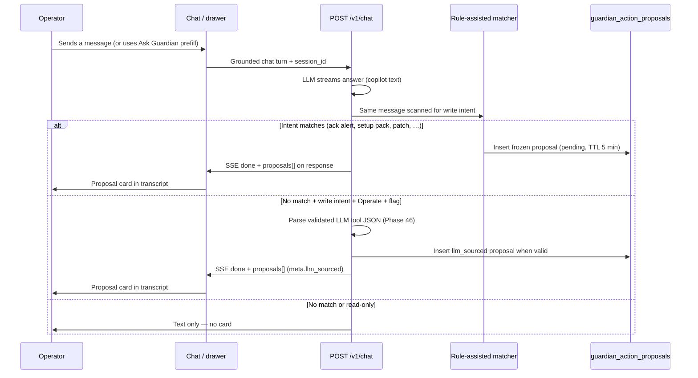

# Guardian change requests — operator guide

**Audience:** Farmers, operators, and developers who need one clear story for “Guardian pull requests.”

**Technical name:** `guardian_action_proposals` — we say **change request**, **proposal**, or **PR** in docs (like approving a Git pull request, not a git branch).

**Architecture:** [`farm-guardian-architecture.md`](farm-guardian-architecture.md) §7–§8 · **PR UX roadmap:** [`plans/guardian_pr_ux_through_farmer_phases.plan.md`](plans/guardian_pr_ux_through_farmer_phases.plan.md)

---

## 1. The one rule

**Nothing changes in your farm database from Guardian until you tap Confirm.**

- Chat can explain, suggest, and show cards.
- **Automation rules** and **schedules on the worker** run without chat — that is not a Guardian PR.
- **Run now** on a fertigation program (product backlog) is a direct API action with audit — not a Guardian proposal.

---

## 2. Three layers (do not mix them up)

| Layer | Who decides | Example |
|-------|-------------|---------|
| **Copilot (chat)** | You read; Guardian answers | “Why is Flower Room humid?” |
| **Actor (confirmed PR)** | You tap **Confirm** | Card: “Acknowledge alert #12” → Confirm |
| **Automation (rules/schedules)** | System (your config) | RH rule fires → alert, no chat |

Guardian is **not** an autopilot. It is a **copilot that can open change requests** you approve.

---

## 3. How a change request is created today (shipped)

### 3.1 What triggers a proposal **today**

| Trigger type | How it works | Examples |
|--------------|--------------|----------|
| **You ask in chat** | After your message, server runs **rule-assisted** intent matchers (regex + snapshot checks) | “ack alert 5”, “add philodendron to Living Room with a light feed program” |
| **Ask Guardian button** | UI opens drawer with **prefilled message**; same matcher runs when you send | Zone card: “What’s the status of Flower Room?”; Alerts: “Explain alert #42…” |
| **Revise in session** | Follow-up message updates the **pending** draft (Phase 34) | “use 0.3 L not 0.5” |
| **LLM structured proposal (Phase 46)** | Matchers miss, but you clearly asked for a change, you have **Operate**, and `GUARDIAN_LLM_PROPOSALS=true` — server parses **validated** tool JSON from the assistant turn | Paraphrased feed patch when regex matchers miss; card shows `llm_sourced` in meta |

**Important:** Copilot text and PR cards are **decoupled**. Guardian can answer well and still show **no** card if matchers miss **and** the LLM path did not produce valid structured output.

### 3.3 When the LLM opens a card (Phase 46 — shipped)

**Hybrid C** — matchers always run first. The LLM proposal path runs only when **all** are true:

| Gate | Meaning |
|------|---------|
| Matcher miss | `matchFreshProposal` returned false for this turn |
| Write intent | Imperative verbs (set, patch, acknowledge, …) — not pure Q&A |
| Operate role | Viewer sees chat only; no LLM proposal insert |
| Feature flag | `GUARDIAN_LLM_PROPOSALS=true` in API env (default off) |
| Valid JSON | Assistant text includes a fenced `tool` + `args` block that passes schema + farm ID binding |
| Allowlist v1 | Narrow set only — see [phase 46 plan §5](plans/phase_46_guardian_llm_tool_proposals.plan.md) |

**Still Confirm-gated.** `meta.llm_sourced: true` on the proposal row is for audit and ops logs — not autopilot.

**Excluded from LLM path:** `apply_grow_setup_pack`, `apply_bootstrap_template`, `enqueue_actuator_command`, and other high-risk bundles — use matchers, wizards, or normal UI.

**Observability:** structured logs `guardian_matcher_proposal_hit`, `guardian_llm_proposal_suggested`, `guardian_llm_proposal_rejected` — see [audit-events-operator-playbook.md](audit-events-operator-playbook.md).

Registered write tools: see [`internal/farmguardian/tools/registry.go`](../internal/farmguardian/tools/registry.go) and [operator-tour §6](operator-tour.md#6-farm-guardian-change-requests-with-your-ok).

### 3.2 What does **not** create a proposal

- Reading sensors, listing alerts (`summarize_zone_lighting`, read tools).
- You editing a form and saving (normal UI).
- Cron worker firing a schedule.
- `POST …/run-now` on a fertigation program.

---

## 4. How you review and approve

| Step | Where |
|------|--------|
| 1. See card | Chat transcript (drawer or `/chat`) |
| 2. Read impact | “If you Confirm, this will…” + risk tier (low / medium / high) |
| 3. Optional refine | Reply in same session or **Refine** button (Phase 34) |
| 4. Inbox later | Drawer **Pending** tab or `/guardian/requests` (badge in TopBar) |
| 5. Confirm | **Operate** role required; viewers see card but cannot Confirm |
| 6. Dismiss / expiry | Wrong draft → Dismiss; TTL ~5 minutes on pending drafts |

**Confirm API:** `POST /v1/chat/confirm` with `proposal_id` — server replays **frozen args**, never trusts the client to resend fields.

**Audit:** `guardian_tool_executed` in farm audit log — see [`audit-events-operator-playbook.md`](audit-events-operator-playbook.md).

---

## 5. Risk tiers (what deserves extra care)

| Tier | Meaning | Examples |
|------|---------|----------|
| **Low** | Reversible, small blast radius | Mark alert read, ack alert |
| **Medium** | Config change, no immediate hardware | Create task, patch program, create lighting program |
| **High** | Hardware queue, bootstrap, big bundles | `enqueue_actuator_command`, `apply_bootstrap_template`, `apply_grow_setup_pack`, disable rule |

High-tier cards should be read slowly. Actuator PRs only **enqueue** Pi commands — GPIO runs on the device poll.

---

## 6. Industry comparison (why we built it this way)

| Product pattern | Similar to gr33n Guardian PR |
|-----------------|------------------------------|
| **GitHub / GitLab PR** | Frozen diff → reviewer approves → merge = **Confirm** |
| **Microsoft Copilot staged actions** | Suggested action → user accepts before execution |
| **ServiceNow / ITSM approval** | Ticket proposed → approver confirms |
| **“Human-in-the-loop” agents** | Agent proposes; human gates writes (2024–2026 norm for ops software) |

**Common industry choices:**

1. **Never silent writes** for config agents in regulated or physical ops (farms, factories, healthcare).
2. **Contextual entry points** (buttons on the record you’re viewing) outperform generic empty chat.
3. **Suggested prompts / conversation starters** are standard — but they should be **grounded in page context**, not random filler.
4. **Inbox for pending approvals** when TTL or async review matters — we have Pending tab + badge.

**Less common for farmers:** Fully autonomous “the AI already changed your schedule” without a review step — we explicitly reject that for Guardian writes.

---

## 7. Conversation starters — current vs planned

### Today

- **Ask Guardian** on zones, alerts, crop summaries → sets `prefilledMessage` + optional `contextRef`.
- **Known weakness:** some prefills are **generic** (e.g. “What’s the current status of {zone}?”) — answers feel obvious; does not create useful PRs.
- **Refine** on proposal cards → prefills correction prompt.
- **No** dynamic starter chips in empty chat yet.

### Target (Phases 40–44 — NOT the same as Phase 46)

| Workstream | Purpose |
|------------|---------|
| **Better Ask Guardian + starter chips** | Snapshot-aware **questions** (alerts, missing bands, queue) |
| **Phase 42 matchers** | More phrases → PR card without LLM |
| **[Phase 46](plans/phase_46_guardian_llm_tool_proposals.plan.md)** | ✅ Shipped — LLM proposes **tool+args** when matchers still miss (flag-gated) |

Starters = **better prompts**. Phase 46 = **more proposals from free-form asks**. Both need Confirm.

---

## 8. Guardian vs wizards (Phases 40–44)

| Path | Best for |
|------|----------|
| **Wizard (44)** | Linear setup: new farm template, add zone, pair Pi |
| **Guardian PR** | Flexible language, bundles (setup pack), patches, acks, actuator queue |
| **Zone cockpit (40)** | Direct edits (setpoints, run now, ack alert inline) — fewer PRs needed |

Farmers should not **need** chat to run a day — PRs are for “help me phrase the change” and bundled setup, not every click.

---

## Related

| Doc | Use |
|-----|-----|
| [operator-tour §6](operator-tour.md#6-farm-guardian-change-requests-with-your-ok) | Walkthrough |
| [farm-guardian-persona-platform-context.md](farm-guardian-persona-platform-context.md) | What Guardian is told |
| [plans/guardian_pr_ux_through_farmer_phases.plan.md](plans/guardian_pr_ux_through_farmer_phases.plan.md) | Starters + triggers by phase |
| [plans/farmer_ux_roadmap_40_plus.plan.md](plans/farmer_ux_roadmap_40_plus.plan.md) | Full UI arc 40–47 |
| [farmer-vocabulary.md](farmer-vocabulary.md) | Grow-path words (feeding, comfort — not setpoint/cron) |
| [plans/phase_47_feeding_water_plain_language.plan.md](plans/phase_47_feeding_water_plain_language.plan.md) | Room-first feeding |
