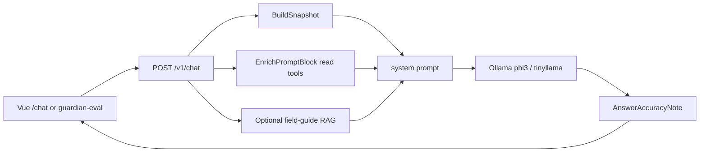

# Farm Guardian pipeline — teaching notes for C# / .NET developers

**Audience:** You know C#, .NET Framework/Core, Entity Framework, MVC, and SQL CRUD. You are learning how gr33n’s **Go API + Vue UI + Ollama LLM** stack wires Farm Guardian — especially recipe outcome “track record” chips and smoke eval.

**Why this doc exists:** Lessons from live debugging (Phase 211.05 recipe outcomes + `smoke-nf-recipe-outcomes` on phi3:mini) live here so they are not trapped in a chat transcript.

**Related:** [farm-guardian-architecture.md §7.0ah](../farm-guardian-architecture.md#70ah-recipe-outcome-insights-phase-21105--shipped) · [phase_211_05 plan](../plans/phase_211_05_recipe_outcome_insights.plan.md) · [ci-guardian-qa.md](../ci-guardian-qa.md)

---

## 1. Mental model: C# → gr33n

| C# / .NET thing you know | gr33n equivalent | Notes |
|--------------------------|------------------|--------|
| ASP.NET MVC / Web API controller | `internal/handler/...` (`chat`, `cropcycle`, …) | Thin HTTP layer; business logic in packages |
| `DbContext` + EF Core | **sqlc** generated `internal/db` + hand-written SQL in `db/queries/*.sql` | You already get this: SQL is the source of truth |
| Repository / service layer | Go packages (`internal/cropcycle/recipeoutcomes`, `internal/farmguardian`) | No DI container — constructors + interfaces when needed |
| DTO / ViewModel | JSON structs with `` `json:"..."` `` tags | Same idea as `[JsonProperty]` |
| Razor / Blazor UI | **Vue 3** SPA in `ui/` | Pinia ≈ a simple store; Axios ≈ `HttpClient` |
| Appsettings + Options pattern | `.env` / `.env.local` + `os.Getenv` | Laptop vs server profiles in docs |
| Background job / Hangfire | goroutines in API process (automation worker, prune loops) | Not a separate worker service by default |
| Unit test (xUnit) | `go test` + Vitest for UI | Table-driven tests are idiomatic Go |
| Integration / E2E | `cmd/api/smoke_*.go`, Playwright `e2e/`, `cmd/guardian-eval` | Guardian eval hits **live** `/v1/chat` |

**Python in this repo:** secondary. Most runtime is **Go**. Python shows up for small shell helpers (token refresh, seed scripts). You do **not** need Python to understand Guardian.

**Go tips that unlock reading this codebase:**

- `package foo` at top of file = namespace; exported names start with **CapitalLetter** (public), lowercase = private to the package.
- `func (h *Handler) RecipeOutcomes(...)` = instance method on a struct (like a class method).
- Error return: `result, err := ...` — check `err != nil` (no exceptions).
- Interfaces are satisfied **implicitly** (duck typing) — if a type has the methods, it implements the interface.
- `context.Context` is the first arg almost everywhere — cancellation + request-scoped values (user id), similar to `CancellationToken` + `HttpContext` bits.

---

## 2. What Farm Guardian is (not a chatbot bolted on)

Guardian is a **grounded counsel pipeline**:

1. Operator asks a question (UI or eval harness).
2. API builds a **system prompt** from farm snapshot + **read tools** + optional RAG chunks.
3. Local LLM (Ollama: `phi3:mini` counsel, `tinyllama` quick chat) writes an answer.
4. Post-processors flag bad answers (`accuracy_note`) — they usually **do not rewrite** the prose.
5. Write intents become **pending proposals** the operator must Confirm (safety).



**Laptop profile (this machine):** Quick chat → `tinyllama`; Farm counsel → `phi3:mini`. Grounded farm questions need counsel (`phi3`), not tinyllama (context window too small for farm + tools + RAG).

---

## 3. Lesson track A — Attribution SQL → Go rollup

**Job:** “Which recipe fed this harvested grow?” then average yield/cost across grows.

### SQL you already understand

File: [`db/queries/crop_recipe_attribution.sql`](../../db/queries/crop_recipe_attribution.sql)

1. **`ListHarvestedCyclesForRecipeOutcomes`** — finished cycles with yield + `crop_key`.
2. **`ListRecipeAttributionHitsForCycle`** — UNION of:
   - `mixing_events.metadata->>'application_recipe_id'`
   - `automation_runs.details->>'application_recipe_id'`
   - filtered by farm, zone, and cycle time window.

Seed stamps those JSON keys in [`db/seeds/master_seed.sql`](../../db/seeds/master_seed.sql) (Phase 211.05 block, markers `[seed:recipe-outcome-*]`).

### Go that wraps it

Package: [`internal/cropcycle/recipeoutcomes`](../../internal/cropcycle/recipeoutcomes/)

| File | Role (C# analogy) |
|------|-------------------|
| `attribution.go` | Pure domain rule: one `(recipe, revision)` must be ≥60% of hits or cycle is **mixed** |
| `outcomes.go` `Build()` | Application service: load cycles → attribute → aggregate avg/median |
| `MinSampleSize = 2` | Business rule: never surface a 1-cycle “average” as a trend |

Same `Build()` feeds:

- HTTP: `GET /farms/{id}/crop-analytics/recipe-outcomes` → [`internal/handler/cropcycle/recipe_outcomes.go`](../../internal/handler/cropcycle/recipe_outcomes.go)
- Guardian read tool text (next section)

Costs (`avg_cost_per_gram`) require scope `money.costs.read` — same idea as an authorize attribute on a controller action.

---

## 4. Lesson track B — Chat turn assembly (read tools ≠ LLM function calls)

**Critical mental shift:** Guardian “tools” here are **not** OpenAI-style tool/function calling for most read paths.

They are **pre-fetched Go queries** whose text is **injected into the system prompt** before Ollama runs.

| Step | File | What happens |
|------|------|----------------|
| Build turn | [`internal/handler/chat/grounded_build.go`](../../internal/handler/chat/grounded_build.go) `buildGroundedTurn` | Assembles `system` string |
| Plan tools | `PlanReadTools` | Mode / intent routing |
| Run tools | [`EnrichPromptBlock`](../../internal/farmguardian/readtools.go) | Appends matching blocks |
| Recipe outcomes | [`readtools_recipe_outcomes.go`](../../internal/farmguardian/readtools_recipe_outcomes.go) | Intent regex → `recipeoutcomes.Build` → text lines |
| Honesty / grounding | `RecipeOutcomeGroundingRule` in platform context | “averaged N cycles”, not forecasts |
| After LLM | [`answer_finalize.go`](../../internal/handler/chat/answer_finalize.go) `applyAnswerAccuracyNote` | Flags `invented_assumption_math`, etc. |

**Order inside `system` (simplified):**

1. Base chat system prompt + grounding rules  
2. Live farm snapshot  
3. **Read-tool results** (header: `Live read-tool results (background — do not cite as [n]):`)  
4. Optional zone/context focus  
5. Optional RAG field guides (those *can* be `[1]` citations)  
6. Honesty block  

So `citations=0` on a recipe-outcomes answer can still mean the tool ran — read-tool numbers are **background**, not numbered citations.

**Intent regex** for this tool matches phrases like “which recipe”, “based on history”, “cost per gram” — see `summarizeRecipeOutcomesIntent` in `readtools_recipe_outcomes.go`.

---

## 5. Lesson track C — UI track record chip

Same analytics payload as Guardian, different surface:

| Layer | File |
|-------|------|
| Store fetch | `ui/src/stores/farm.js` → `loadRecipeOutcomes` |
| Panel load | `ui/src/components/naturalfarming/RecipesApplyPanel.vue` |
| Chip | `ui/src/components/RecipeTrackRecordChip.vue` |
| Format helpers | `ui/src/lib/recipeTrackRecord.js` (also mirrors 0.6 attribution for ops timeline) |

Chip shows violet “Track record” when `cycle_count ≥ 2`; otherwise a grey “need 2+” line. Dollar amounts follow the same cost scope as the API.

---

## 6. Lesson track D — Smoke eval & why `smoke-nf-recipe-outcomes` failed

### How eval works

[`cmd/guardian-eval`](../../cmd/guardian-eval/main.go) posts the fixture prompt to live `/v1/chat` (JWT from `GUARDIAN_EVAL_TOKEN`). It is **not** a mocked unit test.

Fixture: [`fixtures_smoke_natural_farming.go`](../../internal/farmguardian/eval/fixtures_smoke_natural_farming.go) id `smoke-nf-recipe-outcomes`.

Scoring ([`score.go`](../../internal/farmguardian/eval/score.go)):

1. Keyword heuristic for `smoke-nf-*` (must mention avg/cycle/recipe content; must not forecast “will produce”).
2. If that passes → `applySmokeTopicDrift` → `AnswerAccuracyNote` (same detectors as live UI).

### What the 2026-07-25 isolated run showed

| Artifact | Path |
|----------|------|
| Archive | `data/guardian_qa_runs/20260725T225712_smoke-natural-farming_phi3-mini.json` |
| Report | `data/guardian_model_eval_recipe_outcomes.json` |
| Latency | ~23.5 minutes (CPU phi3:mini) |
| Result | **FAIL** — `invented_assumption_math: If we assume` |

Model echoed real FFJ+WCA numbers (tool likely ran) then:

- Treated seed **cycle names** (“Anastasia Green — Run 2…”) as if they were a **recipe**
- Invented “If we assume…” cost math → accuracy gate fails (by design)

**UI note:** Eval creates a **new session** (no `session_id` in the POST). Look under Farm Guardian → Sessions around the run time, or reload that session. Cursor “detached” chat ≠ missing backend session.

### Re-run one fixture

```bash
# API up with AUTH_MODE=auth_test; DB seeded; Ollama with phi3:mini
make guardian-qa-preflight MODEL=phi3:mini FARM_ID=1
go run ./cmd/guardian-eval/ -models phi3:mini -farm-id 1 \
  -suite smoke-natural-farming -prompt-ids smoke-nf-recipe-outcomes \
  -fail-on-regression -report data/guardian_model_eval_recipe_outcomes.json
```

Timeouts on this laptop live in `.env` (`LLM_TIMEOUT_SECONDS`, `GUARDIAN_GROUNDED_TIMEOUT_SECONDS`, `GUARDIAN_EVAL_TIMEOUT_SECONDS`). Full 11-prompt NF suites can exceed the 4h suite context — isolate slow fixtures.

---

## 7. Laptop C-grade strategy (phi3 + tinyllama)

**Goal:** Useful counsel on a 16 GB CPU box; “C” overall means most smoke fixtures pass heuristics without inventing numbers — not matching a 70B GPU farm.

| Model | Use for | Avoid |
|-------|---------|--------|
| `tinyllama` | Ungrounded / quick chat; short smoke like forest-garden brainstorm | Farm counsel with tools + RAG |
| `phi3:mini` | Grounded counsel, NF smokes, recipe outcomes | Expecting perfect long essays |

**Product levers that raise pass rate (see also code comments in grounding rule):**

1. Tighter **recipe-outcome grounding** — only recipes named in the tool block; cycle names ≠ recipes; no “if we assume”.
2. Rigid **tool block footer** for small models.
3. Route **ungrounded** smoke to tinyllama so at least one fixture matches the Quick model operators actually use.
4. Keep accuracy detectors as **flags** (and eval fails) — they catch the failure mode we saw; optional future: one-shot repair pass (pattern exists for proposal JSON in `proposals_repair.go`).

**Operator hygiene:**

- `make guardian-laptop-tune ARGS="--apply"` once per machine  
- Warm counsel before long smokes: `make guardian-qa-preflight`  
- Field memories banner → `make rag-ingest-demo` (helps citation smokes; recipe outcomes use the DB tool, not field-guide RAG)

---

## 8. File map — start here when reading code

| Order | Path | Why |
|-------|------|-----|
| 1 | `db/queries/crop_recipe_attribution.sql` | Hits you already understand |
| 2 | `internal/cropcycle/recipeoutcomes/outcomes.go` | `Build()` loop |
| 3 | `internal/farmguardian/readtools_recipe_outcomes.go` | Text the LLM sees |
| 4 | `internal/handler/chat/grounded_build.go` | Injection into `system` |
| 5 | `internal/farmguardian/answer_accuracy.go` | `InventedAssumptionMathNote` |
| 6 | `ui/.../RecipesApplyPanel.vue` + `RecipeTrackRecordChip.vue` | Same numbers in UI |
| 7 | `internal/farmguardian/eval/score.go` | How smoke pass/fail is decided |

---

## 9. Glossary

| Term | Meaning |
|------|---------|
| **Grounded** | Chat turn with `farm_id` — live farm data + tools |
| **Read tool** | Pre-LLM Go enrichment block (not Confirm) |
| **Write tool / proposal** | Change request; operator Confirms before DB write |
| **Track record chip** | UI summary of recipeoutcome aggregates |
| **Mixed cycle** | No single recipe/revision ≥60% of ops hits |
| **Accuracy note** | Heuristic warning on answer (UI banner + eval) |
| **Smoke fixture** | One eval prompt with id like `smoke-nf-recipe-outcomes` |

---

*Last updated from the Phase 211.05 teaching session (recipe-outcomes eval + UI polish). Extend this file when you add repair passes or new NF smoke fixtures — do not rely on chat history.*
