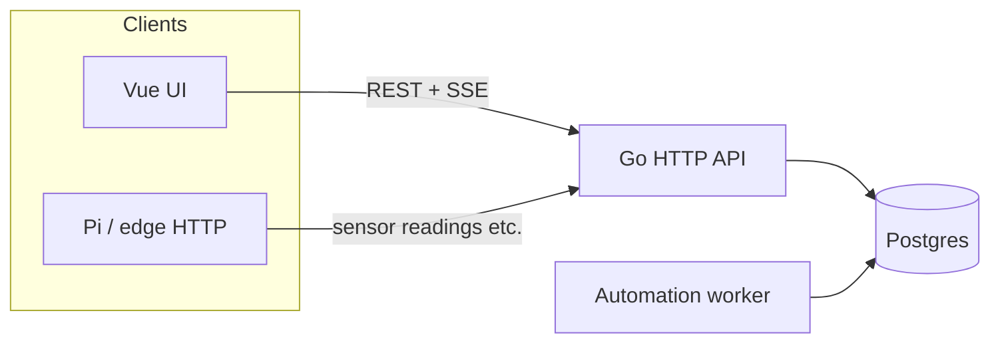

# Operator tour — how gr33n fits together

**Audience:** Farm operators and contributors who want a **single narrative** before clicking every screen. For install steps, use [local-operator-bootstrap.md](local-operator-bootstrap.md).

**UI routes** below match [`ui/src/router/index.js`](../ui/src/router/index.js). Navigation groups match [`ui/src/components/SideNav.vue`](../ui/src/components/SideNav.vue) (some layouts use a slimmer drawer — same destinations).

---

## 1. Start here: farm context

After login, the app works in the context of **one selected farm** (name, zones, devices, sensors). The dashboard header summarizes **zones · sensors · devices** and includes a short **How it all connects** help tip — same mental model as this doc. **In the UI**, **System → Guide** (`/operator-guide`) has the glossary and a clickable walk aligned with §2 below. For Raspberry Pi + Sequent relay HAT wiring, use **System → Guide → Pi + HAT setup** (`/pi-setup`) or the link on empty sensor/actuator wiring badges.

If lists look empty, see [**Why is this empty?**](#4-why-is-this-empty-future-ux) below; detailed hints are tracked as separate UX work in the [sit-in workstream](workstreams/sit-in-operator-experience.md).

---

## 2. Narrative walk (recommended order)

Think **physical layout → signals → automation → work tracking → feeding**.

| Step | Where in the app | What you are doing |
|------|------------------|--------------------|
| **1. Farm home** | `/` Dashboard | Orient: morning strip (tasks, alerts, **Feed & water** chip), recent feeds, what runs when. |
| **2. Zones (plant needs)** | `/zones`, `/zones/:id` | Define **grow areas** (rooms, benches, beds). Open a zone → **Overview** plus **Water / Light / Climate** tabs — the **zone cockpit** for day-to-day grow (Phase 38 + [§4b](#4b-zone-cockpit-walkthrough-phase-40)). Optional zone photos for Guardian context ([architecture §7.4](farm-guardian-architecture.md#74-zone-reference-photos-phase-30-ws5)). |
| **3. Sensors & controls (advanced)** | `/sensors`, `/actuators`, `/setpoints` under **Advanced** in the nav | Farm-wide device lists. **Sensors** and **Controls** show **wiring badges** (GPIO / I2C). Open a sensor for the wiring editor. Prefer zone tabs first; use Advanced when wiring many sensors or debugging. |
| **4. Schedules & rules** | `/schedules`, `/automation` | **Schedules** = time-based cadence (cron-like) tied to actions or fertigation windows. **Rules** (Automation) = conditions + actions (e.g. “if humidity low → open mist”). |
| **4b. Lighting (photoperiod)** | `/lighting` | **Lighting programs** — first-class 18/6, 12/12, or custom ON/OFF photoperiods for grow lights. One program owns a paired schedule + `control_actuator` actions (see [§5](#5-set-up-186-vegetative-lights-phase-35)). |
| **4c. Greenhouse climate** | `/zones/:id`, `/actuators`, `/automation` | **Shade, vents, fans** on `zone_type=greenhouse` — profile in zone meta, typed actuators, lux/temp rules. **Not** supplemental light (see [§5b](#5b-greenhouse-shade-vents-and-fans-phase-36)). |
| **5. Tasks** | `/tasks` | Human **work items**: inspections, harvest prep, fixes — often the day-to-day spine (see sit-in “tasks-first”). |
| **6. Feed & water** | `/feeding`, zone **Water** tab | Daily feeding — one card per zone on the hub; per-zone **feeding plan** on **Water** ([§7b](#7b-feeding--water-for-this-zone-phase-47)). |
| **6b. Operations** | `/operations/supplies`, `/operations/feeding`, `/operations/money` | **Supplies**, **Feeding admin**, **Money** — restock, farm-wide feeding admin, receipts ([§7](#7-supplies-feeding--money-phase-43)). |
| **6c. Fertigation** | `/fertigation` under **Advanced** | Full six-tab console — mixing log, crop cycles, bulk program edit. |
| **7. Guardian (optional AI)** | Side nav `/chat`, drawer robot tab | **Farm Guardian** — grounded Q&A + **change requests** (propose → Confirm). Pending inbox: `/chat?tab=pending`. See [§6](#6-farm-guardian-change-requests-with-your-ok). Starters on **Water** and **Feed & water** for next feed / run now / water-only. |

**Around the edges (same session):** **Alerts** (`/alerts`), **Knowledge** (`/farm-knowledge` — farm-scoped RAG), **Plants / Animals / Aquaponics** when those modules matter, **Settings** / **Catalog** for account and reference data. Legacy **Inventory** / **Costs** routes remain under Advanced for power users.

---

## 4a. Plant needs per zone (Phase 38)

Operators think in **what the plant needs**, not database table names:

| Need | Zone tab | Typical hardware | Operator pages |
|------|----------|------------------|----------------|
| **Water & feeding** | Water | EC/pH/moisture sensors, irrigation pump | **Zone Water tab**, **Feed & water** hub (`/feeding`); Advanced → **Fertigation** |
| **Light** | Light | Grow lights, optional lux/PAR | `/lighting` photoperiod programs |
| **Air & climate** | Climate | Temp/humidity, fans, vents, shade (greenhouse) | Comfort targets on tab; **Automations** under Advanced |

Each tab shows the **connection chain**: live **reading** → **comfort target** → **automation or feed timing** → **pump/light/fan** → **device online**.

**Timed pump runs:** most microcontrollers are on/off relays. Use **Run pulse** (N seconds) on a pump in the zone Water tab or on **Controls** — the Pi runs **on → wait → off**. Fertigation programs can set `run_duration_seconds` so automated feeds use the same pulse.

**Navigation:** sidebar **Grow** (**My zones**, **Feed & water**, **Targets & schedules**) and **Today** (Dashboard, tasks, alerts) are the day-to-day path; **Advanced** holds Automations, Comfort bands, **Fertigation**, Controls, and Sensors for power users. **Phase 49:** hovering a related sidebar item (e.g. **My zones**) gently highlights its siblings (**Feed & water**, **Targets & schedules**) so linked routes are easier to discover.

**Edge commands (Phase 39):** automation, Guardian Confirm, manual **Controls**, and fertigation **mix-jobs** enqueue to a **FIFO command queue** per device (`device_commands`). The Pi drains **`GET /devices/{id}/commands/next`** in order — **`mix_batch`** nutrient steps, then **pulse** irrigate, without last-write-wins. Legacy **`pending_command`** still works one release as a fallback.

**Automated mixing on the Pi (Phase 39):** when a program has a **recipe + reservoir + base water EC**, the cloud calculates a **mix plan** and the Pi runs per-channel pump seconds. Operators without edge hardware still use **Fertigation → Mixing log**. Before the first automated mix, set **base water EC** on the reservoir (API `PATCH /fertigation/reservoirs/{rid}/base-water` or future reservoir card). **Zone → Water** tab: preview mix plan, queue depth chip, last mix “EC met” badge.

**Irrigation-only programs (Phase 39b):** check **Irrigation only (plain water)** when creating a program for RO/well/municipal feed. No recipe, no mix preview, no base EC requirement — only timed pump pulses via the queue.

---

## 4b. Zone cockpit walkthrough (Phase 40)

**Shipped.** The zone hub is the **grow cockpit** — fix targets, ack alerts, and read what runs today **without** hopping to Setpoints, Automation, or Schedules for routine work. Power users still use **Advanced** for farm-wide CRUD and expression editing. Plan: [`plans/phase_40_unified_farmer_ux_zone_cockpit.plan.md`](plans/phase_40_unified_farmer_ux_zone_cockpit.plan.md). Vocabulary: [`farmer-vocabulary.md`](farmer-vocabulary.md) (comfort targets, Feed & water, Ask gr33n).

**Walkthrough — Flower Room example**

### 1. Open the zone

1. Sidebar **My zones** → **Flower Room** (or **Zones** list → pick the zone).
2. Tabs: **Overview** · **Water** · **Light** · **Climate** — stay in the zone for day-to-day grow.

### 2. Overview — “Today in this zone”

The **Today** strip summarizes what matters now:

| Chip | What it shows |
|------|----------------|
| **Next run** | Next schedule tied to this zone (humanized time, e.g. “Every day at 8 AM”) |
| **Automations** | Count of **active rules** scoped to this zone |
| **Alerts** | Unread alerts for sensors/actuators in this zone |
| **Devices** | Online vs offline devices in the zone |
| **Queue** | FIFO command depth on edge hardware (after Phase 39) |
| **Tasks** | Tasks due today for this zone (Done / Snooze inline) |

**Zone alerts** panel below lists unread and recent items for this zone. **Acknowledge** or **Mark read** inline; open farm-wide **Alerts** for history.

**Ask gr33n** starter chips (when AI is enabled) are **zone-aware** — e.g. “Why is humidity off?” — not generic status questions.

### 3. Climate / Light — comfort targets inline

On **Climate** or **Light**, edit **comfort targets** (min / ideal / max) per sensor type **in the tab**. Labels say **comfort target**, not “setpoint.” Saving calls the existing setpoints API (`PATCH` / `POST` on the farm setpoints collection).

**What runs when** card lists zone-scoped **schedules** and **automations** with humanized next run and active toggles. Use **Power settings** (Advanced hint) only when you need cron expressions or farm-wide rule editing.

### 4. Water — grow story

The **Water** tab adds a **grow story** row:

- **Last feed** — last mixing or irrigation event for the active program
- **Next run** — next program schedule fire (humanized)
- **Queue** — mix + pulse depth when edge queue is in use

Keep using **Run pulse** for manual irrigate. Farm-wide program editing stays under **Feed & water** (`/fertigation`); the zone links there with `?zone_id=` when you need the full program card.

### 5. When to leave the zone

| Stay in zone | Use Advanced / farm-wide pages |
|--------------|--------------------------------|
| Edit comfort targets, ack alerts, read today’s runs | Edit cron strings, bulk sensor wiring, debug all rules |
| Run pulse, preview mix, see queue | Create programs, reservoirs, recipes |
| Complete zone tasks due today | Farm-wide task backlog without zone filter |

Farm-wide morning path and empty-state hints: [Phase 41](plans/phase_41_farm_hub_coherence.plan.md). Guardian zone-first guidance: [architecture §7.0f](farm-guardian-architecture.md#70f-zone-cockpit-phase-40).

---

## 3. Data-flow diagram (browser, API, edge)

High level: the **dashboard** talks to the **Go API** with a JWT; optional **Pi / edge** clients send readings with an API key. **Postgres** holds farm data; an **automation worker** (started with the API process) advances schedules and rules against the same database.



**Reading path:** Hardware → (optional Pi / `gr33n_client.py`) → `POST` readings → API → `sensor_readings` (and related). The UI can subscribe to **SSE** live readings for the selected farm (`/farms/{id}/sensors/stream`) so charts update without polling everything.

**Actuation path:** Rules / schedules / fertigation programs → worker or operator → **`device_commands`** queue (FIFO) → Pi **`GET /devices/{id}/commands/next`** → GPIO → **`actuator_events`** (+ **mixing_events** for `mix_batch`). `pending_command` mirrors queue head for backward compat (see §4a, [`pi-integration-guide.md`](pi-integration-guide.md) §1.1).

---

## 3b. Farm hub & morning path (Phase 41)

**Status:** Shipped. Plan: [`plans/phase_41_farm_hub_coherence.plan.md`](plans/phase_41_farm_hub_coherence.plan.md).

**Morning path (complements [tasks-first guide](tasks-first-operator-guide.md)):**

1. **`/` Dashboard** — **This morning** strip: tasks due today, unread alerts, next schedule, device heartbeat, queued commands (when pending).
2. **`/tasks`** → **`/alerts`** → **`/schedules`** with optional **`?zone_id=`** when you started from a zone; breadcrumb shows `Zones › Room › Page`.
3. **`/fertigation?zone_id=`** — events filtered to that room; programs for the zone are highlighted; banner links **Back to zone Water**.
4. **`/lighting?zone_id=`** — programs for one room; **Open zone →** returns to the Light tab.
5. **Why-empty hints** on Dashboard widgets, zone comfort targets, fertigation events, tasks, and alerts — see [§4](#4-why-is-this-empty-future-ux).

Demo tasks with **`zone_id`** appear on **Flower Room** Overview after a fresh seed (`master_seed.sql`).

Requires Phase 40 zone cockpit for consistent zone-first language.

---

## 4. “Why is this empty?” (future UX)

Empty lists usually mean one of: **no data yet**, **wrong farm selected**, **telemetry not reaching the API** (Pi down, URL/key wrong), **automation not configured**, or **setpoints vs live readings** confusion (setpoint without recent readings looks “dead”). **Inline hints** ship in Phase 41 (`EmptyStateHint` on Dashboard, zone comfort targets, fertigation events, tasks, alerts) — this section remains the **conceptual** map.

---

## 5. Set up 18/6 vegetative lights (Phase 35)

Photoperiod lighting is a **first-class domain** — not two loose cron rows in `/schedules`. A **lighting program** owns the grow-light actuator, ON/OFF window, timezone, and the paired schedules the automation worker already runs.

**Recommended path (demo farm or new zone):**

1. **Side nav → Lighting** (`/lighting`) — list programs for the selected farm.
2. Pick zone **Veg Room** (or your vegetative zone) and the **grow light** actuator (`actuator_type=light`).
3. Click **Apply preset → 18/6 (Veg)** — or use the **PhotoperiodClockEditor**: set **Lights ON** (e.g. 06:00), **Duration** 18 h; OFF time updates automatically.
4. Save — the API creates one `lighting_program` plus active ON/OFF schedules and `control_actuator` actions. Cron fires in the program’s **timezone** (farm default or explicit).
5. Confirm on **Schedules** — you should see `LP-{id} ON/OFF: …` rows linked via metadata, not orphan “Light ON 18/6 Veg” names.

**Guardian:** ask *“What’s the light schedule in Veg Room?”* — grounded chat can include a **`summarize_zone_lighting`** block (read-only; no Confirm card).

**Legacy note:** farms bootstrapped before Phase 35 may still have inactive orphan **Light ON/OFF** schedule pairs. They coexist until you migrate via **Lighting → preset apply**; new `jadam_indoor_photoperiod_v1` bootstrap farms get proper `lighting_programs` automatically.

---

## 5b. Greenhouse shade, vents, and fans (Phase 36)

Greenhouse **climate control** (blocking sun, heat relief, ventilation) is separate from **supplemental lighting** ([§5](#5-set-up-186-vegetative-lights-phase-35)). A greenhouse zone carries a **`greenhouse_climate`** profile under `meta_data` and uses **typed actuators** — not free-text motor names only.

**Block sun ≠ add light:** you can run an 18/6 **lighting program** on grow lights in the same zone while **shade_screen** automation deploys cloth when lux is high. They are different actuators and rule families.

### Quick start (bootstrap farm)

1. **Settings → apply template** `greenhouse_climate_v1` (or create farm with that bootstrap). Requires migration `20260603_phase36_greenhouse_climate_v2.sql` on the API database first.
2. Open **Zones** → your greenhouse zone → **Climate** tab (all zones have Water / Light / Climate tabs since Phase 38). For `zone_type=greenhouse`, the Climate tab includes the **greenhouse climate profile**, typed shade/vent/fan controls, and GH rules. Confirm actuators: **GH shade screen**, **GH ridge vent**, **GH exhaust fan**, **GH circulation fan**, plus humidity/CO₂ gear.
3. **Automation** (`/automation`) — find rules prefixed **`GH —`** (high lux → deploy shade, hot → fan, night retract proxy). All start **inactive**; tune thresholds, then enable one rule at a time.
4. **Sensors** — bootstrap adds **GH lux**, temp, RH, dew point, VPD. Without a lux meter wired on the Pi, do **not** enable the high-lux shade rule until readings exist.
5. **Clone GH templates** (Climate tab) — `POST /farms/{id}/automation/rule-templates/greenhouse` requires **`lux_sensor_id`** when linking a shade actuator unless **`allow_missing_lux_sensor`** is true (skips high-lux family). The API blocks **activating** `GH — High lux` rules without a valid lux/PAR sensor unless **`sensor_interlock_override`** is set in `trigger_configuration`.

### Profile and actuators (API / integrators)

Set the climate profile on zone update:

```json
{
  "zone_type": "greenhouse",
  "meta_data": {
    "greenhouse_climate": {
      "cover_type": "polycarbonate",
      "shade_actuator_id": 12,
      "vent_actuator_id": 13,
      "fan_actuator_ids": [14, 15],
      "automation_policy": "auto",
      "notes": "East wall polycarbonate"
    }
  }
}
```

- **`cover_type`:** `glass`, `polycarbonate`, or `film`
- **`automation_policy`:** `auto` (sensor rules), `manual` (operator/Guardian only), or `schedule_only` (cron-only; future)

Create typed actuators via **`POST /farms/{id}/actuators`** with `actuator_type` such as `shade_screen`, `ridge_vent`, `exhaust_fan`, `circulation_fan`. Response includes **`valid_commands`** (e.g. `deploy` / `retract` for shade).

Clone inactive template rules for another zone: **`POST /farms/{id}/automation/rule-templates/greenhouse`** with `zone_id` and optional `shade_actuator_id`, `fan_actuator_id`, `lux_sensor_id`, `temp_sensor_id`.

### Manual and Guardian control

**Execution path:** rules and Guardian enqueue **`device_commands`** (FIFO); the Pi drains the queue on GPIO (same as lights and pumps). Motor verbs map to relay on/off using actuator **config** polarity.

| Intent | Typical command | Guardian / API |
|--------|-----------------|----------------|
| Deploy shade cloth | `deploy` | `enqueue_actuator_command` (Confirm) |
| Retract shade | `retract` | same |
| Open ridge vent | `open` | same |
| Exhaust fan on | `on` | same |

**Guardian read:** ask *“Is shade deployed in the Greenhouse?”* or *“Summarize greenhouse climate for zone Greenhouse”* — grounded chat can include **`summarize_zone_greenhouse_climate`** (profile, actuator states, recent shade/fan events, active `GH —` rules). No Confirm card for read tools.

**Guardian write:** propose **`enqueue_actuator_command`** with `command: deploy` (or `retract`, `open`, `close`, `stop`) — review the card, then **Confirm**.

### UI (Phase 36 + Phase 38)

Open **Zones** → greenhouse zone → **Climate** tab: edit `greenhouse_climate` profile, view climate sensors, send typed commands (**deploy** / **retract** / **on** / **off** via `POST /actuators/{id}/command` or **Run pulse** where applicable → Pi `pending_command`), and review **GH —** rules. **Overview** tab shows farm-wide KPIs and photos; use **Climate** for motor commands and GH automation — not the legacy single-page scroll only.

**Pattern detail:** [`pattern-playbooks.md`](pattern-playbooks.md) · Architecture: [`farm-guardian-architecture.md`](farm-guardian-architecture.md#70c-grow-environment-stack-phase-36-greenhouse-climate) · Plan: [`plans/phase_36_greenhouse_climate.plan.md`](plans/phase_36_greenhouse_climate.plan.md)

---

## 5c. Comfort bands & what runs when (Phase 42 — shipped)

**Status:** Shipped. Plan: [`plans/phase_42_comfort_targets_automation_plain_language.plan.md`](plans/phase_42_comfort_targets_automation_plain_language.plan.md). Depends on [Phase 40](plans/phase_40_unified_farmer_ux_zone_cockpit.plan.md) + [Phase 41](plans/phase_41_farm_hub_coherence.plan.md).

**Goal:** Stop sending operators to raw **Setpoints**, **Schedules**, and **Rules** pages for everyday work. Same database fields; farmer labels and toggles.

### Comfort bands (replaces “Setpoints” in Grow nav)

1. Open **Grow → Targets & schedules** (`/comfort-targets`).
2. Pick a room — see whether humidity/temperature bands are **missing**, **ok**, or **out of range** vs recent readings.
3. Edit **too low / just right / too high** — tied to growth stage when a crop cycle is active.
4. Zone cockpit (Phase 40) uses the same editor inline — you should not need two different UIs for the same band.

### What runs when (schedules)

1. **Schedules** view shows **next run in plain English** (not cron).
2. Simple create: “Every day at 6:00 AM” in farm timezone — cron is stored behind the scenes.
3. Pause a schedule with a toggle — no JSON.

### Automation (rules)

1. Each rule is one **sentence** (what it watches, what it does).
2. Toggle **active** off to pause without deleting.
3. Greenhouse templates still available — **Advanced** opens full RuleForm for power users.

### Power-user escape hatch

**Advanced → Power settings** keeps legacy `/setpoints`, `/automation`, `/schedules` with cron and predicates.

Architecture: [`farm-guardian-architecture.md` §7.0h](farm-guardian-architecture.md#70h-comfort-targets--automation-phase-42--planned).

---

## 6. Farm Guardian change requests (with your OK)

**Requires:** `AI_ENABLED=true`, LLM configured ([`farm-guardian-ollama-setup.md`](farm-guardian-ollama-setup.md)), demo farm selected.

**Full guide (triggers, inbox, starters, industry patterns):** [`guardian-change-requests-guide.md`](guardian-change-requests-guide.md) · Product spec through farmer phases: [`plans/guardian_pr_ux_through_farmer_phases.plan.md`](plans/guardian_pr_ux_through_farmer_phases.plan.md).

Guardian is **not autonomous**. It is a **copilot** in chat and an **actor** only after you **Confirm** a change request (like approving a pull request). **Automation rules and alerts** are a separate layer — they run without chat and are not Guardian PRs.

### Copilot vs actor vs automation

| Layer | You | System |
|-------|-----|--------|
| **Chat (copilot)** | Read answers, optional photos on zones | Guardian explains snapshot + RAG; may show proposal cards |
| **Confirm (actor)** | Tap **Confirm** on a card or inbox row | One frozen change: ack alert, create task, patch schedule, enqueue Pi command, … |
| **Rules (automation)** | Configure rules/schedules | Worker fires alerts or actuation on readings — no Confirm in chat |

Nothing in the database changes from Guardian until you **Confirm** (or you edit the dashboard directly). **Dismiss** or wait for expiry if a proposal is wrong.

### PR inbox workflow

1. Ask Guardian to do something (or accept a rule-assisted proposal, e.g. ack an alert).
2. A **proposal card** appears in the chat transcript (summary + risk tier + frozen args).
3. Review later: Guardian drawer → **Pending** tab, or **`/guardian/requests`** (TopBar badge shows count).
4. **Confirm** (needs **Operate** role) or **Dismiss**. High-risk cards (actuator, bootstrap, disable rule) deserve extra care.
5. Check the result (Alerts, Tasks, Devices) and optional audit `guardian_tool_executed`.

Full operator contract: [`farm-guardian-architecture.md` §8](farm-guardian-architecture.md#8-operator-expectations-at-phase-30-ship).

### What Confirm can do (Phase 32)

Includes everything from Phase 30 — alert ack/read, **create task**, cycle stage, schedule/program/rule patches, zone reference photos, **enqueue actuator command** — plus grow onboarding tools:

| Tool | Tier | What Confirm does |
|------|------|-------------------|
| `create_plant` | medium | Adds one plant catalog row |
| `create_crop_cycle` | medium | Starts an active cycle in a zone (fails if zone already busy) |
| `create_fertigation_program` | medium | Creates a fertigation program for a zone |
| `apply_grow_setup_pack` | **high** | One transaction: optional plant + cycle + program + optional monitor task |

**Guardian never silently adds plants.** Chat may show a setup-pack card; rows appear only after you **Confirm**. To do the same steps manually, use **Plants** (`/plants`), **Crop cycles**, and **Fertigation** without Guardian.

### 6b. Grow setup via Guardian (Phase 32)

**Requires:** demo or real farm with at least one **empty zone** (no active crop cycle), Guardian enabled, **Operate** role.

This walkthrough uses a house-plant example; the same flow works for commercial zones with different default program volumes.

1. **Create or pick a zone** — `/zones` → e.g. "Living Room" (indoor). Confirm the zone has **no active cycle** on the zone detail page.
2. **Open Guardian** — drawer (✨) or `/chat`; select the correct farm.
3. **Ask in plain language**, naming the plant and zone, e.g.  
   *"add my philodendron to Living Room with a light fertigation program"*
4. **Review the setup pack card** — numbered bundle: plant display name, zone, cycle stage, program EC/pH/volume, optional monitor task. **High-tier** warning: creates multiple records at once.
5. **Confirm** (or **Dismiss** if anything looks wrong). Viewers see the card but cannot Confirm.
6. **Verify after Confirm:**
   - **Plants** (`/plants`) — new catalog row
   - **Zone detail** — active crop cycle
   - **Fertigation** — new program; cycle may show linked primary program
   - **Tasks** — optional "Monitor new …" task
   - Audit log — `guardian_tool_executed` with `tool_id: apply_grow_setup_pack`

**When no card appears:** zone name not in the snapshot, zone already has an active cycle, plant name already on the farm, or the message did not match setup intent — ask Guardian to list zones/plants or use the manual UI.

**Bootstrap vs setup pack:** `apply_bootstrap_template` seeds a **blank farm** (admin only). The setup pack adds **one grow** to an existing zone — different tool, same Confirm discipline.

Architecture detail: [`farm-guardian-architecture.md` §7.6](farm-guardian-architecture.md#76-grow-setup-prs-phase-32).

### 6c. Refine a Guardian request (Phase 34)

**Requires:** a pending Guardian proposal in the **current chat session**, **Operate** role.

A proposal is no longer one-shot. If a draft is *close but not quite right*, correct it in the same conversation instead of dismissing and starting over — Guardian revises the draft, and you can tell it things it cannot sense.

1. **Get a draft** — e.g. *"add philodendron to Tent A with a light feed"* → setup-pack card (Revision 1). Each card now shows an **"If you Confirm, this will…"** impact block.
2. **Correct a value** — reply in the same session: *"no, use 0.3 L not 0.5"*. The card becomes **Revision 2** with a **diff vs the previous revision** (`program.total_volume_liters: 0.5 → 0.3`); Revision 1 is marked **superseded**.
3. **Supply an unsensed fact** — *"there's no humidity sensor in Tent A — assume RH around 60%"*. The card adds an **Operator-stated (not measured)** line: *RH 60% (operator-stated, not measured)*. This is recorded as an operator assertion, never as a sensor reading.
4. **Use Refine** — the **Refine** button prefills the prompt so you can push another correction quickly.
5. **Confirm the corrected draft** — only the **latest** revision is confirmable. If you try to Confirm an older (superseded) card you get a clear message pointing at the current revision.
6. **Verify after Confirm** — the persisted program reflects **0.3 L** (the correction), and the audit `guardian_tool_executed` row records the **revision**, **root_proposal_id**, and any **operator_provided** facts.

**What it will not do:** Guardian never writes silently. Every revision is a new frozen, Confirm-gated proposal; a correction it can't confidently interpret produces a clarifying question rather than a wrong revision.

Architecture detail: [`farm-guardian-architecture.md` §7.7](farm-guardian-architecture.md#77-pr-iteration--blind-spot-facts-phase-34).

### 6e. Guardian on comfort & automation (Phase 42 — shipped)

**Spec:** [`plans/phase_42_guardian_pr_spec.md`](plans/phase_42_guardian_pr_spec.md) · **Not** the same as [Phase 46](plans/phase_46_guardian_llm_tool_proposals.plan.md) (LLM opens PRs when matchers miss).

**Starters (conversation chips):** On **Targets & schedules** (`/comfort-targets`) — tabs **Comfort bands**, **What runs when**, **Automation** — snapshot-aware prompts such as “Set humidity comfort band for Flower Room” or “Pause shade rule for this zone.” Chips **prefill chat**; they do not auto-Confirm.

**Matchers (shipped in 42):** After you send a message, the server may open a Confirm card for:

| You might say | Tool (if matched) |
|---------------|-------------------|
| Turn off / pause the shade rule | `patch_rule` (`matchComfortAutomationIntent`) |
| Pause the feeding / lights schedule | `patch_schedule` (`matchFeedingProgramIntent` + comfort matcher) |
| Set feed volume to 0.3 L / set EC target | `patch_fertigation_program` |

If you get advice text but **no card**, matchers did not recognize the phrase — Phase 46 addresses broader NL; 42 adds phrases for comfort/automation only.

**Prefer the UI when it exists:** Use band editor and rule/schedule **toggles** on the same pages; Guardian is for operators who think in chat first.

### 6f. Guardian on supplies & money (Phase 43 — shipped)

**Spec:** [`plans/phase_43_guardian_pr_spec.md`](plans/phase_43_guardian_pr_spec.md) · Persona: architecture [§7.0i](farm-guardian-architecture.md#70i-operations-hub--supplies-feeding-money-phase-43).

**Shipped (WS6):** Guardian says **Supplies**, **Feeding (details)**, and **Money** — not Inventory / Fertigation / Costs. Route `context_ref` on `/operations/*` hubs steers copy. **`create_task_from_alert`** on low-stock alerts (`inventory_low_stock`) proposes a **refill task** with input name in the impact line.

**Shipped (WS8):** Read enrichment **`summarize_farm_low_stock`** answers “What’s running low?” with input names and quantities (no Confirm). **Starter chips** on Supplies / Feeding (details) / Money / Dashboard (when low stock) open Guardian with job-shaped messages — spec §2–§3.

**PR cards today (existing tools only):**

| You might say | Tool (if matched) |
|---------------|-------------------|
| Create a refill task from this low-stock alert | `create_task_from_alert` |
| Create a task to check humidity | `create_task` |

Guardian **cannot** adjust batch quantities or post receipts via Confirm — use the hub UI; broader NL writes are [Phase 46](plans/phase_46_guardian_llm_tool_proposals.plan.md).

### 6g. Guardian during setup (Phase 44 — shipped)

**Spec:** [`plans/phase_44_guardian_pr_spec.md`](plans/phase_44_guardian_pr_spec.md) · Architecture: [`farm-guardian-architecture.md` §7.0j](farm-guardian-architecture.md#70j-getting-started--edge-wizards-phase-44).

- **Wizards win** — farm template, zone, and device are **not** created by starter chips.
- **Setup mode** — grounded chat adds a setup persona when the farm has **zero zones**, `POST /v1/chat` sends `setup_mode: true`, or you open `/chat?setup=1`.
- **Starters** on the first-run checklist, wizard footers, and Guardian drawer: grow-setup phrase, ack alert, Pi procedure help (`start procedure wire-pi-relay-light`).
- **Grow setup pack** — same Confirm bundle as [§6b](#6b-grow-setup-via-guardian-phase-32); use after the room exists.
- **Bootstrap template** — apply in the **Farm setup wizard** (`POST /farms/{id}/bootstrap-template`), not via a chip that opens `apply_bootstrap_template`.

### 6h. When Guardian opens a card from your words (Phase 46 — shipped)

**Spec:** [`plans/phase_46_guardian_llm_tool_proposals.plan.md`](plans/phase_46_guardian_llm_tool_proposals.plan.md) · Guide: [`guardian-change-requests-guide.md` §3.3](guardian-change-requests-guide.md#33-when-the-llm-opens-a-card-phase-46--shipped)

Most cards still come from **pattern matchers** after you send a message. When matchers miss, a **second path** may open a card: if you clearly asked for a change, you have **Operate**, and the API has **`GUARDIAN_LLM_PROPOSALS=true`**, Guardian parses **validated** structured tool JSON from the assistant reply — you still **Confirm**.

| Expectation | Detail |
|-------------|--------|
| Matchers first | Ack alert, setup pack, feed volume regex, comfort patches — unchanged |
| LLM fallback | Paraphrased writes; proposal `meta.llm_sourced` |
| Flag default | Off in `.env.example` — enable per deployment |
| Allowlist v1 | `patch_fertigation_program`, `patch_schedule`, `patch_rule` (pause only), alerts/tasks/stage — not setup pack or bootstrap |
| Viewer | Chat works; no write proposals from LLM path |
| Dismiss | Still does nothing to your data |

**Vitest bundle:** `phase-46-ws1-policy.test.js` … `phase-46-ws5-observability.test.js`, `phase-46-closure.test.js`.

### 6d. First field install with Guardian, offline (Phase 37)

**Requires:** `AI_ENABLED=true`, demo or real farm selected, **Operate** optional for procedure-only turns (Confirm still needed for write proposals).

Use this walkthrough on a **single box** (Postgres + API + UI + Ollama on one NUC/Pi) or any LAN deployment where `LLM_BASE_URL` points at local inference. See [`offline-or-intranet-deployment.md`](offline-or-intranet-deployment.md#field-assistant-mode-phase-37).

1. **Check readiness** — `GET /v1/chat/health?farm_id=1` (or Settings / Guardian when wired). Confirm `field_mode` and `procedures_available` are true after migrations + repo checkout.
2. **Ingest field knowledge (once)** — `make rag-ingest-field-guides` and `make rag-ingest-platform-docs` when `EMBEDDING_API_KEY` is set (optional for procedures; required for grounded doc citations).
3. **Open Guardian** — drawer (✨) or `/chat`; select your farm.
4. **Start a wiring walkthrough** — type: `start procedure wire-pi-relay-light`. Guardian shows **step 1 only** (unplug the light). Reply `done` to advance; use `help` or `repeat` anytime.
5. **Hit the safety stop** — on step 3 (mains / load side), Guardian **stops** and tells you to use a **licensed electrician**. This is intentional — it will not coach line-voltage wiring in chat.
6. **Print a checklist** — use **Print checklist** on the procedure card, or open `/v1/field-guides/procedures/wire-pi-relay-light/print` (works **without** the LLM).
7. **Degrade drill** — stop Ollama (or set a bad `LLM_BASE_URL`), then ask: `help me wire the pi to a light`. You should still get step 1 + print link (`field_degraded` in the API), not a hard error.
8. **Register hardware in gr33n (optional)** — after low-voltage wiring, ask Guardian to propose registering an actuator; **Confirm** the change request (same PR rules as §6).

**Diagnostics:** `start procedure diagnose-sensor-no-reading`, `diagnose-actuator-wont-fire`, or `diagnose-pi-offline` for symptom-based checklists.

Architecture: [`farm-guardian-architecture.md` §7.0e](farm-guardian-architecture.md#70e-offline-field-assistant-phase-37) · Plan: [`plans/phase_37_guardian_offline_field_assistant.plan.md`](plans/phase_37_guardian_offline_field_assistant.plan.md)

### Vision and photos — what to expect

- **Zone photos (shipped):** upload on **Zone detail**; Guardian knows photos exist and can discuss walkthrough context.
- **Leaf/crop image analysis (optional):** set `LLM_VISION_MODEL` (e.g. `llava` on Ollama); attach zone photos in the Guardian drawer when asking **from a zone** (robot tab on a zone page). On **Guardian full page** (`/chat`) the upload UI is hidden until you have zone context — [Phase 66](plans/phase_66_guardian_field_assistant.plan.md) adds camera upload everywhere + a room picker. Treat vision answers as **hypotheses**, not certified diagnosis. Prefer **create task** over silent config changes.

### Platform facts (what Guardian should say about itself)

On-prem gr33n, not a cloud subscription; Lite vs Full; LAN inference when configured; **Propose → Confirm** for writes. Operator mirror: [`farm-guardian-persona-platform-context.md`](farm-guardian-persona-platform-context.md).

### Suggested demo path

1. **Alerts** — seeded demo farm has unread alerts after `make dev-stack-fresh`. Tour assumes **`demo_showcase`** profile on farm 1; daily dev may use **`make dev-reset-farm ARGS="--profile small_indoor"`** ([dev-farm-profiles.md](dev-farm-profiles.md)).
2. **✨ Ask Guardian** on a humidity row (or open the drawer).
3. Ask to acknowledge the alert → **Confirm** the proposal card.
4. Open **`/guardian/requests`** or drawer **Pending** to see the inbox pattern.
5. Optional — **grow setup:** empty zone + *"add my philodendron to {zone} with a light fertigation program"* → review setup pack card → Confirm → check `/plants` and `/fertigation` ([§6b](#6b-grow-setup-via-guardian-phase-32)).
6. Optional: **Zones** → add a reference photo → ask Guardian about that zone.

Architecture: [`farm-guardian-architecture.md`](farm-guardian-architecture.md) §7–§8 · Platform doc RAG: `make rag-ingest-platform-docs` · Bootstrap: [`local-operator-bootstrap.md`](local-operator-bootstrap.md#guardian-ready-demo-after-seed) · Phase 32 grow setup: [`plans/phase_32_guardian_grow_setup_prs.plan.md`](plans/phase_32_guardian_grow_setup_prs.plan.md) · Pi validation: [`plans/phase_31_field_validation_and_edge.plan.md`](plans/phase_31_field_validation_and_edge.plan.md).

---

## 7. Supplies, feeding & money (Phase 43)

**Shipped.** Hubs WS1–WS8 on `main` including Guardian read + starters ([spec](plans/phase_43_guardian_pr_spec.md)). Plan: [`plans/phase_43_operations_stock_feeding_finance.plan.md`](plans/phase_43_operations_stock_feeding_finance.plan.md).

**Goal:** One **Operations** area for restock, feeding admin, and receipts — not three separate schema apps.

### Supplies (`/operations/supplies`)

1. Open **Operations → Supplies**.
2. **Low-stock banner** when batches are below threshold (same worker alerts as `inventory_low_stock`).
3. **On-hand cards** — input name, quantity, low badge — not `input_batches` tab jargon.
4. **Log a mix** → Feeding (details) mixing tab; **Full inventory editor** → `/inventory` for definitions, recipes, and batch forms.
5. Optional `?zone_id=` — zone context banner when linked from zone Water.

### Feeding (details) (`/operations/feeding`)

1. **Operations → Feeding (details)** — programs, nutrient tanks, and strength targets as **cards** (zone name, next run, **Water only** badge).
2. Tabs: Programs · Nutrient tanks · Strength targets.
3. `?zone_id=` filters programs, tanks, and targets; `?tab=mixing` redirects to **Advanced → Feeding (technical)** mixing log.
4. **Feed & water (daily)** link → `/feeding`; full editor → `/fertigation`.

### Money (`/operations/money`)

1. **Operations → Money** — **this month** spent / received / net summary.
2. **Save receipt** — amount, plain category, photo/PDF; no chart of accounts on the first screen.
3. Recent activity with **Details →** to `/costs` for GL mapping and exports.

### Cross-links (WS5)

- Zone **Water** → **Stock & recipes for this zone →** (`/operations/supplies?zone_id=`)
- **Dashboard** morning strip → **Supplies low** chip when batches are below threshold

**Vitest closure:** `phase-43-closure.test.js`, `supplies-hub.test.js`, `feeding-admin-hub.test.js`, `money-hub.test.js`, `nav-groups.test.js`, `farm-grow-summary.test.js`, `zone-feeding-water.test.js`.

Architecture: [`farm-guardian-architecture.md` §7.0i](farm-guardian-architecture.md#70i-operations-hub--supplies-feeding-money-phase-43).

### 7c. Grow + stock + money closure (Phase 53)

**Shipped.** Closes the farmer loop without new migrations. Plan: [`plans/phase_53_grow_stock_money_closure.plan.md`](plans/phase_53_grow_stock_money_closure.plan.md).

| Job | Where | What to click |
|-----|--------|----------------|
| **Start a grow** | Zone **Overview** → **Start a grow**, or **Plants** → **Start a grow** | Strain → zone → optional feeding program; creates a crop cycle |
| **Harvest** | Zone **Overview** → **Harvest weigh-in** | Yield (g), notes → cycle closes → **post-harvest** screen with summary + **Compare to last cycle** |
| **Restock** | **Operations → Supplies** | **+ Add qty** on a batch; low-stock banner → **Create refill task** (links to **Tasks**) |
| **Log spend** | **Operations → Money** | **Save receipt** — optional tag to room + active grow; Dashboard **Spent this month** chip → Money |

**Cross-links:** hover in-page CTAs to see related sidebar items wiggle (**Plants**, **Targets & schedules**, **Supplies**, **Tasks**, **Money**). Dashboard **Getting started** adds optional rows: start a grow, restock one input, log first receipt.

**Vitest:** `phase-53-ws1-grow.test.js`, `phase-53-ws2-supplies.test.js`, `phase-53-ws3-money.test.js`, `phase-53-ws4-crosslinks.test.js`.

---

## 7b. Feeding & water for this zone (Phase 47)

**Shipped.** Completes the Water story from [Phase 40](plans/phase_40_unified_farmer_ux_zone_cockpit.plan.md) WS5 and [Phase 41](plans/phase_41_farm_hub_coherence.plan.md) farm hub links. Plan: [`plans/phase_47_feeding_water_plain_language.plan.md`](plans/phase_47_feeding_water_plain_language.plan.md) · Words: [`farmer-vocabulary.md`](farmer-vocabulary.md).

**One question:** *How does this zone get water?*

1. Open **My zones → Flower Room → Water**.
2. Read the **status line** — next feed in plain time, volume, EC range.
3. **Last feed** — when it ran and whether it looked OK (**See history** → **Feed & water** hub).
4. **Feeding plan** card — inline edit volume, daily time, or **Water only** (irrigation without nutrients); wizard when no plan exists.
5. **Run feed now** or **Pulse pump** when you need manual control.
6. **Reservoir** — Ready or Needs top-up.
7. Farm-wide list: **Feed & water** (`/feeding`) — one card per zone; `?zone_id=` filter from [Phase 41](plans/phase_41_farm_hub_coherence.plan.md).
8. **Ask gr33n** starters on Water and the hub: next feed, run now safe?, switch to water-only.
9. Recipes, mixing log, six tabs → **Operations → Feeding (details)** or **Advanced → Feeding (technical)**.

**Do not** send operators to a page titled **Fertigation** for daily feeding.

**Vitest closure:** `zone-feeding-water.test.js`, `zone-feeding-plan.test.js`, `farm-feeding-hub.test.js`, `farmer-vocabulary-grow-path.test.js`, `guardian-context-prompts.test.js`.

Architecture: [`farm-guardian-architecture.md` §7.0m](farm-guardian-architecture.md#70m-feeding--water-plain-language-phase-47). Workflow: [workflow-guide §4c](workflow-guide.md#4c-feeding-plan--plain-irrigation-phase-47).

---

## 8. Getting started & edge install (Phase 44 — shipped)

**Shipped.** Plan: [`plans/phase_44_getting_started_edge_wizard.plan.md`](plans/phase_44_getting_started_edge_wizard.plan.md) · Guardian: [§6g](#6g-guardian-during-setup-phase-44--shipped).

**Rule:** Use **wizards and checklist buttons** first. Guardian is for questions and the grow-setup **Confirm** bundle — not the only path.

### Suggested click path (new farm)

1. **Settings** → create farm (or open **Farm setup wizard** for an existing blank farm).
2. **`/farms/{id}/setup`** — choose **Start blank** or a template card → preview → **Apply starter pack** (farm admin; idempotent).
3. **Today** (`/`) — **Getting started** checklist when steps remain: zone → edge device → comfort targets → one schedule.
4. **`/farms/{id}/zones/new`** — name, zone type, optional greenhouse profile or lighting preset.
5. **`/farms/{id}/devices/new`** — register Pi, **download bootstrap or generated config.yaml** (Phase 50/51) from platform wiring, embedded field checklist, poll **online**, optional actuators. After the Pi syncs, Dashboard device cards show **Config synced** / **Config stale** / **Never fetched** (Phase 51).
6. **`/comfort-targets`** — set first comfort band; **Schedules** tab to turn on one run.
7. Optional — **Ask Guardian** from checklist chips, wizard **Need help?** footers, or **empty zone** grow starters on zone cockpit ([§6g](#6g-guardian-during-setup-phase-44--shipped)).

| Wizard / surface | Job | Route |
|------------------|-----|-------|
| Farm setup | Pick template → preview → apply bootstrap | `/farms/{id}/setup` |
| Add zone | Name, type, optional lighting preset | `/farms/{id}/zones/new` |
| Edge device | Wiring in UI → generated Pi config, connection test, actuators | `/farms/{id}/devices/new` |
| First-run checklist | Zone → device → comfort band → one schedule | Dashboard `GettingStartedChecklist` |

Pi steps stay in-app: **DB-first** wiring ([pi-integration-guide.md](pi-integration-guide.md) §2a) — set pins in Sensors/Controls, **download config** in the device wizard; checklist §8.3; offline physical wiring procedures in [§6d](#6d-first-field-install-with-guardian-offline-phase-37).

**Vitest closure:** `farm-setup-wizard.test.js`, `zone-setup-wizard.test.js`, `device-setup-wizard.test.js`, `first-run-checklist.test.js`, `guardian-setup-starters.test.js`, `phase-44-wizard-navigation.test.js`, `phase-44-closure.test.js`, `phase-44-guardian-closure.test.js`.

**Go smoke:** `TestPhase44WizardBootstrapApply` — blank farm + `POST /farms/{id}/bootstrap-template` (same path as the wizard).

Architecture: [`farm-guardian-architecture.md` §7.0j](farm-guardian-architecture.md#70j-getting-started--edge-wizards-phase-44).

---

## 9. Farmer validation sit-in (Phase 45 — shipped)

**Status:** **Phase 45 shipped** on `main` — polish (WS1/3/4/5/6/7) plus WS2/WS8 **facilitator dry-run** validation ([sit-in-45-dry-run-log.md](workstreams/sit-in-45-dry-run-log.md), `./scripts/sit-in-dry-run.sh`). External farmer sit-in recommended post-v1. After Phase 44.

### Farmer-ready v1 criteria

| Criterion | Status | Workstream |
|-----------|--------|------------|
| Sit-in protocol + facilitator scorecard | ✅ Shipped | WS1 — [`farmer-sit-in-protocol.md`](workstreams/farmer-sit-in-protocol.md) · [`sit-in-45-session-log-template.md`](workstreams/sit-in-45-session-log-template.md) |
| Vocabulary v2 — **zones not rooms** | ✅ Shipped | WS3 — [`farmer-vocabulary.md`](farmer-vocabulary.md) · `farmerVocabulary.js` |
| Livestock module empty shells | ✅ Shipped | WS5 — [§10a](#10a-livestock-modules-phase-45-ws5--shipped) |
| Light a11y — Confirm/Dismiss, chips, focus | ✅ Shipped | WS6 — [§10b](#10b-light-accessibility-phase-45-ws6--shipped) |
| README + OC-45 docs/tests closure | ✅ Shipped | WS7 — `phase-45-closure.test.js` |
| ≥2 sit-ins; P0 friction backlog empty | ✅ Shipped | WS2 — dry-run DR-A/DR-B; P0 empty |
| Guardian ack + setup pack + dismiss **pass** | ✅ Shipped | WS8 — dry-run + Vitest; [`phase_45_guardian_pr_spec.md`](plans/phase_45_guardian_pr_spec.md) |
| Mobile sit-in path (PWA + scripts) | ✅ Shipped | WS4 — [§10c](#10c-mobile-distribution-phase-45-ws4--shipped) · store track deferred |

**Goal:** Prove a non-technical operator can run the daily loop and trust Guardian **Confirm** vs **Dismiss**.

**Three required PR exercises** (protocol §4):

1. **Ack alert** — proposal card → Confirm → alert cleared.
2. **Grow setup pack** — empty zone → phrase or starter → review bundle → Confirm → plant + program exist.
3. **Dismiss** — open a card → Dismiss → **no farm data change**.

Matcher misses from sit-in feed Phase 46 — not a blocker for polish closure (OC-45).

**Vitest bundle:** `phase-45-ws1-protocol.test.js`, `phase-45-ws2-closure.test.js`, `phase-45-ws3-closure.test.js`, `phase-45-ws4-mobile.test.js`, `phase-45-ws5-module-shells.test.js`, `phase-45-ws6-a11y.test.js`, `phase-45-ws8-guardian-closure.test.js`, `phase-45-closure.test.js`.

---

## 10a. Livestock modules (Phase 45 WS5 — shipped)

**Shipped.** Empty **Animals** and **Aquaponics** pages now explain what each area is for, link to workflow docs, and offer a clear first action — they no longer look “broken” when no rows exist.

| Route | Purpose | Empty-state docs |
|-------|---------|------------------|
| `/animals` | Flocks / herds — head count, lifecycle events, optional primary zone | [`workflow-guide.md` §10](workflow-guide.md#10-animal-husbandry--aquaponics) · [`pattern-playbooks.md`](pattern-playbooks.md) `chicken_coop_v1` |
| `/aquaponics` | Fish-tank zone ↔ grow-bed zone pairing for reporting | [`workflow-guide.md` §10.4](workflow-guide.md#104-aquaponics-loops) · [`pattern-playbooks.md`](pattern-playbooks.md) `small_aquaponics_v1` |

**Nav:** **Livestock** group in the sidebar. Pumps, sensors, and rules still live on **zone** tabs — the module row is the farm-level anchor.

**Vitest:** `module-empty-shell.test.js`, `phase-45-ws5-module-shells.test.js`.

---

## 10b. Light accessibility (Phase 45 WS6 — shipped)

**Shipped.** Not a full WCAG audit — targeted fixes for sit-in and mobile WebView (Session C).

| Surface | Change |
|---------|--------|
| Global | `focus-visible` green ring on buttons, links, inputs (`style.css`) |
| Guardian PR | **Confirm** / **Dismiss** / **Refine** `aria-label` + ~44px tap targets; Dismiss bordered for visibility |
| Guardian chips | Higher contrast green; `Ask Guardian: {label}` per chip |
| Zone Water | **Run feed now** and **Run pulse** descriptive `aria-label` |
| Wizards | `aria-current="step"` on active wizard step indicator |
| First-run checklist | `aria-label` on step links and Hide control |

**Vitest:** `farmer-a11y.test.js`, `phase-45-ws6-a11y.test.js`.

---

## 10c. Mobile distribution (Phase 45 WS4 — shipped)

**Shipped.** Session C (optional mobile sit-in) uses **PWA Add to Home Screen** on the same LAN as the API — no App Store build required for validation.

| Path | Use |
|------|-----|
| **PWA (primary)** | `./scripts/mobile-sit-in-prep.sh` → set `CORS_ORIGIN` → phone opens `http://<LAN-IP>:5173` → install |
| **Capacitor (optional)** | `./scripts/cap-lan-build.sh` → `npm run cap:open:android` (native project from `cap:add:android` once) |
| **TestFlight / Play internal** | ⏳ Deferred — signing + store accounts; see [mobile-distribution.md](mobile-distribution.md) B4 checklist |

**Icons:** `ui/public/icons/icon-192.png`, `icon-512.png`, `icon-maskable-512.png` (from `icon.svg`).

**Full path:** [`workstreams/phase-45-ws4-mobile-sit-in-path.md`](workstreams/phase-45-ws4-mobile-sit-in-path.md) · protocol Session C: [`farmer-sit-in-protocol.md`](workstreams/farmer-sit-in-protocol.md).

**Vitest:** `phase-45-ws4-mobile.test.js`.

---

## 10. Related docs

| Doc | Use |
|-----|-----|
| [local-operator-bootstrap.md](local-operator-bootstrap.md) | First-time env, DB, seed, URLs, Guardian agent demo |
| [farm-guardian-architecture.md](farm-guardian-architecture.md) | Request flow, PR inbox, operator expectations (§8) |
| [farm-guardian-persona-platform-context.md](farm-guardian-persona-platform-context.md) | What Guardian is told about on-prem gr33n (WS9) |
| [plans/phase_35_lighting_domain.plan.md](plans/phase_35_lighting_domain.plan.md) | Photoperiod programs, presets, `/lighting` UI (Phase 35) |
| [plans/phase_38_plant_needs_ui_and_pulse_commands.plan.md](plans/phase_38_plant_needs_ui_and_pulse_commands.plan.md) | Zone Water/Light/Climate tabs, timed pump pulses (Phase 38) |
| [plans/phase_39_edge_fertigation_execution.plan.md](plans/phase_39_edge_fertigation_execution.plan.md) | Shipped: device command queue, automated mix on Pi (Phase 39) |
| [plans/phase_36_greenhouse_climate.plan.md](plans/phase_36_greenhouse_climate.plan.md) | Greenhouse profile, typed actuators, shade/fan rules (Phase 36) |
| [pattern-playbooks.md](pattern-playbooks.md) | `greenhouse_climate_v1` bootstrap pattern |
| [plans/phase_32_guardian_grow_setup_prs.plan.md](plans/phase_32_guardian_grow_setup_prs.plan.md) | Grow setup PR bundle (Phase 32) |
| [plans/phase_47_feeding_water_plain_language.plan.md](plans/phase_47_feeding_water_plain_language.plan.md) | Feeding & water plain language (Phase 47) |
| [farmer-vocabulary.md](farmer-vocabulary.md) | UI language contract for grow paths |
| [plans/phase_31_field_validation_and_edge.plan.md](plans/phase_31_field_validation_and_edge.plan.md) | Pi / breadboard validation after actuator PRs |
| [audit-events-operator-playbook.md](audit-events-operator-playbook.md) | `guardian_tool_executed` after Confirm |
| [operator-troubleshooting.md](operator-troubleshooting.md) | 401 / empty farms / reading logs |
| [operator-logging-runbook.md](operator-logging-runbook.md) | Capture & retention for **`slog`** — Compose rotation, Loki sketch; **logs ≠ hypertable pruning** |
| [tasks-first-operator-guide.md](tasks-first-operator-guide.md) | Morning ops path, tasks vs automation rules, offline queue |
| [database-schema-overview.md](database-schema-overview.md) | Where major tables live |
| [workflow-guide.md](workflow-guide.md) | Deeper workflows (incl. Insert Commons, RAG pointers) |
| [sit-in-operator-experience.md](workstreams/sit-in-operator-experience.md) | Backlog: logging, tasks-first, empty-state UX |
| **In-app:** **System → Guide** (`/operator-guide`) | Phase 26 WS1 — glossary + suggested click path (offline-safe) |

---

*Introduced for sit-in §1 (single-page operator tour). Refine routes and copy as the UI evolves.*
