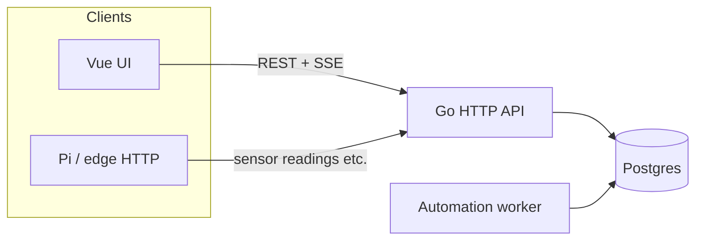

# Operator tour — how gr33n fits together

**Audience:** Farm operators and contributors who want a **single narrative** before clicking every screen. For install steps, use [local-operator-bootstrap.md](local-operator-bootstrap.md).

**UI routes** below match [`ui/src/router/index.js`](../ui/src/router/index.js). Navigation groups match [`ui/src/components/SideNav.vue`](../ui/src/components/SideNav.vue) (some layouts use a slimmer drawer — same destinations).

---

## 1. Start here: farm context

After login, the app works in the context of **one selected farm** (name, zones, devices, sensors). The dashboard header summarizes **zones · sensors · devices** and includes a short **How it all connects** help tip — same mental model as this doc. **In the UI**, **System → Guide** (`/operator-guide`) has the glossary and a clickable walk aligned with §2 below.

If lists look empty, see [**Why is this empty?**](#4-why-is-this-empty-future-ux) below; detailed hints are tracked as separate UX work in the [sit-in workstream](workstreams/sit-in-operator-experience.md).

---

## 2. Narrative walk (recommended order)

Think **physical layout → signals → automation → work tracking → feeding**.

| Step | Where in the app | What you are doing |
|------|------------------|--------------------|
| **1. Farm home** | `/` Dashboard | Orient: counts, quick links to tasks / schedules / fertigation; optional widgets for today’s work and alerts. |
| **2. Zones (plant needs)** | `/zones`, `/zones/:id` | Define **grow areas** (rooms, benches, beds). Open a zone → **Water / Light / Climate** tabs show what the plant needs in one place (Phase 38). |
| **3. Sensors & controls (advanced)** | `/sensors`, `/actuators`, `/setpoints` under **Advanced** in the nav | Farm-wide device lists. Prefer the **zone** tabs first; use Advanced when wiring many sensors or debugging. |
| **4. Schedules & rules** | `/schedules`, `/automation` | **Schedules** = time-based cadence (cron-like) tied to actions or fertigation windows. **Rules** (Automation) = conditions + actions (e.g. “if humidity low → open mist”). |
| **4b. Lighting (photoperiod)** | `/lighting` | **Lighting programs** — first-class 18/6, 12/12, or custom ON/OFF photoperiods for grow lights. One program owns a paired schedule + `control_actuator` actions (see [§5](#5-set-up-186-vegetative-lights-phase-35)). |
| **4c. Greenhouse climate** | `/zones/:id`, `/actuators`, `/automation` | **Shade, vents, fans** on `zone_type=greenhouse` — profile in zone meta, typed actuators, lux/temp rules. **Not** supplemental light (see [§5b](#5b-greenhouse-shade-vents-and-fans-phase-36)). |
| **5. Tasks** | `/tasks` | Human **work items**: inspections, harvest prep, fixes — often the day-to-day spine (see sit-in “tasks-first”). |
| **6. Fertigation** | `/fertigation` | Programs, mixing logs, reservoirs, recipes — ties schedules + inventory-style inputs to delivery. |
| **7. Guardian (optional AI)** | Side nav `/chat`, drawer robot tab | **Farm Guardian** — grounded Q&A + **change requests** (propose → Confirm). Pending inbox: `/chat?tab=pending`. See [§6](#6-farm-guardian-change-requests-with-your-ok). |
| **7b. Zone photos (optional)** | `/zones/:id` | Reference / walkthrough photos per zone; Guardian sees them in the farm snapshot ([architecture §7.4](farm-guardian-architecture.md#74-zone-reference-photos-phase-30-ws5)). |

**Around the edges (same session):** **Alerts** (`/alerts`), **Costs** (`/costs`), **Knowledge** (`/farm-knowledge` — farm-scoped RAG), **Plants / Animals / Aquaponics** when those modules matter, **Settings** / **Catalog** for account and reference data.

---

## 4a. Plant needs per zone (Phase 38)

Operators think in **what the plant needs**, not database table names:

| Need | Zone tab | Typical hardware | Operator pages |
|------|----------|------------------|----------------|
| **Water & feeding** | Water | EC/pH/moisture sensors, irrigation pump | `/fertigation`, schedules on the program |
| **Light** | Light | Grow lights, optional lux/PAR | `/lighting` photoperiod programs |
| **Air & climate** | Climate | Temp/humidity, fans, vents, shade (greenhouse) | `/automation` rules, `/setpoints` targets |

Each tab shows the **connection chain**: live **reading** → **target band** (setpoint) → **schedule or rule** → **pump/light/fan** → **device online**.

**Timed pump runs:** most microcontrollers are on/off relays. Use **Run pulse** (N seconds) on a pump in the zone Water tab or on **Controls** — the Pi runs **on → wait → off**. Fertigation programs can set `run_duration_seconds` so automated feeds use the same pulse.

**Navigation:** sidebar **Grow** (zones, fertigation) and **Operate** (tasks, schedules, lighting) are the day-to-day path; **Advanced** holds Rules, Setpoints, Controls, and Sensors for power users.

**Edge commands (important):** automation, Guardian Confirm, and manual **Controls** all write **`pending_command`** on a device. Today there is **only one slot per device** — if a schedule, fertigation program, and operator all enqueue within the same poll window, **the last write wins** and earlier commands can be lost. Use **Run pulse** for timed pump runs (Phase 38); do not assume the Pi is running a full multi-step nutrient mix automatically.

**Automated mixing on the Pi:** **not available yet.** Operators record what went into the tank via **Fertigation → Mixing log** (API `POST …/mixing-events`). A future **Phase 39** will add a device **command queue** and **`mix_batch`** steps (recipe + base reservoir EC → pump seconds on the edge). Until then, Guardian and docs should treat fertigation programs as **pulse irrigation + logging**, not EC dosing hardware.

---

## 4b. Zone cockpit walkthrough (Phase 40 — planned)

**Status:** Doc stub until Phase 40 ships. Plan: [`plans/phase_40_unified_farmer_ux_zone_cockpit.plan.md`](plans/phase_40_unified_farmer_ux_zone_cockpit.plan.md).

**Intended walk (Flower Room example):**

1. **Zones → Flower Room → Overview** — “Today” strip: next schedule, active rules, unread alerts, device/queue summary.
2. **Climate / Water / Light** — edit **target bands inline** (no Setpoints sidebar hop); ack an alert from Overview.
3. **Water** — grow story: last feed, next program run, queue head (after Phase 39); **Run pulse** for manual irrigate.
4. **Power settings** — link out to Advanced only when cron/rule expression editing is needed.

Farm-wide morning path and empty-state hints: [Phase 41](plans/phase_41_farm_hub_coherence.plan.md). Gap index: [pre_development_gaps_index](plans/pre_development_gaps_index.plan.md).

---

## 3. Data-flow diagram (browser, API, edge)

High level: the **dashboard** talks to the **Go API** with a JWT; optional **Pi / edge** clients send readings with an API key. **Postgres** holds farm data; an **automation worker** (started with the API process) advances schedules and rules against the same database.



**Reading path:** Hardware → (optional Pi / `gr33n_client.py`) → `POST` readings → API → `sensor_readings` (and related). The UI can subscribe to **SSE** live readings for the selected farm (`/farms/{id}/sensors/stream`) so charts update without polling everything.

**Actuation path:** Rules / schedules / fertigation programs → worker or operator → **`pending_command`** on the device row → Pi poll → GPIO → **`actuator_events`**. One pending slot per device today (see §4a).

**After Phase 39 (planned):** writers enqueue to **`device_commands`** (FIFO); Pi drains via **`GET /devices/{id}/commands/next`** (see [`workflow-guide.md`](workflow-guide.md) §4b, [`pi-integration-guide.md`](pi-integration-guide.md)). `pending_command` may mirror queue head for one release. **Re-ingest RAG** after §3 text is updated on ship — see [`rag/platform-doc-manifest.yaml`](rag/platform-doc-manifest.yaml).

---

## 3b. Farm hub & morning path (Phase 41 — planned)

**Status:** Doc stub until Phase 41 ships. Plan: [`plans/phase_41_farm_hub_coherence.plan.md`](plans/phase_41_farm_hub_coherence.plan.md).

**Intended path (complements [tasks-first guide](tasks-first-operator-guide.md)):**

1. **`/` Dashboard** — morning strip: tasks due, unread alerts, next schedule, offline devices, queue depth (post-39).
2. **`/tasks`** → **`/alerts`** → **`/schedules`** with optional **`?zone_id=`** when you started from a zone.
3. **`/fertigation?zone_id=`** — events/programs filtered to that room; banner back to **Zones → Water**.
4. **Why-empty hints** on empty widgets (telemetry vs setpoint vs automation off) — replaces guesswork in [§4](#4-why-is-this-empty-future-ux).

Requires Phase 40 zone cockpit for consistent zone-first language.

---

## 4. “Why is this empty?” (future UX)

Empty lists usually mean one of: **no data yet**, **wrong farm selected**, **telemetry not reaching the API** (Pi down, URL/key wrong), **automation not configured**, or **setpoints vs live readings** confusion (setpoint without recent readings looks “dead”). **Inline hints** are planned in [Phase 41 WS4](plans/phase_41_farm_hub_coherence.plan.md#ws4--why-empty-inline-hints) (see [gaps index](plans/pre_development_gaps_index.plan.md)); this section stays the **conceptual** map until that ships.

---

## 5. Set up 18/6 vegetative lights (Phase 35)

Photoperiod lighting is a **first-class domain** — not two loose cron rows in `/schedules`. A **lighting program** owns the grow-light actuator, ON/OFF window, timezone, and the paired schedules the automation worker already runs.

**Recommended path (demo farm or new zone):**

1. **Side nav → Lighting** (`/lighting`) — list programs for the selected farm.
2. Pick zone **Veg Room** (or your vegetative zone) and the **grow light** actuator (`actuator_type=light`).
3. Click **Apply preset → 18/6 (Veg)** — or use the **PhotoperiodClockEditor**: set **Lights ON** (e.g. 06:00), **Duration** 18 h; OFF time updates automatically.
4. Save — the API creates one `lighting_program` plus active ON/OFF schedules and `control_actuator` actions. Cron fires in the program’s **timezone** (farm default or explicit).
5. Confirm on **Schedules** — you should see `LP-{id} ON/OFF: …` rows linked via metadata, not orphan “Light ON 18/6 Veg” names.

**Guardian:** ask *“What’s the light schedule in Veg Room?”* — grounded chat can include a **`summarize_zone_lighting`** block (read-only; no Confirm card).

**Legacy note:** farms bootstrapped before Phase 35 may still have inactive orphan **Light ON/OFF** schedule pairs. They coexist until you migrate via **Lighting → preset apply**; new `jadam_indoor_photoperiod_v1` bootstrap farms get proper `lighting_programs` automatically.

---

## 5b. Greenhouse shade, vents, and fans (Phase 36)

Greenhouse **climate control** (blocking sun, heat relief, ventilation) is separate from **supplemental lighting** ([§5](#5-set-up-186-vegetative-lights-phase-35)). A greenhouse zone carries a **`greenhouse_climate`** profile under `meta_data` and uses **typed actuators** — not free-text motor names only.

**Block sun ≠ add light:** you can run an 18/6 **lighting program** on grow lights in the same zone while **shade_screen** automation deploys cloth when lux is high. They are different actuators and rule families.

### Quick start (bootstrap farm)

1. **Settings → apply template** `greenhouse_climate_v1` (or create farm with that bootstrap). Requires migration `20260603_phase36_greenhouse_climate_v2.sql` on the API database first.
2. Open **Zones** → your greenhouse zone → **Climate** tab (all zones have Water / Light / Climate tabs since Phase 38). For `zone_type=greenhouse`, the Climate tab includes the **greenhouse climate profile**, typed shade/vent/fan controls, and GH rules. Confirm actuators: **GH shade screen**, **GH ridge vent**, **GH exhaust fan**, **GH circulation fan**, plus humidity/CO₂ gear.
3. **Automation** (`/automation`) — find rules prefixed **`GH —`** (high lux → deploy shade, hot → fan, night retract proxy). All start **inactive**; tune thresholds, then enable one rule at a time.
4. **Sensors** — bootstrap adds **GH lux**, temp, RH, dew point, VPD. Without a lux meter wired on the Pi, do **not** enable the high-lux shade rule until readings exist.
5. **Clone GH templates** (Climate tab) — `POST /farms/{id}/automation/rule-templates/greenhouse` requires **`lux_sensor_id`** when linking a shade actuator unless **`allow_missing_lux_sensor`** is true (skips high-lux family). The API blocks **activating** `GH — High lux` rules without a valid lux/PAR sensor unless **`sensor_interlock_override`** is set in `trigger_configuration`.

### Profile and actuators (API / integrators)

Set the climate profile on zone update:

```json
{
  "zone_type": "greenhouse",
  "meta_data": {
    "greenhouse_climate": {
      "cover_type": "polycarbonate",
      "shade_actuator_id": 12,
      "vent_actuator_id": 13,
      "fan_actuator_ids": [14, 15],
      "automation_policy": "auto",
      "notes": "East wall polycarbonate"
    }
  }
}
```

- **`cover_type`:** `glass`, `polycarbonate`, or `film`
- **`automation_policy`:** `auto` (sensor rules), `manual` (operator/Guardian only), or `schedule_only` (cron-only; future)

Create typed actuators via **`POST /farms/{id}/actuators`** with `actuator_type` such as `shade_screen`, `ridge_vent`, `exhaust_fan`, `circulation_fan`. Response includes **`valid_commands`** (e.g. `deploy` / `retract` for shade).

Clone inactive template rules for another zone: **`POST /farms/{id}/automation/rule-templates/greenhouse`** with `zone_id` and optional `shade_actuator_id`, `fan_actuator_id`, `lux_sensor_id`, `temp_sensor_id`.

### Manual and Guardian control

**Execution path:** rules and Guardian write **`pending_command`** on the device; the Pi client executes on GPIO (same as lights and pumps). Motor verbs map to relay on/off using actuator **config** polarity. Only **one** pending command per device at a time — avoid overlapping automation and manual enqueue on the same Pi device (Phase 39 command queue will fix this).

| Intent | Typical command | Guardian / API |
|--------|-----------------|----------------|
| Deploy shade cloth | `deploy` | `enqueue_actuator_command` (Confirm) |
| Retract shade | `retract` | same |
| Open ridge vent | `open` | same |
| Exhaust fan on | `on` | same |

**Guardian read:** ask *“Is shade deployed in the Greenhouse?”* or *“Summarize greenhouse climate for zone Greenhouse”* — grounded chat can include **`summarize_zone_greenhouse_climate`** (profile, actuator states, recent shade/fan events, active `GH —` rules). No Confirm card for read tools.

**Guardian write:** propose **`enqueue_actuator_command`** with `command: deploy` (or `retract`, `open`, `close`, `stop`) — review the card, then **Confirm**.

### UI (Phase 36 + Phase 38)

Open **Zones** → greenhouse zone → **Climate** tab: edit `greenhouse_climate` profile, view climate sensors, send typed commands (**deploy** / **retract** / **on** / **off** via `POST /actuators/{id}/command` or **Run pulse** where applicable → Pi `pending_command`), and review **GH —** rules. **Overview** tab shows farm-wide KPIs and photos; use **Climate** for motor commands and GH automation — not the legacy single-page scroll only.

**Pattern detail:** [`pattern-playbooks.md`](pattern-playbooks.md) · Architecture: [`farm-guardian-architecture.md`](farm-guardian-architecture.md#70c-grow-environment-stack-phase-36-greenhouse-climate) · Plan: [`plans/phase_36_greenhouse_climate.plan.md`](plans/phase_36_greenhouse_climate.plan.md)

---

## 6. Farm Guardian change requests (with your OK)

**Requires:** `AI_ENABLED=true`, LLM configured ([`farm-guardian-ollama-setup.md`](farm-guardian-ollama-setup.md)), demo farm selected.

Guardian is **not autonomous**. It is a **copilot** in chat and an **actor** only after you **Confirm** a change request (like approving a pull request). **Automation rules and alerts** are a separate layer — they run without chat and are not Guardian PRs.

### Copilot vs actor vs automation

| Layer | You | System |
|-------|-----|--------|
| **Chat (copilot)** | Read answers, optional photos on zones | Guardian explains snapshot + RAG; may show proposal cards |
| **Confirm (actor)** | Tap **Confirm** on a card or inbox row | One frozen change: ack alert, create task, patch schedule, enqueue Pi command, … |
| **Rules (automation)** | Configure rules/schedules | Worker fires alerts or actuation on readings — no Confirm in chat |

Nothing in the database changes from Guardian until you **Confirm** (or you edit the dashboard directly). **Dismiss** or wait for expiry if a proposal is wrong.

### PR inbox workflow

1. Ask Guardian to do something (or accept a rule-assisted proposal, e.g. ack an alert).
2. A **proposal card** appears in the chat transcript (summary + risk tier + frozen args).
3. Review later: Guardian drawer → **Pending** tab, or **`/guardian/requests`** (TopBar badge shows count).
4. **Confirm** (needs **Operate** role) or **Dismiss**. High-risk cards (actuator, bootstrap, disable rule) deserve extra care.
5. Check the result (Alerts, Tasks, Devices) and optional audit `guardian_tool_executed`.

Full operator contract: [`farm-guardian-architecture.md` §8](farm-guardian-architecture.md#8-operator-expectations-at-phase-30-ship).

### What Confirm can do (Phase 32)

Includes everything from Phase 30 — alert ack/read, **create task**, cycle stage, schedule/program/rule patches, zone reference photos, **enqueue actuator command** — plus grow onboarding tools:

| Tool | Tier | What Confirm does |
|------|------|-------------------|
| `create_plant` | medium | Adds one plant catalog row |
| `create_crop_cycle` | medium | Starts an active cycle in a zone (fails if zone already busy) |
| `create_fertigation_program` | medium | Creates a fertigation program for a zone |
| `apply_grow_setup_pack` | **high** | One transaction: optional plant + cycle + program + optional monitor task |

**Guardian never silently adds plants.** Chat may show a setup-pack card; rows appear only after you **Confirm**. To do the same steps manually, use **Plants** (`/plants`), **Crop cycles**, and **Fertigation** without Guardian.

### 6b. Grow setup via Guardian (Phase 32)

**Requires:** demo or real farm with at least one **empty zone** (no active crop cycle), Guardian enabled, **Operate** role.

This walkthrough uses a house-plant example; the same flow works for commercial zones with different default program volumes.

1. **Create or pick a zone** — `/zones` → e.g. "Living Room" (indoor). Confirm the zone has **no active cycle** on the zone detail page.
2. **Open Guardian** — drawer (✨) or `/chat`; select the correct farm.
3. **Ask in plain language**, naming the plant and zone, e.g.  
   *"add my philodendron to Living Room with a light fertigation program"*
4. **Review the setup pack card** — numbered bundle: plant display name, zone, cycle stage, program EC/pH/volume, optional monitor task. **High-tier** warning: creates multiple records at once.
5. **Confirm** (or **Dismiss** if anything looks wrong). Viewers see the card but cannot Confirm.
6. **Verify after Confirm:**
   - **Plants** (`/plants`) — new catalog row
   - **Zone detail** — active crop cycle
   - **Fertigation** — new program; cycle may show linked primary program
   - **Tasks** — optional "Monitor new …" task
   - Audit log — `guardian_tool_executed` with `tool_id: apply_grow_setup_pack`

**When no card appears:** zone name not in the snapshot, zone already has an active cycle, plant name already on the farm, or the message did not match setup intent — ask Guardian to list zones/plants or use the manual UI.

**Bootstrap vs setup pack:** `apply_bootstrap_template` seeds a **blank farm** (admin only). The setup pack adds **one grow** to an existing zone — different tool, same Confirm discipline.

Architecture detail: [`farm-guardian-architecture.md` §7.6](farm-guardian-architecture.md#76-grow-setup-prs-phase-32).

### 6c. Refine a Guardian request (Phase 34)

**Requires:** a pending Guardian proposal in the **current chat session**, **Operate** role.

A proposal is no longer one-shot. If a draft is *close but not quite right*, correct it in the same conversation instead of dismissing and starting over — Guardian revises the draft, and you can tell it things it cannot sense.

1. **Get a draft** — e.g. *"add philodendron to Tent A with a light feed"* → setup-pack card (Revision 1). Each card now shows an **"If you Confirm, this will…"** impact block.
2. **Correct a value** — reply in the same session: *"no, use 0.3 L not 0.5"*. The card becomes **Revision 2** with a **diff vs the previous revision** (`program.total_volume_liters: 0.5 → 0.3`); Revision 1 is marked **superseded**.
3. **Supply an unsensed fact** — *"there's no humidity sensor in Tent A — assume RH around 60%"*. The card adds an **Operator-stated (not measured)** line: *RH 60% (operator-stated, not measured)*. This is recorded as an operator assertion, never as a sensor reading.
4. **Use Refine** — the **Refine** button prefills the prompt so you can push another correction quickly.
5. **Confirm the corrected draft** — only the **latest** revision is confirmable. If you try to Confirm an older (superseded) card you get a clear message pointing at the current revision.
6. **Verify after Confirm** — the persisted program reflects **0.3 L** (the correction), and the audit `guardian_tool_executed` row records the **revision**, **root_proposal_id**, and any **operator_provided** facts.

**What it will not do:** Guardian never writes silently. Every revision is a new frozen, Confirm-gated proposal; a correction it can't confidently interpret produces a clarifying question rather than a wrong revision.

Architecture detail: [`farm-guardian-architecture.md` §7.7](farm-guardian-architecture.md#77-pr-iteration--blind-spot-facts-phase-34).

### 6d. First field install with Guardian, offline (Phase 37)

**Requires:** `AI_ENABLED=true`, demo or real farm selected, **Operate** optional for procedure-only turns (Confirm still needed for write proposals).

Use this walkthrough on a **single box** (Postgres + API + UI + Ollama on one NUC/Pi) or any LAN deployment where `LLM_BASE_URL` points at local inference. See [`offline-or-intranet-deployment.md`](offline-or-intranet-deployment.md#field-assistant-mode-phase-37).

1. **Check readiness** — `GET /v1/chat/health?farm_id=1` (or Settings / Guardian when wired). Confirm `field_mode` and `procedures_available` are true after migrations + repo checkout.
2. **Ingest field knowledge (once)** — `make rag-ingest-field-guides` and `make rag-ingest-platform-docs` when `EMBEDDING_API_KEY` is set (optional for procedures; required for grounded doc citations).
3. **Open Guardian** — drawer (✨) or `/chat`; select your farm.
4. **Start a wiring walkthrough** — type: `start procedure wire-pi-relay-light`. Guardian shows **step 1 only** (unplug the light). Reply `done` to advance; use `help` or `repeat` anytime.
5. **Hit the safety stop** — on step 3 (mains / load side), Guardian **stops** and tells you to use a **licensed electrician**. This is intentional — it will not coach line-voltage wiring in chat.
6. **Print a checklist** — use **Print checklist** on the procedure card, or open `/v1/field-guides/procedures/wire-pi-relay-light/print` (works **without** the LLM).
7. **Degrade drill** — stop Ollama (or set a bad `LLM_BASE_URL`), then ask: `help me wire the pi to a light`. You should still get step 1 + print link (`field_degraded` in the API), not a hard error.
8. **Register hardware in gr33n (optional)** — after low-voltage wiring, ask Guardian to propose registering an actuator; **Confirm** the change request (same PR rules as §6).

**Diagnostics:** `start procedure diagnose-sensor-no-reading`, `diagnose-actuator-wont-fire`, or `diagnose-pi-offline` for symptom-based checklists.

Architecture: [`farm-guardian-architecture.md` §7.0e](farm-guardian-architecture.md#70e-offline-field-assistant-phase-37) · Plan: [`plans/phase_37_guardian_offline_field_assistant.plan.md`](plans/phase_37_guardian_offline_field_assistant.plan.md)

### Vision and photos — what to expect

- **Zone photos (shipped):** upload on **Zone detail**; Guardian knows photos exist and can discuss walkthrough context.
- **Leaf/crop image analysis (optional, WS6):** set `LLM_VISION_MODEL` (e.g. `llava` on Ollama); attach zone photos in the Guardian drawer when asking from a zone; treat answers as **hypotheses**, not certified diagnosis. Prefer **create task** over silent config changes.

### Platform facts (what Guardian should say about itself)

On-prem gr33n, not a cloud subscription; Lite vs Full; LAN inference when configured; **Propose → Confirm** for writes. Operator mirror: [`farm-guardian-persona-platform-context.md`](farm-guardian-persona-platform-context.md).

### Suggested demo path

1. **Alerts** — seeded demo farm has unread alerts after `make dev-stack-fresh`.
2. **✨ Ask Guardian** on a humidity row (or open the drawer).
3. Ask to acknowledge the alert → **Confirm** the proposal card.
4. Open **`/guardian/requests`** or drawer **Pending** to see the inbox pattern.
5. Optional — **grow setup:** empty zone + *"add my philodendron to {zone} with a light fertigation program"* → review setup pack card → Confirm → check `/plants` and `/fertigation` ([§6b](#6b-grow-setup-via-guardian-phase-32)).
6. Optional: **Zones** → add a reference photo → ask Guardian about that zone.

Architecture: [`farm-guardian-architecture.md`](farm-guardian-architecture.md) §7–§8 · Platform doc RAG: `make rag-ingest-platform-docs` · Bootstrap: [`local-operator-bootstrap.md`](local-operator-bootstrap.md#guardian-ready-demo-after-seed) · Phase 32 grow setup: [`plans/phase_32_guardian_grow_setup_prs.plan.md`](plans/phase_32_guardian_grow_setup_prs.plan.md) · Pi validation: [`plans/phase_31_field_validation_and_edge.plan.md`](plans/phase_31_field_validation_and_edge.plan.md).

---

## 7. Related docs

| Doc | Use |
|-----|-----|
| [local-operator-bootstrap.md](local-operator-bootstrap.md) | First-time env, DB, seed, URLs, Guardian agent demo |
| [farm-guardian-architecture.md](farm-guardian-architecture.md) | Request flow, PR inbox, operator expectations (§8) |
| [farm-guardian-persona-platform-context.md](farm-guardian-persona-platform-context.md) | What Guardian is told about on-prem gr33n (WS9) |
| [plans/phase_35_lighting_domain.plan.md](plans/phase_35_lighting_domain.plan.md) | Photoperiod programs, presets, `/lighting` UI (Phase 35) |
| [plans/phase_38_plant_needs_ui_and_pulse_commands.plan.md](plans/phase_38_plant_needs_ui_and_pulse_commands.plan.md) | Zone Water/Light/Climate tabs, timed pump pulses (Phase 38) |
| [plans/phase_39_edge_fertigation_execution.plan.md](plans/phase_39_edge_fertigation_execution.plan.md) | Planned: device command queue, automated mix on Pi (Phase 39) |
| [plans/phase_36_greenhouse_climate.plan.md](plans/phase_36_greenhouse_climate.plan.md) | Greenhouse profile, typed actuators, shade/fan rules (Phase 36) |
| [pattern-playbooks.md](pattern-playbooks.md) | `greenhouse_climate_v1` bootstrap pattern |
| [plans/phase_32_guardian_grow_setup_prs.plan.md](plans/phase_32_guardian_grow_setup_prs.plan.md) | Grow setup PR bundle (Phase 32) |
| [plans/phase_31_field_validation_and_edge.plan.md](plans/phase_31_field_validation_and_edge.plan.md) | Pi / breadboard validation after actuator PRs |
| [audit-events-operator-playbook.md](audit-events-operator-playbook.md) | `guardian_tool_executed` after Confirm |
| [operator-troubleshooting.md](operator-troubleshooting.md) | 401 / empty farms / reading logs |
| [operator-logging-runbook.md](operator-logging-runbook.md) | Capture & retention for **`slog`** — Compose rotation, Loki sketch; **logs ≠ hypertable pruning** |
| [tasks-first-operator-guide.md](tasks-first-operator-guide.md) | Morning ops path, tasks vs automation rules, offline queue |
| [database-schema-overview.md](database-schema-overview.md) | Where major tables live |
| [workflow-guide.md](workflow-guide.md) | Deeper workflows (incl. Insert Commons, RAG pointers) |
| [sit-in-operator-experience.md](workstreams/sit-in-operator-experience.md) | Backlog: logging, tasks-first, empty-state UX |
| **In-app:** **System → Guide** (`/operator-guide`) | Phase 26 WS1 — glossary + suggested click path (offline-safe) |

---

*Introduced for sit-in §1 (single-page operator tour). Refine routes and copy as the UI evolves.*
