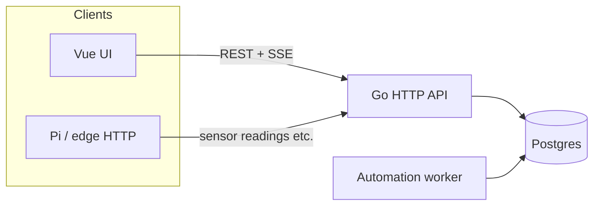

# Operator tour — how gr33n fits together

**Audience:** Farm operators and contributors who want a **single narrative** before clicking every screen. For install steps, use [local-operator-bootstrap.md](local-operator-bootstrap.md).

**UI routes** below match [`ui/src/router/index.js`](../ui/src/router/index.js). Navigation groups match [`ui/src/components/SideNav.vue`](../ui/src/components/SideNav.vue) (some layouts use a slimmer drawer — same destinations).

---

## 1. Start here: farm context

After login, the app works in the context of **one selected farm** (name, zones, devices, sensors). The dashboard header summarizes **zones · sensors · devices** and includes a short **How it all connects** help tip — same mental model as this doc.

If lists look empty, see [**Why is this empty?**](#4-why-is-this-empty-future-ux) below; detailed hints are tracked as separate UX work in the [sit-in workstream](workstreams/sit-in-operator-experience.md).

---

## 2. Narrative walk (recommended order)

Think **physical layout → signals → automation → work tracking → feeding**.

| Step | Where in the app | What you are doing |
|------|------------------|--------------------|
| **1. Farm home** | `/` Dashboard | Orient: counts, quick links to tasks / schedules / fertigation; optional widgets for today’s work and alerts. |
| **2. Zones** | `/zones`, `/zones/:id` | Define **grow areas** (rooms, benches, beds). Sensors and actuators are attached **to zones** (directly or via devices). Crop cycles and many logs hang off zones. |
| **3. Sensors & controls** | `/sensors`, `/sensors/:id`, `/actuators`, `/setpoints` | **Sensors** ingest readings (from Pi, gateways, or manual). **Actuators** are what automation turns on/off (valves, lights, pumps). **Setpoints** are **targets** (e.g. climate band) the product can compare to live readings — different from a raw sensor row. |
| **4. Schedules & rules** | `/schedules`, `/automation` | **Schedules** = time-based cadence (cron-like) tied to actions or fertigation windows. **Rules** (Automation) = conditions + actions (e.g. “if humidity low → open mist”). |
| **5. Tasks** | `/tasks` | Human **work items**: inspections, harvest prep, fixes — often the day-to-day spine (see sit-in “tasks-first”). |
| **6. Fertigation** | `/fertigation` | Programs, mixing logs, reservoirs, recipes — ties schedules + inventory-style inputs to delivery. |

**Around the edges (same session):** **Alerts** (`/alerts`), **Costs** (`/costs`), **Knowledge** (`/farm-knowledge` — farm-scoped RAG), **Plants / Animals / Aquaponics** when those modules matter, **Settings** / **Catalog** for account and reference data.

---

## 3. Data-flow diagram (browser, API, edge)

High level: the **dashboard** talks to the **Go API** with a JWT; optional **Pi / edge** clients send readings with an API key. **Postgres** holds farm data; an **automation worker** (started with the API process) advances schedules and rules against the same database.

**Reading path:** Hardware → (optional Pi / `gr33n_client.py`) → `POST` readings → API → `sensor_readings` (and related). The UI can subscribe to **SSE** live readings for the selected farm (`/farms/{id}/sensors/stream`) so charts update without polling everything.

**Actuation path:** Rules / schedules → worker + DB state → commands toward **actuators** (exact wiring depends on device integration — treat API + worker as the logical control plane).

---

## 4. “Why is this empty?” (future UX)

Empty lists usually mean one of: **no data yet**, **wrong farm selected**, **telemetry not reaching the API** (Pi down, URL/key wrong), **automation not configured**, or **setpoints vs live readings** confusion (setpoint without recent readings looks “dead”). The sit-in stream tracks **per-area inline hints** as **separate tickets**; this tour stays the **conceptual** map — update both when product copy lands.

---

## 5. Related docs

| Doc | Use |
|-----|-----|
| [local-operator-bootstrap.md](local-operator-bootstrap.md) | First-time env, DB, seed, URLs |
| [operator-troubleshooting.md](operator-troubleshooting.md) | 401 / empty farms / reading logs |
| [tasks-first-operator-guide.md](tasks-first-operator-guide.md) | Morning ops path, tasks vs automation rules, offline queue |
| [database-schema-overview.md](database-schema-overview.md) | Where major tables live |
| [workflow-guide.md](workflow-guide.md) | Deeper workflows (incl. Insert Commons, RAG pointers) |
| [sit-in-operator-experience.md](workstreams/sit-in-operator-experience.md) | Backlog: logging, tasks-first, empty-state UX |

---

*Introduced for sit-in §1 (single-page operator tour). Refine routes and copy as the UI evolves.*
