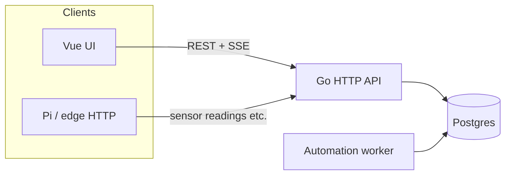

# Operator tour — how gr33n fits together

**Audience:** Farm operators and contributors who want a **single narrative** before clicking every screen. For install steps, use [local-operator-bootstrap.md](local-operator-bootstrap.md).

**UI routes** below match [`ui/src/router/index.js`](../ui/src/router/index.js). Navigation groups match [`ui/src/components/SideNav.vue`](../ui/src/components/SideNav.vue) (some layouts use a slimmer drawer — same destinations).

---

## 1. Start here: farm context

After login, the app works in the context of **one selected farm** (name, zones, devices, sensors). The dashboard header summarizes **zones · sensors · devices** and includes a short **How it all connects** help tip — same mental model as this doc. **In the UI**, **System → Guide** (`/operator-guide`) has the glossary and a clickable walk aligned with §2 below.

If lists look empty, see [**Why is this empty?**](#4-why-is-this-empty-future-ux) below; detailed hints are tracked as separate UX work in the [sit-in workstream](workstreams/sit-in-operator-experience.md).

---

## 2. Narrative walk (recommended order)

Think **physical layout → signals → automation → work tracking → feeding**.

| Step | Where in the app | What you are doing |
|------|------------------|--------------------|
| **1. Farm home** | `/` Dashboard | Orient: counts, quick links to tasks / schedules / fertigation; optional widgets for today’s work and alerts. |
| **2. Zones** | `/zones`, `/zones/:id` | Define **grow areas** (rooms, benches, beds). Sensors and actuators are attached **to zones** (directly or via devices). Crop cycles and many logs hang off zones. |
| **3. Sensors & controls** | `/sensors`, `/sensors/:id`, `/actuators`, `/setpoints` | **Sensors** ingest readings (from Pi, gateways, or manual). **Actuators** are what automation turns on/off (valves, lights, pumps). **Setpoints** are **targets** (e.g. climate band) the product can compare to live readings — different from a raw sensor row. |
| **4. Schedules & rules** | `/schedules`, `/automation` | **Schedules** = time-based cadence (cron-like) tied to actions or fertigation windows. **Rules** (Automation) = conditions + actions (e.g. “if humidity low → open mist”). |
| **5. Tasks** | `/tasks` | Human **work items**: inspections, harvest prep, fixes — often the day-to-day spine (see sit-in “tasks-first”). |
| **6. Fertigation** | `/fertigation` | Programs, mixing logs, reservoirs, recipes — ties schedules + inventory-style inputs to delivery. |
| **7. Guardian (optional AI)** | Drawer, `/chat`, `/guardian/requests`, `/alerts` | **Farm Guardian** — grounded Q&A + **change requests** (propose → Confirm). See [§6](#6-farm-guardian-change-requests-with-your-ok). |
| **7b. Zone photos (optional)** | `/zones/:id` | Reference / walkthrough photos per zone; Guardian sees them in the farm snapshot ([architecture §7.4](farm-guardian-architecture.md#74-zone-reference-photos-phase-30-ws5)). |

**Around the edges (same session):** **Alerts** (`/alerts`), **Costs** (`/costs`), **Knowledge** (`/farm-knowledge` — farm-scoped RAG), **Plants / Animals / Aquaponics** when those modules matter, **Settings** / **Catalog** for account and reference data.

---

## 3. Data-flow diagram (browser, API, edge)

High level: the **dashboard** talks to the **Go API** with a JWT; optional **Pi / edge** clients send readings with an API key. **Postgres** holds farm data; an **automation worker** (started with the API process) advances schedules and rules against the same database.

**Reading path:** Hardware → (optional Pi / `gr33n_client.py`) → `POST` readings → API → `sensor_readings` (and related). The UI can subscribe to **SSE** live readings for the selected farm (`/farms/{id}/sensors/stream`) so charts update without polling everything.

**Actuation path:** Rules / schedules → worker + DB state → commands toward **actuators** (exact wiring depends on device integration — treat API + worker as the logical control plane).

---

## 4. “Why is this empty?” (future UX)

Empty lists usually mean one of: **no data yet**, **wrong farm selected**, **telemetry not reaching the API** (Pi down, URL/key wrong), **automation not configured**, or **setpoints vs live readings** confusion (setpoint without recent readings looks “dead”). The sit-in stream tracks **per-area inline hints** as **separate tickets**; this tour stays the **conceptual** map — update both when product copy lands.

---

## 6. Farm Guardian change requests (with your OK)

**Requires:** `AI_ENABLED=true`, LLM configured ([`farm-guardian-ollama-setup.md`](farm-guardian-ollama-setup.md)), demo farm selected.

Guardian is **not autonomous**. It is a **copilot** in chat and an **actor** only after you **Confirm** a change request (like approving a pull request). **Automation rules and alerts** are a separate layer — they run without chat and are not Guardian PRs.

### Copilot vs actor vs automation

| Layer | You | System |
|-------|-----|--------|
| **Chat (copilot)** | Read answers, optional photos on zones | Guardian explains snapshot + RAG; may show proposal cards |
| **Confirm (actor)** | Tap **Confirm** on a card or inbox row | One frozen change: ack alert, create task, patch schedule, enqueue Pi command, … |
| **Rules (automation)** | Configure rules/schedules | Worker fires alerts or actuation on readings — no Confirm in chat |

Nothing in the database changes from Guardian until you **Confirm** (or you edit the dashboard directly). **Dismiss** or wait for expiry if a proposal is wrong.

### PR inbox workflow

1. Ask Guardian to do something (or accept a rule-assisted proposal, e.g. ack an alert).
2. A **proposal card** appears in the chat transcript (summary + risk tier + frozen args).
3. Review later: Guardian drawer → **Pending** tab, or **`/guardian/requests`** (TopBar badge shows count).
4. **Confirm** (needs **Operate** role) or **Dismiss**. High-risk cards (actuator, bootstrap, disable rule) deserve extra care.
5. Check the result (Alerts, Tasks, Devices) and optional audit `guardian_tool_executed`.

Full operator contract: [`farm-guardian-architecture.md` §8](farm-guardian-architecture.md#8-operator-expectations-at-phase-30-ship).

### What Confirm can do (Phase 32)

Includes everything from Phase 30 — alert ack/read, **create task**, cycle stage, schedule/program/rule patches, zone reference photos, **enqueue actuator command** — plus grow onboarding tools:

| Tool | Tier | What Confirm does |
|------|------|-------------------|
| `create_plant` | medium | Adds one plant catalog row |
| `create_crop_cycle` | medium | Starts an active cycle in a zone (fails if zone already busy) |
| `create_fertigation_program` | medium | Creates a fertigation program for a zone |
| `apply_grow_setup_pack` | **high** | One transaction: optional plant + cycle + program + optional monitor task |

**Guardian never silently adds plants.** Chat may show a setup-pack card; rows appear only after you **Confirm**. To do the same steps manually, use **Plants** (`/plants`), **Crop cycles**, and **Fertigation** without Guardian.

### 6b. Grow setup via Guardian (Phase 32)

**Requires:** demo or real farm with at least one **empty zone** (no active crop cycle), Guardian enabled, **Operate** role.

This walkthrough uses a house-plant example; the same flow works for commercial zones with different default program volumes.

1. **Create or pick a zone** — `/zones` → e.g. "Living Room" (indoor). Confirm the zone has **no active cycle** on the zone detail page.
2. **Open Guardian** — drawer (✨) or `/chat`; select the correct farm.
3. **Ask in plain language**, naming the plant and zone, e.g.  
   *"add my philodendron to Living Room with a light fertigation program"*
4. **Review the setup pack card** — numbered bundle: plant display name, zone, cycle stage, program EC/pH/volume, optional monitor task. **High-tier** warning: creates multiple records at once.
5. **Confirm** (or **Dismiss** if anything looks wrong). Viewers see the card but cannot Confirm.
6. **Verify after Confirm:**
   - **Plants** (`/plants`) — new catalog row
   - **Zone detail** — active crop cycle
   - **Fertigation** — new program; cycle may show linked primary program
   - **Tasks** — optional "Monitor new …" task
   - Audit log — `guardian_tool_executed` with `tool_id: apply_grow_setup_pack`

**When no card appears:** zone name not in the snapshot, zone already has an active cycle, plant name already on the farm, or the message did not match setup intent — ask Guardian to list zones/plants or use the manual UI.

**Bootstrap vs setup pack:** `apply_bootstrap_template` seeds a **blank farm** (admin only). The setup pack adds **one grow** to an existing zone — different tool, same Confirm discipline.

Architecture detail: [`farm-guardian-architecture.md` §7.6](farm-guardian-architecture.md#76-grow-setup-prs-phase-32).

### Vision and photos — what to expect

- **Zone photos (shipped):** upload on **Zone detail**; Guardian knows photos exist and can discuss walkthrough context.
- **Leaf/crop image analysis (optional, WS6):** set `LLM_VISION_MODEL` (e.g. `llava` on Ollama); attach zone photos in the Guardian drawer when asking from a zone; treat answers as **hypotheses**, not certified diagnosis. Prefer **create task** over silent config changes.

### Platform facts (what Guardian should say about itself)

On-prem gr33n, not a cloud subscription; Lite vs Full; LAN inference when configured; **Propose → Confirm** for writes. Operator mirror: [`farm-guardian-persona-platform-context.md`](farm-guardian-persona-platform-context.md).

### Suggested demo path

1. **Alerts** — seeded demo farm has unread alerts after `make dev-stack-fresh`.
2. **✨ Ask Guardian** on a humidity row (or open the drawer).
3. Ask to acknowledge the alert → **Confirm** the proposal card.
4. Open **`/guardian/requests`** or drawer **Pending** to see the inbox pattern.
5. Optional — **grow setup:** empty zone + *"add my philodendron to {zone} with a light fertigation program"* → review setup pack card → Confirm → check `/plants` and `/fertigation` ([§6b](#6b-grow-setup-via-guardian-phase-32)).
6. Optional: **Zones** → add a reference photo → ask Guardian about that zone.

Architecture: [`farm-guardian-architecture.md`](farm-guardian-architecture.md) §7–§8 · Platform doc RAG: `make rag-ingest-platform-docs` · Bootstrap: [`local-operator-bootstrap.md`](local-operator-bootstrap.md#guardian-ready-demo-after-seed) · Phase 32 grow setup: [`plans/phase_32_guardian_grow_setup_prs.plan.md`](plans/phase_32_guardian_grow_setup_prs.plan.md) · Pi validation: [`plans/phase_31_field_validation_and_edge.plan.md`](plans/phase_31_field_validation_and_edge.plan.md).

---

## 7. Related docs

| Doc | Use |
|-----|-----|
| [local-operator-bootstrap.md](local-operator-bootstrap.md) | First-time env, DB, seed, URLs, Guardian agent demo |
| [farm-guardian-architecture.md](farm-guardian-architecture.md) | Request flow, PR inbox, operator expectations (§8) |
| [farm-guardian-persona-platform-context.md](farm-guardian-persona-platform-context.md) | What Guardian is told about on-prem gr33n (WS9) |
| [plans/phase_32_guardian_grow_setup_prs.plan.md](plans/phase_32_guardian_grow_setup_prs.plan.md) | Grow setup PR bundle (Phase 32) |
| [plans/phase_31_field_validation_and_edge.plan.md](plans/phase_31_field_validation_and_edge.plan.md) | Pi / breadboard validation after actuator PRs |
| [audit-events-operator-playbook.md](audit-events-operator-playbook.md) | `guardian_tool_executed` after Confirm |
| [operator-troubleshooting.md](operator-troubleshooting.md) | 401 / empty farms / reading logs |
| [operator-logging-runbook.md](operator-logging-runbook.md) | Capture & retention for **`slog`** — Compose rotation, Loki sketch; **logs ≠ hypertable pruning** |
| [tasks-first-operator-guide.md](tasks-first-operator-guide.md) | Morning ops path, tasks vs automation rules, offline queue |
| [database-schema-overview.md](database-schema-overview.md) | Where major tables live |
| [workflow-guide.md](workflow-guide.md) | Deeper workflows (incl. Insert Commons, RAG pointers) |
| [sit-in-operator-experience.md](workstreams/sit-in-operator-experience.md) | Backlog: logging, tasks-first, empty-state UX |
| **In-app:** **System → Guide** (`/operator-guide`) | Phase 26 WS1 — glossary + suggested click path (offline-safe) |

---

*Introduced for sit-in §1 (single-page operator tour). Refine routes and copy as the UI evolves.*
