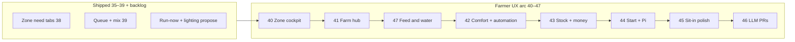

# Farmer UX roadmap — Phases 40–47

## Where we are now (2026-06)

| Status | Phases |
|--------|--------|
| **Shipped** | 40, 41, 47, 42, **43** (WS1–WS8) |
| **Next feature code** | **[44](phase_44_getting_started_edge_wizard.plan.md)** — Getting started + edge wizards |
| **Parallel infra** | **[48](phase_48_dev_seed_and_small_farm_profiles.plan.md)** — dev seed hygiene (recommended before 45 sit-in) |
| **Then** | 44 → 45 → 46 |

---

## Design rule (non-negotiable)

> **The UI is not the database.** Operators work in **jobs** (grow this room, feed today, fix humidity, restock, pay bills). The API already exposes the right tables; phases **compose** existing endpoints into farmer language — new schema only when a job truly cannot be expressed (rare).

| Layer | Farmer sees | Implementation |
|-------|-------------|----------------|
| **Jobs** | "Comfort band for humidity", "Lights on at 6am" | Vue views + aggregates |
| **API** | PATCH setpoints, POST schedules, Confirm tools | Unchanged contracts where possible |
| **DB** | `zone_setpoints`, `schedules`, … | Hidden behind copy and wizards |

---

## Where we are vs where we're going



**After 46 (not in this roadmap):** Tier D only — closed-loop EC dosing, vendor hardware buses, enterprise multi-site. See [pre_development_gaps_index](pre_development_gaps_index.plan.md) Tier D.

---

## How the site should feel (target state)

### Primary navigation (farmer mental model)

| Sidebar group | Farmer label (target) | What lives here |
|---------------|----------------------|-----------------|
| **Today** | Today | Dashboard morning cockpit (41), tasks due, alerts |
| **Grow** | My zones *(v2 — Phase 45; 47 shipped “My rooms”)* | Zones list → zone cockpit (40) — default entry |
| **Feed & water** | Feeding | Phase **47** room-first feeding plan; not six-tab Fertigation first ([phase_47](phase_47_feeding_water_plain_language.plan.md)) |
| **Comfort** | Targets & schedules | Phase 42 — bands + "what runs when" (replaces raw Setpoints/Schedules tour) |
| **Stock & costs** | Supplies & money | Phase 43 — inventory, recipes, receipts simplified |
| **Help** | Setup & devices | Phase 44 — farm wizard, Pi pairing |
| **Guardian** | Ask gr33n | Drawer + optional full chat; guided setup, not DB admin |
| **Advanced** | Power settings | Collapsed: raw Rules, cron editor, audit, org — for agronomist/IT |

Phase 40 **WS7** starts the shift (Grow-first nav); Phase 42 **renames and rehomes** Setpoints/Automation/Schedules content.

### Zone cockpit (Phase 40) — one room, one screen

```
Zones → Flower Room
├── Overview — Today strip (next run, alerts, devices, queue)
├── Water   — grow story, run now, pulse, mix preview
├── Light   — photoperiod summary, link to program
└── Climate — sensors, comfort band inline edit, GH rules summary
```

No card should say "add under **Setpoints**" after 40 WS2. Raw `/setpoints` becomes **Advanced → Comfort bands (farm-wide)** after 42.

### Setpoints today vs target (why 42 exists)

| Today (rough) | Target (42) |
|---------------|-------------|
| Table of `zone_setpoints` rows | **"How comfortable should this room be?"** per need (humidity, temp, …) |
| `min` / `ideal` / `max` without context | Slider or three plain fields + **"too dry / just right / too wet"** labels |
| Stage + zone + cycle scope confusion | **"Uses veg stage target"** chip tied to active crop cycle |
| Rules reference setpoint keys | Rule card: **"Alert when humidity leaves comfort band"** |

Phase 40 inline edit is the **wedge**; Phase 42 **owns the full comfort-target experience** and demotes the admin table.

---

## Phase map (canonical order)

| Phase | Name | Outcome for farmers | Plan |
|-------|------|---------------------|------|
| **40** | Zone cockpit | Daily grow in the room — targets, alerts, today, water story (wedge) | [phase_40](phase_40_unified_farmer_ux_zone_cockpit.plan.md) |
| **41** | Farm hub | Morning dashboard, `?zone_id=`, why-empty hints | [phase_41](phase_41_farm_hub_coherence.plan.md) |
| **47** | Feeding & water | One job: how this room gets water — plan, last/next feed, no fertigation console | [phase_47](phase_47_feeding_water_plain_language.plan.md) |
| **42** | Comfort & automation | Understandable targets; schedules/rules without cron literacy | [phase_42](phase_42_comfort_targets_automation_plain_language.plan.md) |
| **43** | Operations hub | Stock, recipes, feeding admin, receipts — not NF schema tour | [phase_43](phase_43_operations_stock_feeding_finance.plan.md) |
| **44** | Getting started & edge | New farm wizard; Pi install in-app; Guardian setup paths | [phase_44](phase_44_getting_started_edge_wizard.plan.md) |
| **45** | Validation & polish | Real farmer sit-in fixes; mobile checklist; copy pass v2 | [phase_45](phase_45_farmer_validation_whole_app_polish.plan.md) |
| **46** | LLM tool proposals | Hybrid C: matchers first; validated LLM proposal on miss — **not** starter chips | [phase_46](phase_46_guardian_llm_tool_proposals.plan.md) |

**Start Phase 40 only after** [Pre–Phase 40 gate](phase_35_37_operational_closure.plan.md#prephase-40-gate-start-feature-work-only-when-these-are-green) is green — including Guardian PR docs ([guide](../guardian-change-requests-guide.md), [PR UX plan](guardian_pr_ux_through_farmer_phases.plan.md)). **Do not** wait for 42–47 to start 40 — they follow in order. **Recommended:** ship **47** soon after **41** so Water tab completes before comfort (42).

**Vocabulary:** [farmer-vocabulary.md](../farmer-vocabulary.md) — enforced in Phase 47 WS5; **Vocabulary v2 (zones not rooms)** in Phase 45 WS3; sit-in validation in Phase 45.

---

## What 40–41 deliberately defer (now scheduled in 42–45)

| Former "out of scope" | Owning phase |
|----------------------|--------------|
| Replace Advanced CRUD (`/setpoints`, `/automation`, `/schedules`) | **42** (farmer routes + plain language; Advanced keeps escape hatch) |
| Inventory / recipes / costs / org / audit as separate "apps" | **43** (operations hub); org/audit stay Advanced |
| Fertigation six-tab console as daily UI | **47** (feeding plan on zone Water + Feeding hub) |
| First-time farm setup wizard | **44** (extends Phase 15 bootstrap UI) |
| Pi / device install in-app | **44** |
| Guardian as only UI | **Not a goal** — **44** adds guided flows; Confirm stays for writes |
| Mobile store polish | **45** (execute [mobile-distribution.md](../mobile-distribution.md)) |
| Animals / aquaponics full journeys | **45** WS4 shells + sit-in backlog, or post-45 |
| Closed-loop dosing, vendor hardware, enterprise | **Tier D** — no phase in 40–47 |

---

## Guardian change requests (PRs) — read before Phase 40 code

Guardian **proposals** are not Git PRs — they are **Confirm-gated change requests**. Today they are opened by **rule-assisted matchers** after you send a chat message, not by the LLM silently.

| Doc | Use |
|-----|-----|
| [guardian-change-requests-guide.md](../guardian-change-requests-guide.md) | Operator + industry patterns + inbox flow |
| [guardian_pr_ux_through_farmer_phases.plan.md](guardian_pr_ux_through_farmer_phases.plan.md) | Starters + matchers per phase 40–46 |
| [phase_44_guardian_pr_spec.md](phase_44_guardian_pr_spec.md) | Wizards first; setup starters |
| [phase_45_guardian_pr_spec.md](phase_45_guardian_pr_spec.md) | Sit-in PR paths |
| [farmer-sit-in-protocol.md](../workstreams/farmer-sit-in-protocol.md) | Phase 45 validation script |
| [phase_47_feeding_water_plain_language.plan.md](phase_47_feeding_water_plain_language.plan.md) | Feeding & water — ties arc for growers |
| [farmer-vocabulary.md](../farmer-vocabulary.md) | Language contract (47 WS5, 45 sit-in) |

**UX rule for 40+:** Zone **inline** actions (ack alert, edit band, run now) beat PRs for the same job. Starters are shortcuts to **send chat**, not auto-approvals.

---

## Cross-cutting workstreams (every phase)

| Workstream | Applies to |
|------------|------------|
| **Plain language** | [farmer-vocabulary.md](../farmer-vocabulary.md); no schema words on grow routes |
| **Guardian PR boundaries** | [guardian_pr_ux_through_farmer_phases.plan.md](guardian_pr_ux_through_farmer_phases.plan.md) |
| **Why-empty** | Started 41 WS4; rolled to every list in 43–45 |
| **API-first UI** | New screens = compose existing handlers; document new aggregates only if N+1 |
| **operator-tour + architecture** | Each phase WS8 / OC row in [closure doc](phase_35_37_operational_closure.plan.md) |
| **Vitest + smokes** | Farmer flows, not only CRUD |
| **Guardian alignment** | Tool + persona doc when a phase adds a farmer job |

---

## Suggested calendar (indicative)

| Phase | Rough size | Depends on |
|-------|------------|------------|
| 40 | Medium | 38, 39, 39b ✅ |
| 41 | Medium | 40 |
| 47 | Medium–large | 40 WS5, 41 |
| 42 | Medium–large | 40 WS2 wedge |
| 43 | Large | 41, 47 feeding hub links |
| 44 | Medium | 15 bootstrap API ✅ |
| 45 | Medium + sit-in week | 40–44 shipped |

Total **~8 feature phases** after 39 for "farmer-grade whole app" v1 (40–47) including **46** for Guardian NL→PR — not including Tier D engineering.

### Dev hygiene track (parallel — Phase 48)

Not farmer-facing UI. Run **in parallel** with 43–46; **complete before Phase 45 sit-in** if possible.

| Phase | Name | Outcome |
|-------|------|---------|
| **48** | Dev seed & small farm profiles | Idempotent seed, `small_indoor` vs `demo_showcase`, reset script, optional Timescale retention |

Plan: [phase_48_dev_seed_and_small_farm_profiles.plan.md](phase_48_dev_seed_and_small_farm_profiles.plan.md) · Closure: **OC-48**

---

## Related

| Doc | Use |
|-----|-----|
| [pre_development_gaps_index.plan.md](pre_development_gaps_index.plan.md) | Gap IDs → phase links (update Tier A to A2–A6) |
| [phase_35_37_operational_closure.plan.md](phase_35_37_operational_closure.plan.md) | OC-40 … OC-48 trackers |
| [sit-in-operator-experience.md](../workstreams/sit-in-operator-experience.md) | Feeds 45 |
| [phase_15_farm_onboarding.plan.md](phase_15_farm_onboarding.plan.md) | Bootstrap API — 44 surfaces it |
| [phase_20_6_stage_scoped_setpoints.plan.md](phase_20_6_stage_scoped_setpoints.plan.md) | Underlying setpoint model — 42 reframes UI |

---

## Using this in a new chat

> Read `docs/plans/farmer_ux_roadmap_40_plus.plan.md` and `docs/farmer-vocabulary.md` first. Implement only the phase named in the prompt (40–47). Do not add schema unless the phase plan explicitly allows it. Prefer farmer job language over table names.
