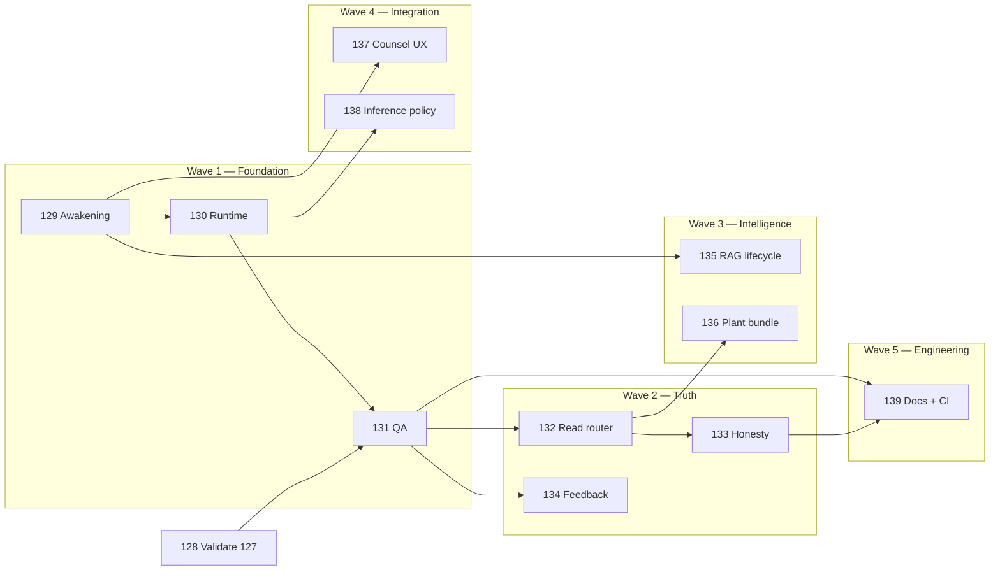

# Guardian next-level roadmap — Phases 129–139

**Status:** **Shipped** (129–139 complete; see [closure checklist](phase-129-139-closure.md))

**Prerequisite:** Phases 27–127 shipped (chat, RAG, read tools, morning walkthrough, field guides).

---

## The arc in one line

> **Boot reliably (129–131) → answer truthfully (132–134) → know the farm deeply (135–136) → feel integrated everywhere (137–138) → maintain confidently (139).**

---

## Phase map

| Phase | Name | Priority | One job |
|-------|------|----------|---------|
| [128](phase_128_validate_phase127_guardian.plan.md) | Validate 127 | — | Device/fertigation fixtures + manual UI (run after 130) |
| [129](phase_129_guardian_awakening.plan.md) | Awakening | P0 | Login-and-go; mode cards; warmup; tune script |
| [130](phase_130_guardian_runtime_orchestration.plan.md) | Runtime | P0 | Timeouts, embed unload, SSE phases, busy lock |
| [131](phase_131_guardian_qa_harness.plan.md) | QA harness | P0 | Smoke prompts, recorded answers, manual parity |
| [132](phase_132_guardian_read_tool_router.plan.md) | Read-tool router | P0 | Stop missing data; walkthrough → proposals |
| [133](phase_133_guardian_answer_grounding_honesty.plan.md) | Answer honesty | P0 | Source labels, trim banner, citation trust |
| [134](phase_134_guardian_answer_feedback.plan.md) | Feedback loop | P0 | Thumbs + reasons; agronomy review path |
| [135](phase_135_guardian_rag_lifecycle.plan.md) | RAG lifecycle | P1 | Freshness, re-ingest UX, Settings corpus card |
| [136](phase_136_guardian_plant_context_bundle.plan.md) | Plant context | P1 | Phase 82 WS7 — fused grow block |
| [137](phase_137_guardian_counsel_integration.plan.md) | Counsel integration | P1 | Nudges, vision, offline field mode |
| [138](phase_138_guardian_inference_policy.plan.md) | Inference policy | P2 | Split hosts, counsel/quick models, cost hint |
| [139](phase_139_guardian_docs_and_engineering.plan.md) | Docs & engineering | P2/P3 | Architecture profiles, turn debugger, nightly CI |

---

## Dependency graph

---

## Waves & ship order

### Wave 1 — Foundation (laptop unblocked)

**129 + 130 + 131** — ship together or 130 WS1–2 immediately after 129 WS3.

Exit: `make guardian-qa-smoke` passes; morning walkthrough completes without CLI rituals.

### Wave 2 — Truth (Guardian feels smart)

**132 → 133 → 134** — can parallelize 133/134 after 132 core router.

Exit: smoke prompts pass with log evidence; operators see source labels and trim warnings; feedback stored.

### Wave 3 — Intelligence (deep farm knowledge)

**135 + 136** — 135 pairs with 129 Settings; 136 extends 132 read tools.

Exit: Settings shows corpus age; grow questions get `plant_context_bundle`.

### Wave 4 — Integration & scale

**137 + 138** — product polish and server farms.

Exit: nudge → Farm counsel + warm; split Ollama health; farm counsel/quick model settings.

### Wave 5 — Engineering closure

**139** — docs + debugger + optional nightly smoke.

Exit: architecture doc matches laptop + server; dev turn inspector; CI doc for self-hosted QA.

---

## What each wave fixes in the leaky diagram

| Layer | Phases |
|-------|--------|
| Before first SSE byte invisible | 130 WS3, 129 WS4 |
| Regex read tools miss | **132** |
| Embed + chat fight | **130** WS2 |
| Stale RAG invisible | **135** |
| Silent trim | **133** |
| No feedback | **134**, **131** |
| Cold / timeout | **129**, **130** |

---

## Phase 82 / 73 / 61 carryover

| Deferred item | Absorbed into |
|---------------|---------------|
| Phase 82 WS7 `plant_context_bundle` | **136** |
| Phase 73 read-tool reliability | **132** |
| Phase 61 nudges → counsel | **137** |
| Phase 126 embed auto-unload | **130** |
| Phase 122 eval gaps | **131**, **139** |

---

## Acceptance (roadmap complete)

- [x] Laptop: login → Farm counsel → morning walkthrough → answer with sources cited
- [x] `make guardian-qa-smoke` green on phi3 CPU (recorded JSON archived)
- [x] No manual `ollama stop` in operator bootstrap doc
- [x] Settings: corpus freshness + re-ingest + readiness + last QA run
- [x] Server profile: split embed/chat health documented and tested
- [x] `farm-guardian-architecture.md` leads with Profile A + D, not 70B-only

---

## Related docs to update on completion

- [local-operator-bootstrap.md](../local-operator-bootstrap.md)
- [farm-guardian-architecture.md](../farm-guardian-architecture.md)
- [guardian-ollama-laptop-playbook.md](../guardian-ollama-laptop-playbook.md)
- [connectivity-requirements.md](../connectivity-requirements.md)
- [recommended-hardware-and-sizing.md](../recommended-hardware-and-sizing.md)
