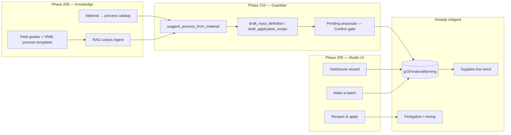

# Natural farming studio — Phases 207–211

**Status:** planned · **Depends on:** Phase 205–206 (test baseline + plans archive) · **No code in this thread**

## North star

> A grower who knows bottles and EC can open **Natural farming**, see what their
> biomass can become, make a batch with plain steps, apply it to a zone or livestock
> paddock — and Guardian can suggest the same path when they ask in chat
> ("I'm keeping goldenrod for dyes — can I use it for the cherry tree?").

## What already exists (do not rebuild)

| Layer | Today | Location |
|-------|-------|----------|
| **Schema** | `input_definitions`, `input_batches`, `application_recipes`, `recipe_input_components` | `gr33nnaturalfarming` in [`db/schema/gr33n-schema-v2-FINAL.sql`](../db/schema/gr33n-schema-v2-FINAL.sql) |
| **API** | Full CRUD for inputs, batches, recipes, components | [`internal/handler/naturalfarming/`](../internal/handler/naturalfarming/) |
| **Ops** | Mixing events debit NF batches; low-stock alerts; animal_feed category | [`docs/workflow-guide.md`](../workflow-guide.md) § fertigation + supplies |
| **Bootstrap** | `jadam_indoor_photoperiod_v1` seeds JMS/JLF/FFJ/WCA demo rows | OpenAPI + `db/migrations/20260423_farm_bootstrap_templates.sql` |
| **Recipe canon (seed)** | **15 input definitions + 14 application recipes** in `master_seed.sql` — Cho 2016 sourced; **needs JMS dilution audit** (see Phase 208 WS0) | [`db/seeds/master_seed.sql`](../db/seeds/master_seed.sql) |
| **UI (buried)** | Definitions / batches / recipes editor | [`ui/src/views/Inventory.vue`](../ui/src/views/Inventory.vue) under **Money → Inventory & recipes** |
| **Feeding link** | Programs and mixing can reference `application_recipe_id` / `input_batch_id` | [`ui/src/views/Fertigation.vue`](../ui/src/views/Fertigation.vue) |
| **Guardian writes** | `apply_bootstrap_template` only for JADAM starter pack | [`internal/farmguardian/tools/registry.go`](../internal/farmguardian/tools/registry.go) |
| **Guardian reads** | Low stock, fertigation summary, plants list — **no** process/material catalog | [`internal/farmguardian/readtools.go`](../internal/farmguardian/readtools.go) |

**Gap:** no bridge from "I grow goldenrod" / "I run a 1.8 EC veg program" to "here's a JLF batch + drench recipe for your cherry understory."

## Locked phase order

| Phase | Plan | One-line goal |
|-------|------|----------------|
| **207** | *This roadmap* | Arc overview, sidebar placement, smoke safety rules |
| **208** | [Process & material knowledge](phase_208_natural_farming_process_knowledge.plan.md) | Structured catalog: plant/animal material → process type (JLF, FFJ, JMS, livestock feed, …) + RAG |
| **209** | [Natural farming studio UI](phase_209_natural_farming_studio_ui.plan.md) | Dedicated sidebar workspace + switchover wizard + make batch + apply |
| **210** | [Guardian integration](phase_210_natural_farming_guardian_integration.plan.md) | Read tools, write proposals, **additive** regression fixture — smoke suite unchanged |
| **211** | [Switchover & Commons packs](phase_211_natural_farming_switchover_commons.plan.md) | EC-program mapping packs, importable recipe packs, livestock feed use cases |

**Execute 208 → 209 → 210 → 211** (207 is planning only). 208 lets Guardian *read* goldenrod→JLF before the studio ships. 209 gives operators the workspace. 210 connects chat to proposals. 211 closes the Mericle-style switchover story with importable packs.

## Sidebar placement (recommendation)

Natural farming is **not** a Money sub-tab — it's an operational workflow (make → ferment → apply), not ledger/stock accounting.

```
Grow & operate
  ├── My zones
  ├── Feed & water          ← commercial EC / programs stay here
  ├── Natural farming   🧪  ← NEW (Phase 209)
  ├── Comfort & automation
  ├── Wiring
  └── Money                   ← supplies on-hand + unit costs; deep-link back
```

- **Route:** `/natural-farming`
- **Label:** `Natural farming` (matches API module name + [`terminology-guideline.md`](../terminology-guideline.md))
- **Absorb:** `/inventory` → `/natural-farming?tab=inventory` (legacy Inventory.vue moves here)
- **Mobile:** not in bottom nav v1 — link from Feed & water + Today low-stock chips

## Goldenrod / cherry — the bar we're aiming for

**Smoke test today** (`smoke-cherry-forest`, farm context **off**):

```11:11:internal/farmguardian/eval/fixtures_smoke.go
			Prompt: "I have a cherry tree with plants growing under it — I want this forest garden situation but I think the Canadian goldenrod is not good; I'll use it for dyes but maybe I need to get rid of it now. The blackberries would be nice if they could stay; they have thorns.",
```

Pass criteria today: answer > 80 chars, mentions cherry **or** goldenrod **or** blackberry.

**Target counsel (Phase 210+ regression, not smoke v1):**

> "You're keeping goldenrod for dyes — that biomass can also become JLF using the standard weed-and-grass method (Cho). Start at 1:100 dilution for your cherry understory. Want me to draft a recipe?"

Requires: process catalog (208), optional farm plant awareness (210 read tools), proposal tools (210 writes).

### Smoke test safety (hard rule)

**Do not change `SmokeFixtures()` or `smoke-cherry-forest` scoring while smoke runs are in flight.**

- Phase 210 adds **`regression-cherry-goldenrod-jlf`** to `RegressionFixtures()` / `make guardian-qa-regression` only.
- Promote to smoke tier only after regression passes consistently on CPU + GPU paths.
- Existing four-step smoke order stays identical ([`phase_131`](../plans/archive/phase_131_guardian_qa_harness.plan.md)).

## Architecture sketch



## Explicit non-goals (v1 arc)

| Out of scope | Why / when |
|--------------|------------|
| Full livestock ration formulation | Phase 210 may cover simple feed inputs; not TMR balancing |
| Auto-ferment scheduling from IoT sensors | Batch status is manual; no pH probe → "ready" automation |
| Replacing Commons crop catalog | Recipe **packs** import via Commons in 211 |
| Schema rewrite of `gr33nnaturalfarming` | Tables are sufficient; add catalog tables only if YAML ceiling hit |
| Inventing recipe ratios not in seed or Cho 2016 | Phase 208 WS0 audit + `source_tier` on every catalog entry |
| Moving commercial fertigation out of Feed & water | Parallel paths — switchover wizard maps between them |

## Verification (full arc)

```bash
# Backend
go test ./internal/handler/naturalfarming/... ./internal/farmguardian/...

# UI closure (one per phase when shipped)
npm --prefix ui test -- --run src/__tests__/phase-208-closure.test.js
npm --prefix ui test -- --run src/__tests__/phase-209-closure.test.js

# Guardian — smoke unchanged; new regression only
make guardian-qa-smoke          # must still pass 4/4 with old cherry criteria
make guardian-qa-regression     # includes regression-cherry-goldenrod-jlf after 209
```

## Docs touchpoints (each phase)

- Own `phase_NNN_*.plan.md`
- § in [`operator-tour.md`](../operator-tour.md) (new § Natural farming studio)
- Row in [`current-state.md`](../current-state.md)
- [`farm-guardian-architecture.md`](../farm-guardian-architecture.md) § tools when 210 ships
- Field guide manifest in [`docs/field-guides/README.md`](../field-guides/README.md) when 208 ships
- Recipe audit log: `docs/field-guides/procedures/recipe-audit-log.md` when 208 WS0 ships

## Handoff checklist (paste into new chat)

1. Read [207 roadmap](phase_207_natural_farming_studio.plan.md) then start **208**
2. **208 WS0 first** — fix JMS dilution drift in seed before writing guides
3. Recipe canon = [`master_seed.sql`](../../db/seeds/master_seed.sql) (15 inputs, 14 application recipes)
4. Goldenrod = **extension** (JLF general method), not a Cho-named recipe
5. **Do not touch** smoke fixtures until 211 optional promotion
6. Every guide needs: ingredients, steps, timeline, ready signs, dilution, safety, `reference_source`

## Handoff context (prior chat)

- Today UI, crop picker, router fixes — unrelated; keep that work out of this arc.
- Rice catalog, `/automation` route fix — no dependency.
- Prior spec source: operator switching from Mericle-style EC to ferments/drenches; Guardian should propose recipes from on-farm materials; all plant/animal goods may become process goods (human food, livestock feed, fertigation inputs).
