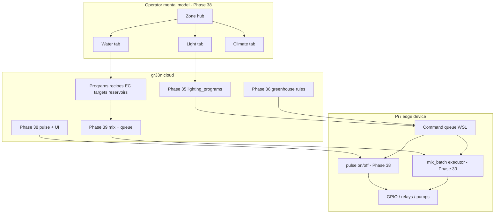

# Phase 39 — Edge fertigation execution (mix jobs + command queue)

## Status

**Phase 39 complete (WS1–WS8).** Depends on Phases **22**, **35**, **38**. Manual **`POST …/mixing-events`** remains for labs without hardware; edge path automates the same audit trail when a Pi and pumps exist.

---

## Why this phase

| Today | Gap |
|-------|-----|
| Fertigation **programs** fire `control_actuator` + log events | Pi only gets **one instant or pulse** GPIO command |
| **Mixing events** are operator-entered in the UI | No **recipe → ml/pump-seconds** math pushed to the edge |
| `devices.config.pending_command` is a **single JSON slot** | Schedule + rule + program + operator **overwrite** each other (**last write wins**) |
| `run_duration_seconds` on programs (Phase 38) | Helps **irrigation pump** pulse only — not multi-input dosing |

**Lighting (Phase 35):** one ON and one OFF per day — single-slot `pending_command` was tolerable. **Fertigation mixing** needs **several steps** (nutrient A, B, stir, verify EC, then zone pump). That requires a **queue** and a **`mix_batch`** command type.

**Phase 38 did not fix last-write-wins.** Phase **39 WS1** does.

---

## Plant environment stack (phases 35–39)

How the grow-stack plans fit together for operators and edge devices:



| Need | Phase | Edge behavior |
|------|-------|----------------|
| **Light** | 35 (+ 38 UI) | Cron → `control_actuator` on/off → **queue** (39) → GPIO |
| **Climate** | 36 (+ 38 UI) | Rules → deploy/retract, fans → **queue** (39) → GPIO |
| **Water / feed** | 22 fertigation + **39** | Program → **mix_batch** (recipe math) → **pulse** irrigate → events |
| **Plain RO/well** | **[Phase 39b](phase_39b_plain_irrigation.plan.md)** | `irrigation_only` program type — pulse without mix (no EC math) |
| **Operator visibility** | 38 | Zone tabs; 39 adds live queue + mix plan on Water tab |

**Phase 37** (Guardian field assistant) complements **install**; 39 complements **runtime** mix/irrigate.

---

## Design principles

1. **Cloud owns the recipe math** — Pi runs **steps** (channel, seconds, order), not dilution algebra. Inputs: `application_recipe` + components, `ec_targets`, reservoir **base EC/pH/volume**, optional live sensor reading.
2. **FIFO command queue per device** — every writer (`worker`, `POST /actuators/{id}/command`, Guardian Confirm) **appends**; Pi **acks** and dequeues. Deprecate overwriting `pending_command` (keep key as **mirror of queue head** for one release if needed).
3. **Thin new command types** — `pulse` (Phase 38 shape), `actuator` (instant on/off/deploy), `mix_batch` (structured steps). Extensible JSON `command_type` field.
4. **Same audit tables** — automated mix completes with `POST` mixing-event (+ components) and fertigation-event; links `mixing_event_id` on apply.
5. **Simulation first** — worker can dequeue in simulation without GPIO; smokes assert queue + plan JSON without hardware.
6. **Plain-water irrigation** — **[Phase 39b](phase_39b_plain_irrigation.plan.md)** after WS1; worm casting / new inputs remain inventory rows.

---

## Architecture

```
Program schedule fires (worker runProgramTick)
   │
   ├─► [optional] Enqueue mix_batch
   │      payload: { reservoir_id, target_ec, base_ec, volume_l, steps: [{channel, seconds, input_id}] }
   │      source: program_id + schedule_id
   │
   └─► Enqueue pulse (irrigation pump)
          payload: { actuator_id, command: on, duration_seconds: program.run_duration_seconds }

Pi poll GET /devices/{id}/commands/next  (or GET /farms/{id}/devices with queue_head)
   │
   ├─ mix_batch → run steps sequentially on GPIO map
   │              → POST /farms/{id}/fertigation/mixing-events (automated)
   │              → PATCH reservoir EC if sensor present
   │
   └─ pulse / actuator → existing ActuatorController (Phase 38)
   │
   ACK DELETE or POST …/commands/{id}/ack → next command
```

---

## WS1 — Device command queue (fixes last-write-wins)

**Goal:** Safe concurrent automation + operator + Guardian enqueue.

**Problem today:** [`SetDevicePendingCommand`](../../db/queries/devices.sql) does `jsonb_set(config, '{pending_command}', …)` — one slot per device.

**Proposed schema (v1):**

Table `gr33ncore.device_commands`:

| Column | Purpose |
|--------|---------|
| `id` | PK |
| `device_id` | FK devices |
| `farm_id` | denorm for auth |
| `sequence` | monotonic per device (or `created_at` ordering) |
| `command_type` | `actuator` \| `pulse` \| `mix_batch` |
| `payload` | JSONB (full command body + provenance) |
| `status` | `pending` \| `in_progress` \| `completed` \| `failed` \| `cancelled` |
| `source` | operator \| schedule \| rule \| program \| guardian |
| `schedule_id`, `rule_id`, `program_id`, `actuator_id` | nullable provenance |
| `created_at`, `started_at`, `completed_at` | audit |

**API:**

- `POST /devices/{id}/commands` — enqueue (replaces direct overwrite for new clients)
- `GET /devices/{id}/commands/next` — Pi-key: head pending row (mark `in_progress`)
- `POST /devices/{id}/commands/{cid}/ack` — Pi-key: complete / fail + optional result JSON
- `GET /devices/{id}/commands?status=pending` — operator debug (JWT)

**Migration path:**

1. New table + queries (sqlc).
2. Refactor [`SetDevicePendingCommand`](../../internal/handler/actuator/command.go) callers to `EnqueueDeviceCommand` (worker, Guardian, actuator handler).
3. Keep writing `config.pending_command` = **head payload** for **one release** backward compat with old Pi client; Pi 2.0 prefers `/commands/next`.
4. [`pi_client/gr33n_client.py`](../../pi_client/gr33n_client.py) `_schedule_loop` → drain queue until empty or one per poll (configurable).

**Acceptance:** Enqueue pulse then mix_batch then actuator — Pi executes **three** steps in order; no lost commands when worker and operator write within same 30s tick.

**This WS answers: “Will Phase 39 fix last-write-wins?” — Yes, when WS1 ships.**

---

## WS2 — Mix dose calculator (cloud)

**Goal:** Given “what solution + concentration + base reservoir EC + target EC”, produce a **mix plan** the Pi can run.

**Inputs (existing tables):**

- `gr33nnaturalfarming.application_recipes` + `recipe_input_components`
- `gr33nfertigation.ec_targets`
- `gr33nfertigation.fertigation_reservoirs` (+ optional latest sensor reading for EC/pH)
- Program: `application_recipe_id`, `ec_target_id`, `total_volume_liters`, `dilution_ratio`

**Output:** `MixPlan` struct:

```json
{
  "reservoir_id": 3,
  "water_volume_liters": 95,
  "water_ec_mscm": 0.2,
  "target_ec_mscm": 1.6,
  "steps": [
    { "step": 1, "input_definition_id": 12, "channel": 2, "run_seconds": 8, "notes": "JLF 1:500" }
  ],
  "estimated_final_ec_mscm": 1.55
}
```

**Tasks:**

1. Package `internal/fertigation/mixplan` — pure Go calculator; unit tests with JADAM-style dilution strings from seed.
2. v1 scope: **volume-based** component lines from recipe; EC delta heuristic or lookup table (document limitations).
3. v2 (defer): closed-loop “dose until EC reading ≥ target” on Pi with sensor feedback.

**Acceptance:** Unit test: Veg program + reservoir 0.2 mS/cm base + target 1.6 → non-empty `steps[]` with positive `run_seconds`.

---

## WS3 — `mix_batch` command type

**Goal:** Wire calculator → queue.

**Tasks:**

1. `command_type: mix_batch` payload embeds `MixPlan` + `mixing_event_draft` metadata.
2. `POST /farms/{id}/fertigation/mix-jobs` (or `POST /reservoirs/{id}/enqueue-mix`) — operator/Guradian preview + enqueue.
3. Program tick: if program has `application_recipe_id` + reservoir, enqueue `mix_batch` **before** irrigate action (WS5).
4. OpenAPI + validation: refuse mix if reservoir missing base EC (WS6).

**Acceptance:** HTTP enqueue returns `command_id`; Pi poll receives `mix_batch` with ordered steps.

---

## WS4 — Pi mix executor

**Goal:** Run multi-step mix on hardware.

**Tasks:**

1. Extend Pi config: `mix_channels[]` mapping `input_definition_id` or channel index → GPIO / pump.
2. Executor runs steps sequentially; honors per-step `run_seconds` (reuse pulse timer pattern from Phase 38).
3. On success: `POST /farms/{id}/fertigation/mixing-events` with components + measured EC if available.
4. On failure: `ack` with `failed` + reason; optional alert.

**Acceptance:** Simulated config runs 2-step mix in integration test; DB has mixing_event row linked to program.

---

## WS5 — Program pipeline (worker)

**Goal:** One program fire = ordered cloud enqueue, not three competing `pending_command` writes.

**Tasks:**

1. Update [`dispatchProgramActuator`](../../internal/automation/program_tick.go) to use **queue** (WS1).
2. New `dispatchProgramMix` when recipe + reservoir present — runs calculator (WS2), enqueues `mix_batch`.
3. Ordering: **mix_batch** (if any) → **pulse** irrigate → optional `update_record` fertigation_event (existing).
4. Idempotency: same-minute program fire must not duplicate queue rows (reuse `automation_runs` key).

**Acceptance:** Smoke: program tick enqueues 2 commands; Pi contract test drains in order.

---

## WS6 — Reservoir snapshot (base EC)

**Goal:** Calculator always has “base EC for reservoir.”

**Tasks:**

1. Fields on reservoir or `meta_data`: `last_measured_ec_mscm`, `last_measured_ph`, `last_measured_at` (may exist — verify and document).
2. Operator UI: “Set base water EC” on reservoir card; Guardian read tool `summarize_reservoir_mix_context`.
3. Block automated mix enqueue if base EC unknown unless operator override flag.

**Acceptance:** Enqueue mix without base EC returns 400 with plain-language error.

---

## WS7 — Zone Water tab (Phase 38 extension)

**Goal:** Surface queue + mix plan where farmers already look (Phase 38 Water tab).

**Tasks:**

1. Show pending command count for zone devices.
2. “Preview mix” button → calls mix calculator (read-only) before Confirm/enqueue.
3. Last mixing event + “met EC target?” badge.

**Acceptance:** Zone Water tab shows plan preview for active program without visiting Advanced pages.

---

## WS8 — Docs, tests, seed (OC-39)

| Layer | Artifacts |
|-------|-----------|
| **Docs** | `pi-integration-guide.md` (queue + mix_batch); `workflow-guide.md` §4 automated vs manual mix; operator-tour §4a extension |
| **OpenAPI** | `/devices/{id}/commands/*`, `MixPlan`, `mix_batch` payload |
| **Smokes** | `smoke_phase39_command_queue_test.go`, `smoke_phase39_mix_plan_test.go` |
| **Seed** | Optional: demo reservoir base EC + program with 2-step recipe; **no breaking change** to existing seed rows |
| **RAG** | platform-doc-manifest Phase 39 sections (OC-39E in closure doc) |

**Seed / schema note:** WS1 **does** add a migration (`device_commands` table). Phase 38 intentionally avoided schema changes; 39 is the first schema touch for edge execution. Existing seed continues to work; new columns/tables are additive.

---

## Out of scope (v1)

- Repeat/interval pulse trains (irigation “pulse every 5 min for 1h”) — defer
- Closed-loop EC dosing with inline sensor (v2 in WS2 note)
- Peristaltic vendor protocols (Modbus) — map to `channel` + seconds in v1
- Plain-water-only programs — **[Phase 39b](phase_39b_plain_irrigation.plan.md)** (`irrigation_only` flag; separate `irrigation_program` table deferred)
- CO₂ / cooling pad / weather API
- Replacing manual mixing UI — manual path stays for labs without edge hardware
- **Unified zone cockpit** (inline setpoints, zone alerts, today's schedule) — **[Phase 40](phase_40_unified_farmer_ux_zone_cockpit.plan.md)**

---

## Recommended order

WS1 → WS2 → WS3 → WS6 → WS5 → WS4 → WS7 → WS8

Queue first (unblocks safe multi-step). Calculator before Pi executor. Worker pipeline after enqueue API exists.

---

## Definition of done

- [x] `device_commands` queue; no silent overwrites of concurrent automation
- [x] Mix plan from recipe + base EC + target EC
- [x] `mix_batch` enqueued by program tick and operator API
- [x] Pi drains queue; mixing_event written on completion
- [x] Phase 38 pulse remains valid as queued `pulse` commands
- [x] Docs + smokes; seed still loads; operator-tour explains automated vs manual mix

---

## Related

| Doc | Use |
|-----|-----|
| [phase_38_plant_needs_ui_and_pulse_commands.plan.md](phase_38_plant_needs_ui_and_pulse_commands.plan.md) | Zone UI + pulse (prerequisite) |
| [phase_35_lighting_domain.plan.md](phase_35_lighting_domain.plan.md) | Lighting — uses queue after WS1 |
| [phase_36_greenhouse_climate.plan.md](phase_36_greenhouse_climate.plan.md) | Climate actuators — uses queue |
| [phase_39b_plain_irrigation.plan.md](phase_39b_plain_irrigation.plan.md) | RO/well — after WS1 queue |
| [pre_development_gaps_index.plan.md](pre_development_gaps_index.plan.md) | All gaps before dev |
| [phase_35_37_operational_closure.plan.md](phase_35_37_operational_closure.plan.md) | OC rollup; extend with OC-38/39 |
| [workflow-guide.md](../workflow-guide.md) | Fertigation domain today |
| [pi-integration-guide.md](../pi-integration-guide.md) | Edge contract (update in WS8) |

---

## Using this plan in a new chat

> Implement Phase 39 starting with **WS1 device command queue** (fixes last-write-wins). Do not re-litigate Phase 38 UI. Mix math stays in Go (`internal/fertigation/mixplan`). Pi runs steps only. Keep manual `POST …/mixing-events` for operators without hardware.
