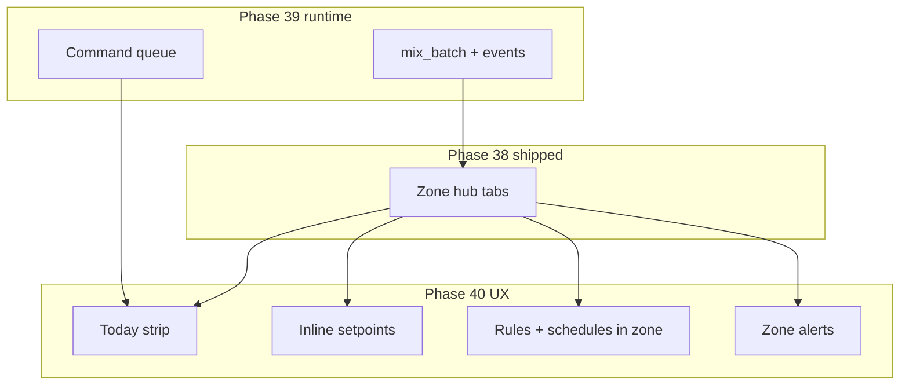

# Phase 40 — Unified farmer UX (zone cockpit)

## Status

**Planned.** Depends on **Phase 38** (zone need tabs + connection cards) shipped. **Phase 39** (command queue + mix on Water tab) should land **before or in parallel with WS5** so the Water story shows honest queue/mix state — not fake "program ran" copy.

**Quick fix (not a full WS):** [`bug-guardian-nav`](#bug-guardian-nav-hotfix) — do before or alongside WS7; tracked in plan todos.

---

## Problem (what operators feel today)

Phase 38 gave the right **mental model** (Water / Light / Climate per zone) but many cards still say:

- "No setpoint — add under **Setpoints**"
- "Rules use **Setpoints** page"
- "**Manage →**" fertigation / lighting / automation

That is accurate to the schema but feels like **the UI is the database**. Farmers want:

> Open **Flower Room** → see if the plant is OK → fix targets → see what runs today → handle alerts → pulse the pump — without six sidebar hops.

The **schema already connects** zones, sensors, setpoints, rules, schedules, programs, events, and alerts. Phase 40 is **presentation and edit affordances**, not a new domain model.

---

## What Phase 39 vs Phase 40 own

| Concern | Owner |
|---------|--------|
| Last-write-wins on `pending_command` | **Phase 39 WS1** |
| Automated mix math + `mix_batch` on Pi | **Phase 39 WS2–WS5** |
| Queue depth + mix preview on Water tab | **Phase 39 WS7** (Phase 40 WS5 extends narrative) |
| Inline setpoints, rules, schedules, alerts **in the zone** | **Phase 40** |
| Guardian drawer vs sidebar duplication | **Phase 40 bug + WS7** |
| Replace farm-wide Advanced pages | **No** — power users keep Rules / Setpoints / Schedules |

---

## Design principles

1. **Zone is the default lens** — farm-wide pages remain for bulk edit and audit.
2. **Read inline, link out for power** — 80% of edits on the zone tab; "Open in Advanced →" for cron expressions and farm-wide rule templates.
3. **Plain language over table names** — "Runs today at 6:00" not `schedule_id=12`; "Too humid" not `alerts_notifications`.
4. **No schema churn in v1** — reuse `setpoints`, `automation_rules`, `schedules`, `alerts_notifications`, existing PATCH/POST APIs. Optional **read aggregate** endpoint only if N+1 fetches hurt.
5. **Do not duplicate Guardian** — one primary entry (right-edge drawer); full `/chat` for long sessions.

---

## BUG — Guardian nav hotfix (`bug-guardian-nav`)

**Symptoms (reported 2026-06):** Misplaced "Farm Guardian" chrome at bottom-left of sidebar; long nav pushes Guardian under Monitor; edge tab + sidebar feel like two products.

**Likely causes:**

- [`GuardianEdgeTab.vue`](../../ui/src/components/GuardianEdgeTab.vue) `fixed right-0` vs viewport/sidebar width
- [`navGroups.js`](../../ui/src/lib/navGroups.js) — Guardian buried in Monitor after Phase 38 regroup
- Duplicate paths: edge drawer vs `/chat` full page

**Acceptance (hotfix):**

- Edge tab stays **right**, never overlaps farm selector or sidebar
- Sidebar: either remove duplicate Guardian link or label "Guardian (full page)" under System
- Drawer remains default from TopBar ✨ and edge tab

**Estimate:** Small UI-only PR; no backend.

---

## WS1 — Zone Overview "Today" strip

**Goal:** Overview tab answers "what matters now?" in one glance.

**UI (Overview tab, above need summary tiles):**

| Chip | Source (existing data) |
|------|-------------------------|
| Next schedule | Farm schedules filtered by zone-linked programs / lighting cron |
| Active rules | `automation_rules` where `zone_id` matches + `is_active` |
| Open alerts | Unread `alerts_notifications` for zone sensors |
| Devices | Online/offline count for zone devices |
| Queue (post-39) | Pending `device_commands` count for zone devices |

**API:** Prefer client-side filter from data ZoneDetail already loads; optional `GET /farms/{farm_id}/zones/{zone_id}/grow-summary` if load is >4 round trips.

**Acceptance:** Demo Flower Room Overview shows at least one non-empty chip when seed data exists.

---

## WS2 — Inline setpoint editor

**Goal:** Replace "add under Setpoints" with edit-in-place on Water / Light / Climate.

**Tasks:**

1. Reuse `GET /farms/{id}/setpoints?zone_id=` (already in ZoneDetail).
2. Per need tab, **Targets** section: inline inputs for min / ideal / max (and stage if shown).
3. Save → existing setpoint PATCH/POST endpoints (verify OpenAPI paths).
4. Empty state: "+ Add target for humidity" creates row for that `sensor_type` + `zone_id`.

**Acceptance:** Change Flower Room humidity band without visiting `/setpoints`.

---

## WS3 — Rules + schedules in zone context

**Goal:** Show **what automation applies to this room**, not pointers to other apps.

**Tasks:**

1. Filter `rules` / `schedules` already loaded in ZoneDetail by `zone_id` and need (sensor/actuator types from `plantNeeds.js`).
2. Card per rule: name, active toggle, last fired (if available), "Edit in Rules →" link.
3. Card per schedule: humanized next run (cron → local time text), linked program/lighting name.
4. Climate: surface GH template rules from Phase 36 with interlock badges (lux sensor present / override).

**Acceptance:** Flower Room Climate lists GH shade rule; toggle inactive without leaving zone.

---

## WS4 — Zone alerts panel

**Goal:** Alerts feel part of the grow area, not a separate monitor app.

**Tasks:**

1. `GET` farm alerts filtered by zone (sensor_ids in zone) — or client filter.
2. Strip on Overview + badge on zone list row: unread count.
3. Inline ack / mark read (Phase 29 patterns); link "All farm alerts →".

**Acceptance:** Acknowledge humidity alert from Zone Overview.

---

## WS5 — Water "grow story"

**Goal:** Unify fertigation program, events, and edge queue into one narrative on Water tab.

**Depends on:** Phase 39 WS1 + WS7 for queue/mix honesty.

**UI:**

- **Last feed:** last `fertigation_events` row for zone (time, EC, program name)
- **Next:** linked schedule next fire + program name
- **Edge:** queue depth + head command type (`pulse` / `mix_batch`)
- **Actions:** Run pulse (38), Preview mix (39), Log event → modal or shallow link to Fertigation Events tab with zone filter

**Acceptance:** Operator does not need Fertigation → Events tab for "what happened last" for this zone.

---

## WS6 — Tasks in zone (optional v1)

**Goal:** Surface human work (defoliation, reservoir refill) beside automation.

**Tasks:**

1. Filter `tasks` by `zone_id` when field exists on task rows.
2. Overview: "Due today" list (max 5) + link Tasks page.

**Defer if:** tasks lack zone_id in schema — document gap and skip WS6.

---

## WS7 — Nav IA polish

**Goal:** Sidebar matches "help me grow" not "help me admin the DB."

**Tasks:**

1. Implement `bug-guardian-nav` acceptance.
2. Zone pages: subtle banner "Power settings: Rules · Setpoints · Schedules" → Advanced routes.
3. Consider moving **Guardian** out of Monitor into **Operate** or top-level icon-only entry.

**Acceptance:** New operator can open Guardian drawer without scrolling sidebar to bottom.

---

## WS8 — Docs, tests, closure (OC-40)

| Layer | Artifacts |
|-------|-----------|
| **operator-tour** | New §4b — zone cockpit walkthrough (edit target, ack alert, see today) |
| **architecture** | §7.0f — zone cockpit vs Advanced pages |
| **Vitest** | ZoneNeedSection inline setpoint save mock; Today strip renders chips |
| **Smokes** | Optional API test for grow-summary if added |
| **RAG** | platform-doc-manifest + operator-tour §4b re-ingest |

---

## Out of scope (v1)

- Replacing `/setpoints`, `/automation`, `/schedules` farm-wide CRUD pages
- New automation engine or alert types
- Mobile-only redesign (follow existing PWA patterns)
- Guardian autonomous zone changes (still Confirm-gated)
- Merging Fertigation EC target matrix into zone (still farm-wide; zone shows **active** target for crop stage)

---

## Recommended order

`bug-guardian-nav` (can ship anytime) → WS1 → WS2 → WS4 → WS3 → WS5 (after 39 queue) → WS7 → WS6 (if schema) → WS8

WS2 + WS4 give the biggest "not the DB" win early.

---

## Definition of done

- [ ] Guardian hotfix: no overlapping chrome; drawer is obvious primary entry
- [ ] Zone Overview "Today" strip with schedules, rules, alerts, devices (and queue when 39 shipped)
- [ ] Inline setpoint edit on need tabs
- [ ] Zone-filtered rules/schedules with active toggles and humanized next run
- [ ] Zone alerts ack inline
- [ ] Water tab grow story (last event, next run, queue) — requires Phase 39 for queue line
- [ ] operator-tour §4b + architecture §7.0f + Vitest

---

## Related

| Doc | Use |
|-----|-----|
| [phase_38_plant_needs_ui_and_pulse_commands.plan.md](phase_38_plant_needs_ui_and_pulse_commands.plan.md) | Zone tabs + connection cards (prerequisite) |
| [phase_39_edge_fertigation_execution.plan.md](phase_39_edge_fertigation_execution.plan.md) | Queue + mix — feeds WS5 |
| [phase_35_37_operational_closure.plan.md](phase_35_37_operational_closure.plan.md) | OC-40 tracker (add when WS8 lands) |
| [operator-tour.md](../operator-tour.md) §4a | Phase 38 plant needs |
| [ZoneDetail.vue](../../ui/src/views/ZoneDetail.vue) | Integration point |
| [ZoneNeedSection.vue](../../ui/src/components/ZoneNeedSection.vue) | Connection cards to replace |

---

## Using this plan in a new chat

> Implement Phase 40 from `docs/plans/phase_40_unified_farmer_ux_zone_cockpit.plan.md`. Start with **bug-guardian-nav** or **WS2 inline setpoints** for fastest UX win. Do not add schema unless tasks lack `zone_id`. Keep farm-wide Advanced pages. Assume Phase 38 zone hub and Phase 39 queue on Water tab exist or are in flight.
