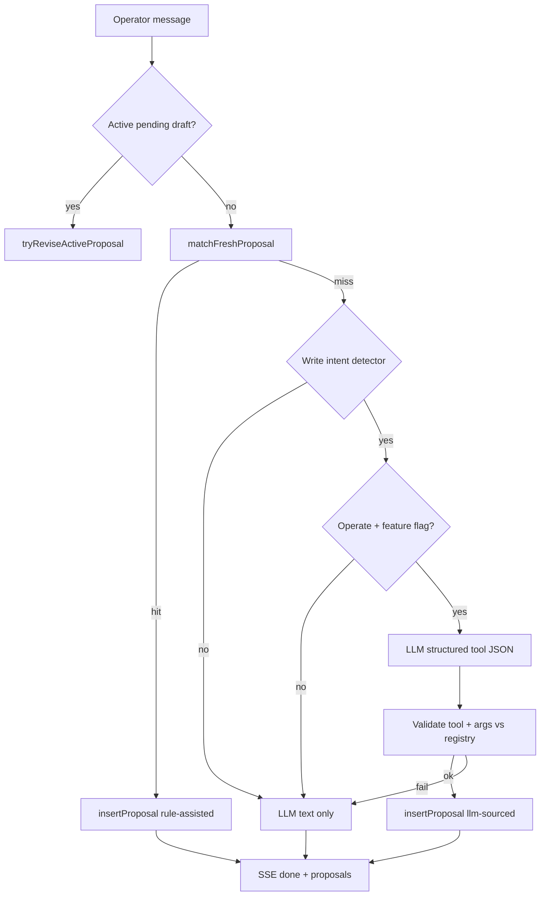

# Phase 46 — Guardian LLM tool proposals

## Status

**In progress.** WS1–WS3 shipped (policy, schema/binding, chat handler hook). WS4 safety tests next.

**Canonical implementation spec:** this document (full phase = Guardian slice).

---

## 1. Problem

Today **`BuildRuleAssistedProposals`** only ([`proposals.go`](../../internal/farmguardian/proposals.go)). The LLM answers in prose; matchers may return **no card**.

| Operator says | Today | Target (46) |
|---------------|-------|---------------|
| “Set feed volume to 0.3 L for Flower Room” | Advice text; card only if regex matches (42) | Matcher OR validated LLM `patch_fertigation_program` proposal |
| “Acknowledge the humidity alert” | `ack_alert` if unread + intent match | Matcher first (unchanged) |
| “What's running low?” | Read enrichment (43) or alerts | **No write proposal** — read only |

**Sit-in (45)** records phrases that failed → §9 backlog drives allowlist expansion.

---

## 2. This is NOT conversation starter chips

| Workstream | Fixes | Phase |
|------------|-------|-------|
| **Contextual Ask Guardian + starter chips** | Generic **prompts** | **40–44** |
| **Rule-assisted matchers** | More phrases **without** LLM | **42–43**, incremental |
| **LLM tool proposals (this phase)** | Matcher **miss** + clear **write** intent | **46** |

Starters improve **what you ask**. Matchers improve **deterministic** cards. Phase 46 improves **recall** for natural language writes — still **Confirm-gated**.

---

## 3. Invariants (unchanged)

| Rule | Detail |
|------|--------|
| **Confirm only** | [`POST /v1/chat/confirm`](../../internal/handler/chat/confirm.go) executes frozen args |
| **Frozen args** | Proposal row TTL 5 min; revise chain max 8 (Phase 34) |
| **Audit** | `guardian_tool_executed` with `tool_id`, `proposal_id` |
| **Risk tiers** | [`tools/risk.go`](../../internal/farmguardian/tools/risk.go) — UI warnings unchanged |
| **Matchers first** | If `matchFreshProposal` returns ok → **do not** call LLM proposal path |
| **Role gates** | `RequiresOperate` / `RequiresAdmin` on registry — LLM cannot bypass |

---

## WS1 — Hybrid policy ✅

**Shipped:** `internal/farmguardian/proposals_llm.go` — `GUARDIAN_LLM_PROPOSALS` env flag, `ShouldAttemptLLMProposal`, `HasWriteIntent`, v1 allowlist §5, `ParseLLMProposalFromAssistant`, `TryBuildLLMProposalsFromAssistant` (handler hook in WS3). Tests: `proposals_llm_test.go`, `phase-46-ws1-policy.test.js`.

---

## WS2 — Schema + farm ID binding ✅

**Shipped:** `internal/farmguardian/proposals_llm_validate.go` — per-tool arg schema, DB farm-scope binding (`program_id`, `schedule_id`, `rule_id`, `alert_id`, `zone_id`, `crop_cycle_id`), `patch_rule` is_active-false-only v1, `LogLLMProposalRejected`. Tests: `proposals_llm_validate_test.go`, `phase-46-ws2-schema.test.js`.

---

## WS3 — Chat handler wiring ✅

**Shipped:** `internal/handler/chat/confirm.go` — `attachProposals` calls `BuildRuleAssistedProposals` first; on empty, `TryBuildLLMProposalsFromAssistant` with `FreshMatcherMatches`, `FarmCapsForUser`, and `GUARDIAN_LLM_PROPOSALS`. Non-stream `PostV1` and SSE `done` pass assistant text. Tests: `confirm_proposals_test.go`, `phase-46-ws3-handler.test.js`.

---

## 4. Recommended design: Hybrid C



### 4.1 Write intent detector (gate)

Run LLM proposal path only when **all** true:

| Check | Implementation sketch |
|-------|-------------------------|
| No rule-assisted match | `matchFreshProposal` returned false |
| Operate capability | JWT / session has operate on farm |
| Feature flag | `GUARDIAN_LLM_PROPOSALS=true` (farm or global) |
| Write intent | Lightweight classifier: imperative verbs + domain nouns OR second LLM call `intent: write\|read` |
| Not field procedure | Exclude `start procedure` turns (Phase 37) |
| Not pure Q&A | Exclude “why / what is / explain” only turns |

### 4.2 LLM output shape

Single JSON object in a fenced block or tool channel (implementation choice):

```json
{
  "tool": "patch_fertigation_program",
  "args": {
    "program_id": 12,
    "total_volume_liters": 0.3
  },
  "summary": "Set program Flower Feed volume to 0.3 L",
  "confidence": "high"
}
```

| Field | Validation |
|-------|------------|
| `tool` | Must exist in [`registry.go`](../../internal/farmguardian/tools/registry.go) and be in **allowlist** (§5) |
| `args` | Per-tool JSON schema; IDs must exist on farm snapshot |
| `summary` | Operator-facing; max length |
| `confidence` | Optional; reject `low` on high-tier tools |

Store `meta.llm_sourced: true` on proposal row for audit.

---

## 5. Tool allowlist (v1)

Start **narrow**; expand from sit-in backlog.

| Tool | LLM allowed v1 | Notes |
|------|----------------|-------|
| `patch_fertigation_program` | yes | Volume, EC, `is_active` |
| `patch_schedule` | yes | `is_active` only |
| `patch_rule` | yes | `is_active` false only (high risk) |
| `ack_alert` | yes | `alert_id` must match unread snapshot |
| `create_task` | yes | Title + optional `zone_id` |
| `create_task_from_alert` | yes | Alert must exist |
| `update_cycle_stage` | optional | Stage enum validated |
| `apply_grow_setup_pack` | **no** | Too bundle-heavy — keep rule-assisted only |
| `apply_bootstrap_template` | **no** | Admin + wizard |
| `enqueue_actuator_command` | **no** v1 | Safety review |
| `create_lighting_program` | optional v2 | |
| Read tools (`summarize_*`) | **no** | Enrichment path only |

---

## 6. Validation pipeline (WS2)

| Step | Action |
|------|--------|
| 1 | `tools.Lookup(toolID)` |
| 2 | Reject if `RequiresAdmin` unless admin |
| 3 | Schema validate args (required fields, types) |
| 4 | **ID binding** — `program_id`, `rule_id`, `alert_id` must belong to `farmID` from chat |
| 5 | Recompute `RiskTierForTool` server-side — ignore LLM tier |
| 6 | `impact.BuildImpactSummary` — same as rule-assisted |
| 7 | On any failure → log `llm_proposal_rejected` → text-only response |

**Never** trust LLM for IDs not in snapshot without DB lookup confirmation.

---

## 7. Handler changes (WS3)

| Area | Change |
|------|--------|
| Chat stream | After LLM completes, if policy §4.1 → parse proposal JSON |
| `BuildRuleAssistedProposals` | Unchanged entry; call **before** LLM proposal |
| Duplicate guard | If matcher inserted proposal, skip LLM proposal |
| SSE `done` event | `proposals[]` may include `meta.llm_sourced` |
| Confirm | Unchanged — executes registry `Execute` |

Files (expected):

- `internal/farmguardian/proposals_llm.go` — parse + validate
- `internal/handler/chat/handler.go` — orchestration hook
- `internal/farmguardian/proposals_llm_test.go` — table tests

---

## 8. Safety tests (WS4)

| Case | Expect |
|------|--------|
| Matcher hit + LLM also emits tool | Single matcher proposal only |
| Unknown `tool` | No row; no Confirm |
| Wrong `program_id` for farm | Rejected |
| `apply_bootstrap_template` from LLM | Rejected (not on allowlist) |
| Viewer role | No LLM proposal insert |
| Confirm without Operate | 403 (existing) |
| Expired proposal | Confirm fails (existing TTL) |

Smoke: one happy path `patch_fertigation_program` via LLM JSON in integration test with mock LLM client.

---

## 9. Sit-in backlog intake (from 45)

| Source | Action |
|--------|--------|
| `matcher_gap` issues | Add phrase to matcher **or** allowlist tool |
| High-frequency miss | Prioritize 46 WS3 |
| False positive LLM proposal | Tighten write intent gate; add negative test |

---

## 10. Observability (WS5)

| Metric / log | Use |
|--------------|-----|
| `guardian_llm_proposal_suggested` | Count by tool |
| `guardian_llm_proposal_rejected` | Validation reason |
| `guardian_matcher_proposal_hit` | Compare rates |

---

## 11. Docs (WS6)

| Doc | Update |
|-----|--------|
| [guardian-change-requests-guide.md](../guardian-change-requests-guide.md) | § “When LLM opens a card” |
| [guardian_pr_ux_through_farmer_phases.plan.md](guardian_pr_ux_through_farmer_phases.plan.md) | Mark §8 implemented |
| [operator-tour.md](../operator-tour.md) §6h | Operator expectations |
| [farm-guardian-architecture.md](../farm-guardian-architecture.md) §7.0k | Architecture stub → shipped |

---

## 12. Out of scope

- Removing Confirm or autonomous writes
- LLM executing tools without proposal row
- Replacing wizards (44) or starters (40–44)
- Full OpenAPI rewrite (extend `ActionProposal.meta` only if needed)

---

## 13. Definition of done

- [ ] Hybrid C shipped behind feature flag
- [ ] Allowlist §5 tools validated in tests
- [ ] High-tier tools still show impact + warnings
- [ ] Sit-in top 3 matcher gaps addressed (matcher or LLM)
- [ ] Docs §11 updated; OC-46 closed
- [ ] No regression: rule-assisted ack + setup pack still work

---

## Related

| Doc | Use |
|-----|-----|
| [phase_45_guardian_pr_spec.md](phase_45_guardian_pr_spec.md) | Sit-in PR validation |
| [phase_42_guardian_pr_spec.md](phase_42_guardian_pr_spec.md) | Matchers first for patch_* |
| [phase_34_guardian_pr_iteration.plan.md](phase_34_guardian_pr_iteration.plan.md) | Revise loop |
| [farmer_ux_roadmap_40_plus.plan.md](farmer_ux_roadmap_40_plus.plan.md) | Arc position |
