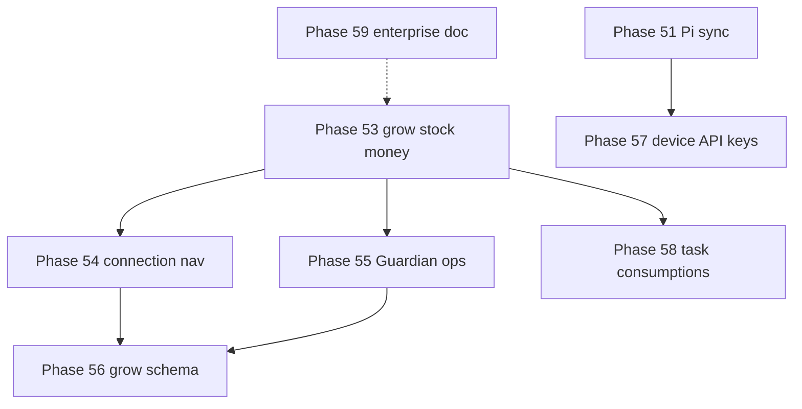

# Phases 53–59 — Farmer closure arc

## Where we are (2026-06)

| Status | Phases |
|--------|--------|
| **Shipped** | 40–52 (farmer UX arc, Pi sync, Guardian UI context, Pi setup guide) |
| **Planned next** | **53** → 54 → 55 (can overlap 53 WS2/3 with 54) |
| **Schema / security** | **56**, **57** after 53 farmer paths proven |
| **Runtime polish** | **58** parallel with 55–56 |
| **Explicit deferrals** | **59** doc-only — no accidental ERP creep |

---

## Phase map

| Phase | One job | New backend? | Plan |
|-------|---------|--------------|------|
| **53** | Start grow, restock, tag receipt — without Advanced editors | No | [phase_53](phase_53_grow_stock_money_closure.plan.md) |
| **54** | See how the whole system connects — wiggle every link | No | [phase_54](phase_54_zone_connection_nav.plan.md) |
| **55** | Guardian knows grow, stock, money — starters + read tools | Read tools only | [phase_55](phase_55_guardian_ops_grow_money.plan.md) |
| **56** | Plants ↔ cycles linked; post-harvest compare in one flow | Small migration | [phase_56](phase_56_grow_schema_harvest_analytics.plan.md) |
| **57** | Each Pi has its own API key | Yes | [phase_57](phase_57_pi_device_api_keys.plan.md) |
| **58** | Task drawdown + consumptions visible | No (API exists) | [phase_58](phase_58_task_consumptions_runtime.plan.md) |
| **59** | Say no to POs/METRC until we mean it | Doc only | [phase_59](phase_59_enterprise_tier_boundary.plan.md) |

---

## Recommended ship order

1. **53 WS2 → 53 WS3 → 53 WS1** (stock before money autolog $; grow in parallel)
2. **54** alongside 53 WS5 (wiggles on new CTAs)
3. **55** after 53 WS1–3 surfaces exist (Guardian has something to talk about)
4. **56** after harvest flow from 53 is exercised
5. **57** when Pi fleet >1 device per farm in production
6. **58** anytime after 53 WS2 (restock + consumptions share stock mental model)
7. **59** anytime — product gate doc

---

## Guardian across 53–55

| Phase | Guardian deliverable |
|-------|---------------------|
| 52 ✅ | Route + nav history + Pi setup framing |
| 53 | Starters on grow strip, Supplies, Money |
| 54 | Context for connection pipeline segments |
| 55 | Read tools: cycle cost, spending summary, restock priority; ops persona copy |

**Rule:** Inline wizards beat Confirm PRs for restock/receipt/harvest. Phase 55 adds **read depth**, not new write tools (Phase 46 backlog for NL→PR).

---

## Operational closure (OC rows)

| OC | Phase | Close when |
|----|-------|------------|
| OC-52 | 52 Guardian UI context | ✅ Shipped |
| OC-53 | 53 grow/stock/money | WS7 docs/tests |
| OC-54 | 54 connection nav | WS4 docs/tests |
| OC-55 | 55 Guardian ops | WS5 docs/tests + guardian pr spec |
| OC-56 | 56 grow schema | Migration + smokes |
| OC-57 | 57 device keys | Security smokes + pi guide |
| OC-58 | 58 consumptions | Vitest + operator-tour |
| OC-59 | 59 enterprise doc | README + gaps index updated |

Track in [phase_35_37_operational_closure.plan.md](phase_35_37_operational_closure.plan.md).

---

## Related shipped phases

- [phase_52_guardian_ui_context.plan.md](phase_52_guardian_ui_context.plan.md) — nav history, Pi guide, wiggles
- [phase_51_pi_config_sync.plan.md](phase_51_pi_config_sync.plan.md) — platform config sync
- [phase_43_operations_stock_feeding_finance.plan.md](phase_43_operations_stock_feeding_finance.plan.md) — hubs
- [farmer_ux_roadmap_40_plus.plan.md](farmer_ux_roadmap_40_plus.plan.md) — 40–59 arc table
- [pre_development_gaps_index.plan.md](pre_development_gaps_index.plan.md) — gap A10
