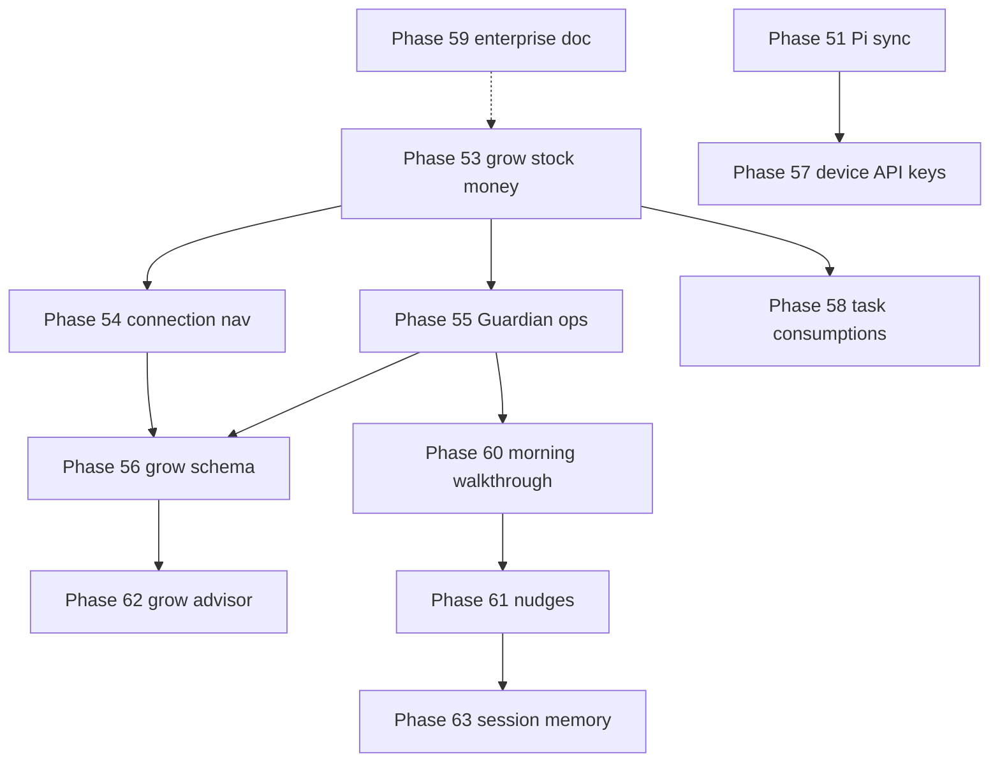

# Phases 53–59 — Farmer closure arc

## Where we are (2026-06)

| Status | Phases |
|--------|--------|
| **Shipped** | 40–52 (farmer UX arc, Pi sync, Guardian UI context, Pi setup guide) |
| **Planned next** | **53** → 54 → 55 (can overlap 53 WS2/3 with 54) |
| **Schema / security** | **56**, **57** after 53 farmer paths proven |
| **Runtime polish** | **58** parallel with 55–56 |
| **Explicit deferrals** | **59** doc-only — no accidental ERP creep |

---

## Phase map

### Farmer closure (53–59)

| Phase | One job | New backend? | Plan |
|-------|---------|--------------|------|
| **53** | Start grow, restock, tag receipt — without Advanced editors | No | [phase_53](phase_53_grow_stock_money_closure.plan.md) |
| **54** | See how the whole system connects — wiggle every link | No | [phase_54](phase_54_zone_connection_nav.plan.md) |
| **55** | Guardian knows grow, stock, money — starters + read tools | Read tools only | [phase_55](phase_55_guardian_ops_grow_money.plan.md) |
| **56** | Plants ↔ cycles linked; post-harvest compare in one flow | Small migration | [phase_56](phase_56_grow_schema_harvest_analytics.plan.md) |
| **57** | Each Pi has its own API key | Yes | [phase_57](phase_57_pi_device_api_keys.plan.md) |
| **58** | Task drawdown + consumptions visible | No (API exists) | [phase_58](phase_58_task_consumptions_runtime.plan.md) |
| **59** | Say no to POs/METRC until we mean it | Doc only | [phase_59](phase_59_enterprise_tier_boundary.plan.md) |

### Guardian intelligence arc (60–63)

| Phase | One job | New backend? | Plan |
|-------|---------|--------------|------|
| **60** | Morning walkthrough — one tap, Guardian tells you what's wrong today | Read tool | [phase_60](phase_60_guardian_morning_walkthrough.plan.md) |
| **61** | Proactive nudges — dot on robot icon when something needs attention | Lightweight poller | [phase_61](phase_61_guardian_proactive_nudges.plan.md) |
| **62** | Grow advisor — VPD, DLI, stage transitions, post-harvest analysis | Read tool (needs 64) | [phase_62](phase_62_guardian_grow_advisor.plan.md) |
| **63** | Session memory — Guardian remembers what you asked, you control it | Session summary job | [phase_63](phase_63_guardian_session_memory.plan.md) |

### Guardian knowledge & sensing arc (64–66)

These answer *"how does Guardian actually KNOW things?"* — grounding, not guessing.

| Phase | One job | New backend? | Plan |
|-------|---------|--------------|------|
| **64** | Crop knowledge base — real EC/pH/VPD/DLI per crop per stage; Guardian cites, never guesses | Migration + seed | [phase_64](phase_64_crop_knowledge_base.plan.md) |
| **65** | Weather & site — offline solar (sunrise/DLI from lat-long), sensor, optional online | Solar engine + ingest | [phase_65](phase_65_weather_site_context.plan.md) |
| **66** | Hands-free field assistant — voice in/out, crop-grounded photo diagnosis | STT/TTS + vision | [phase_66](phase_66_guardian_field_assistant.plan.md) |

**Key dependency:** **64 must precede 62** — the grow advisor reads targets from the crop knowledge base. **64 also grounds 66** photo diagnosis. **65** is independent (schema + coordinates already exist).

---

## Recommended ship order

**Farmer closure:**
1. **53 WS2 → 53 WS3 → 53 WS1** (stock before money autolog; grow in parallel)
2. **54** alongside 53 WS4 (wiggles on new CTAs)
3. **55** after 53 WS1–3 surfaces exist (Guardian has something to talk about)
4. **56** after harvest flow from 53 is exercised
5. **57** when Pi fleet >1 device per farm in production
6. **58** anytime after 53 WS2 (restock + consumptions share stock mental model)
7. **59** anytime — product gate doc

**Guardian intelligence arc:**
8. **60** after 55 read tools ship — morning walkthrough uses same pipeline
9. **61** after 60 — nudge engine wraps same data
10. **64** before 62 — crop knowledge base must exist for grow advisor to cite targets
11. **62** after 56 + 64 — needs `plant_id`, stage data, and real targets
12. **63** when session list is well-established — memory wraps existing sessions

**Knowledge & sensing arc:**
13. **64** anytime after 56 — foundational; unblocks 62 and 66
14. **65** anytime — coordinates + `weather_data` table already exist; offline solar first
15. **66** after 64 — voice baseline is independent; photo diagnosis grounds on 64

---

## Guardian across 53–63

| Phase | Guardian deliverable |
|-------|---------------------|
| 52 ✅ | Route + nav history + Pi setup framing |
| 53 | Starters on grow strip, Supplies, Money |
| 54 | Context for connection pipeline segments |
| 55 | Read tools: cycle cost, spending summary, restock priority; ops persona copy |
| 60 | Morning walkthrough — one read tool, all farm findings ranked |
| 61 | Proactive nudge dot — one alert, one tap, dismissed per session |
| 62 | Grow advisor — VPD/DLI/stage starters; post-harvest analysis |
| 63 | Session memory — topic tags, related context injection, operator-deletable |

**Rule:** Inline wizards beat Confirm PRs for restock/receipt/harvest. Phases 55 + 60–62 add **read depth**; new write tools stay in Phase 46 backlog for NL→PR until proven valuable.

---

## Operational closure (OC rows)

| OC | Phase | Close when |
|----|-------|------------|
| OC-52 | 52 Guardian UI context | ✅ Shipped |
| OC-53 | 53 grow/stock/money | WS6 docs/tests |
| OC-54 | 54 connection nav | WS4 docs/tests |
| OC-55 | 55 Guardian ops | WS5 docs/tests + guardian pr spec |
| OC-56 | 56 grow schema | Migration + smokes |
| OC-57 | 57 device keys | Security smokes + pi guide |
| OC-58 | 58 consumptions | Vitest + operator-tour |
| OC-59 | 59 enterprise doc | README + gaps index updated |
| OC-60 | 60 morning walkthrough | walk_farm tool + closure test |
| OC-61 | 61 nudges | Dot badge + dismiss + operator-tour |
| OC-62 | 62 grow advisor | VPD/EC starters (from 64) + post-harvest + closure test |
| OC-63 | 63 session memory | Topic tags + inject + delete + privacy note |
| OC-64 | 64 crop knowledge base | 7 profiles seeded + grounding guard test |
| OC-65 | 65 weather & site | Offline solar test + supplemental-light starter |
| OC-66 | 66 field assistant | Mic + TTS + grounded photo diagnosis |

Track in [phase_35_37_operational_closure.plan.md](phase_35_37_operational_closure.plan.md).

---

## Guardian "almighty helper" backlog (not yet phased)

Ideas worth doing, parked until 60–66 prove out. Each could become a phase.

| Idea | Sketch | Why later |
|------|--------|-----------|
| **Trend / anomaly detection** | "Your RH has crept up 8% over 5 days" — rolling stats on sensor history | Needs 60/61 data pipeline first |
| **What-if simulator** | "If I drop RH to 55%, VPD becomes 1.3 kPa" — pure-math preview | Small; bolt onto 62 advisor |
| **Auto feed-chart generator** | From crop profile (64) + water test → full weekly feed schedule draft → Confirm | Needs 64 + a write tool (Phase 46 track) |
| **Yield / harvest prediction** | Days-to-harvest + estimated yield from stage + history | Needs 56/64 history |
| **Operator knowledge ingestion** | Drop your own grow notes/PDFs into Guardian's RAG | Extends Phase 37 field-guide RAG |
| **Multi-zone load balancing** | "Stagger feeds so the pump isn't double-booked" | Careful re: enterprise boundary (59) |
| **Seasonal planning** | Combine solar (65) + crop (64) → "best window to start next run" | Needs 64 + 65 |

> **Through-line:** every "smart" feature must be **grounded** — structured data or RAG for facts, LLM for synthesis only. No invented numbers. This is the rule that keeps Guardian trustworthy as it gets more capable.

---

## Related shipped phases

- [phase_52_guardian_ui_context.plan.md](phase_52_guardian_ui_context.plan.md) — nav history, Pi guide, wiggles
- [phase_51_pi_config_sync.plan.md](phase_51_pi_config_sync.plan.md) — platform config sync
- [phase_43_operations_stock_feeding_finance.plan.md](phase_43_operations_stock_feeding_finance.plan.md) — hubs
- [farmer_ux_roadmap_40_plus.plan.md](farmer_ux_roadmap_40_plus.plan.md) — 40–59 arc table
- [pre_development_gaps_index.plan.md](pre_development_gaps_index.plan.md) — gap A10
