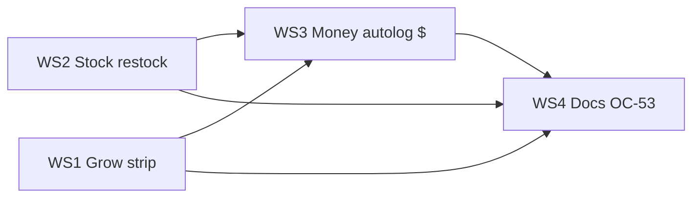

# Phase 53 — Grow + stock + money closure

## Status

**Planned.** No new backend tables or routes required — UI wiring to APIs shipped in Phases 20.7, 28, 32, and 43.

**Predecessors:**
- [Phase 43](phase_43_operations_stock_feeding_finance.plan.md) — Supplies / Money / Feeding admin hubs (shipped)
- [Phase 28](phase_28_crop_intelligence_guardian_depth.md) — crop cycle summary + compare (shipped)
- [Phase 47](phase_47_feeding_water_plain_language.plan.md) — zone Water owns feeding (shipped)
- [Phase 52](phase_52_guardian_ui_context.plan.md) — nav-hint wiggle pattern (shipped)

**Not the same as:** Phase 51 doc **"Phase 52+ per-device API keys"** (security hardening — separate future phase).

---

## The three jobs

| # | Farmer job | Today pain | Target surface |
|---|------------|------------|----------------|
| 1 | **"What's growing in this room?"** | Cycles buried in Advanced → Fertigation tab | Zone cockpit + Grow nav |
| 2 | **"Restock what ran low"** | Supplies hub read-only → full Inventory editor | Supplies hub inline restock |
| 3 | **"What did this grow cost?"** | Receipts untagged; autolog is jargon | Money hub tag + plain lines |

---

## Problem (why a dedicated phase)

Phase **43** shipped farmer **hubs** for stock and money. Phase **28** shipped **analytics** for crop cycles. The **backend loops** (mix → deduct stock → post cost; low-stock alerts; cycle cost summary API) already work.

Farmers still bounce to **power-user** surfaces:

| Symptom | Root cause |
|---------|------------|
| "Where's my grow?" | No cycle card on [ZoneDetail.vue](../../ui/src/views/ZoneDetail.vue); lifecycle in [Fertigation.vue](../../ui/src/views/Fertigation.vue) Crop Cycles tab |
| "I got a low-stock alert" | [SuppliesHub.vue](../../ui/src/views/SuppliesHub.vue) shows banner but no **restock** action |
| "How much did Flower Room cost?" | [MoneyHub.vue](../../ui/src/views/MoneyHub.vue) `createCost` omits `crop_cycle_id` (API supports it) |
| Mix autolog invisible | `unit_cost` on input definitions has **no UI** — auto-cost rows need plain copy |
| Plants page feels orphaned | [Plants.vue](../../ui/src/views/Plants.vue) disconnected from cycles (`strain_or_variety` text only) |

**Enterprise ERP** (POs, METRC, multi-warehouse, GL) is **out of scope** — this phase closes **small-farm daily jobs**.

---

## Design principles

1. **APIs exist — wire the UI** — `createCost` + `crop_cycle_id`, `updateNfBatch`, `updateCropCycle`, `GET /crop-cycles/{id}/cost-summary`.
2. **Zone-first for grow** — cockpit strip before Advanced Fertigation.
3. **Hub-first for stock/money** — inline forms on Supplies/Money; footer link to full editor stays.
4. **Nav-hint wiggles** — new links use `v-nav-hint` per [Phase 52](phase_52_guardian_ui_context.plan.md).
5. **Guardian complements, not replaces** — inline wizards beat Confirm PRs for restock/receipt/harvest.

---

## WS1 — Grow closure

**Goal:** A farmer manages the **current grow** from the zone and Grow nav without opening Fertigation.

### Deliverables

| # | Item | Implementation notes |
|---|------|-------------------|
| 1.1 | **Current grow strip** on zone Overview (and/or Water header) | Name, stage, days in stage, link to `/crop-cycles/:id/summary`; empty → "Start a grow" CTA |
| 1.2 | **Start grow wizard** (`/plants/start` or modal from zone) | Steps: pick plant (or strain) → confirm zone → optional fertigation program; `POST` existing crop cycle API; reuse [Guardian setup pack](../../internal/farmguardian/proposals_setup_pack.go) field names where possible |
| 1.3 | **Harvest weigh-in** | Zone or wizard step: `yield_grams` + optional notes; `PATCH` `updateCropCycle`; offer link to summary + compare |
| 1.4 | **Plants page polish** | `EmptyStateHint` + link to start-grow; strain picker pre-fills cycle create (client-side — no `plant_id` FK required v1) |
| 1.5 | **Guardian starters** | Zone strip chips: "Harvest this grow", "How does this cycle compare?" |

### APIs (existing — no new routes)

| Method | Path | Use |
|--------|------|-----|
| `GET` | `/farms/{id}/crop-cycles` | Active cycle per zone |
| `POST` | `/farms/{id}/crop-cycles` | Start grow |
| `PATCH` | `/crop-cycles/{id}` | Yield, deactivate |
| `PATCH` | `/crop-cycles/{id}/stage` | Stage advance |
| `GET` | `/crop-cycles/{id}/summary` | Post-harvest card |
| `GET` | `/farms/{id}/plants` | Wizard plant pick list |

### Acceptance

- [ ] Zone with active cycle shows strip without visiting Fertigation
- [ ] Start grow completes in ≤3 steps from zone or Plants
- [ ] Harvest sets `yield_grams` and links to summary
- [ ] Vitest: strip visibility, wizard payload shape

---

## WS2 — Stock closure

**Goal:** **Restock** and **unit cost** on the Supplies hub — not only "open full editor."

### Deliverables

| # | Item | Implementation notes |
|---|------|-------------------|
| 2.1 | **Restock form** on [SuppliesHub.vue](../../ui/src/views/SuppliesHub.vue) | Per batch card: "+ Add qty" → number input → `store.updateNfBatch(id, { current_quantity_remaining })`; success toast |
| 2.2 | **Quick new batch** (optional v1.1) | If batch exhausted: minimal create batch dialog (input def pick + qty + unit) via `createNfBatch` |
| 2.3 | **Unit cost field** | On input definition card or edit drawer: `unit_cost` + currency; `PATCH` existing NF input API — unlocks mix autolog $ on Money hub |
| 2.4 | **Low-stock → refill task** | Extend low-stock banner: "Create refill task" → `POST /tasks` with source alert id (pattern exists server-side) |
| 2.5 | **Nav hints** | Restock CTA `v-nav-hint` stays on `/operations/supplies`; low-stock chip wiggles Supplies + Tasks |

### APIs (existing)

| Method | Path | Use |
|--------|------|-----|
| `GET` | `/farms/{id}/naturalfarming/batches` | On-hand list |
| `PATCH` | `/naturalfarming/batches/{id}` | Restock qty |
| `PATCH` | `/naturalfarming/inputs/{id}` | Unit cost |
| `POST` | `/farms/{id}/tasks` | Refill task |

### Acceptance

- [ ] Operator can add 5L to a batch without opening Inventory tabs
- [ ] Setting unit cost on an input causes next mix autolog to show $ on Money hub (WS3)
- [ ] Low-stock banner offers one-tap task create
- [ ] Vitest: restock PATCH payload, suppliesHub helpers

---

## WS3 — Money closure

**Goal:** Receipts and autolog lines answer **"what did we spend, and on which grow?"**

### Deliverables

| # | Item | Implementation notes |
|---|------|-------------------|
| 3.1 | **Tag receipt to grow** | [MoneyHub.vue](../../ui/src/views/MoneyHub.vue) receipt form: optional zone → active cycle dropdown; pass `crop_cycle_id` to `store.createCost` (already in [farm.js](../../ui/src/stores/farm.js) params) |
| 3.2 | **Today spend chip** | [FarmMorningStrip.vue](../../ui/src/components/FarmMorningStrip.vue) or dashboard: "Spent $X this month" → `/operations/money`; mirror low-stock chip pattern in [farmGrowSummary.js](../../ui/src/lib/farmGrowSummary.js) |
| 3.3 | **Plain autolog lines** | Money hub recent activity: map `related_table_name` to farmer copy ("Mixed 2L JMS in Veg Room"); tap → feeding admin or mix event context |
| 3.4 | **Zone cost peek** (read-only) | Zone cockpit footer: "This grow: ~$X" from `GET /crop-cycles/{id}/cost-summary` when cycle active |
| 3.5 | **Energy price nudge** | If no energy price and autolog electricity expected: one-line CTA on Money hub → existing Costs energy form (link only) |

### APIs (existing)

| Method | Path | Use |
|--------|------|-----|
| `POST` | `/farms/{id}/costs` | Receipt + `crop_cycle_id` |
| `GET` | `/farms/{id}/costs/summary` | Month chip |
| `GET` | `/crop-cycles/{id}/cost-summary` | Zone peek |
| `GET` | `/farms/{id}/energy-prices` | Nudge detection |

### Acceptance

- [ ] Receipt save with cycle tag appears in cycle cost summary
- [ ] Dashboard shows month spend chip when costs exist
- [ ] Autolog rows use plain language on Money hub (no raw table names)
- [ ] Vitest: `createCost` with `crop_cycle_id`, month chip helper

---

## WS4 — Docs, tests, closure (OC-53)

| # | Item |
|---|------|
| 4.1 | [operator-tour.md](../operator-tour.md) — § grow strip, restock, tag receipt |
| 4.2 | [farm-guardian-architecture.md](../farm-guardian-architecture.md) — §7.0q one paragraph |
| 4.3 | `ui/src/__tests__/phase-53-closure.test.js` — artifact bundle |
| 4.4 | [phase_35_37_operational_closure.plan.md](phase_35_37_operational_closure.plan.md) — OC-53 row |
| 4.5 | [farmer_ux_roadmap_40_plus.plan.md](farmer_ux_roadmap_40_plus.plan.md) — add Phase 53 to map |

---

## Definition of done (phase)

- [ ] WS1–WS3 acceptance checklists green
- [ ] No new DB migrations required for v1
- [ ] Farmer can complete **start grow → restock → tag receipt → see cycle cost** without Advanced Inventory/Fertigation/Costs as default path
- [ ] OC-53 closed in operational closure plan

---

## Out of scope

| Item | Owning idea |
|------|-------------|
| `plant_id` FK on `crop_cycles` | Future schema tidy-up; v1 uses strain picker |
| Purchase orders, vendors, warehouses | Enterprise inventory |
| METRC / compliance traceability | Regulated markets |
| Guardian Confirm tools for restock/receipt | UI-first; Phase 46 backlog |
| Per-device API keys | Phase 51 "Phase 52+ security" track |

---

## Suggested implementation order

**WS2 before WS3** so unit cost makes autolog dollars visible when Money plain-lines ship.

---

## Guardian (optional slice — no new Confirm tools)

| Surface | Starter |
|---------|---------|
| Zone grow strip | "What did this room cost so far?" |
| Supplies hub | "What should I restock first?" |
| Money hub | "Summarize spending this month by category" |

Reuse `summarize_farm_low_stock`, cycle cost summary read tools; starters only.

---

## Artifact checklist (for closure test)

| Path | WS |
|------|-----|
| `ui/src/components/ZoneCurrentGrowStrip.vue` (or equivalent) | 1 |
| `ui/src/views/StartGrowWizard.vue` (or zone modal) | 1 |
| `ui/src/lib/suppliesHub.js` — `restockBatch` helper | 2 |
| `ui/src/views/SuppliesHub.vue` — restock UI | 2 |
| `ui/src/views/MoneyHub.vue` — cycle tag + plain autolog | 3 |
| `ui/src/lib/farmGrowSummary.js` — spend chip | 3 |
| `docs/plans/phase_53_grow_stock_money_closure.plan.md` | 4 |
