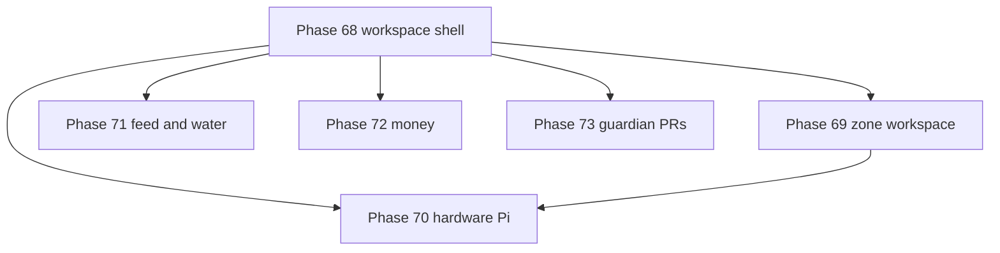

# Phases 68–73 — SPA workspace refactor arc

## Status

**Planned.** New arc opened after the Phase 40–67 farmer-closure + Guardian capstone work shipped. Operator feedback (the "Zone Details" walkthrough, 2026-06): *the site looks good, but the sidebar has too many items, several pages explain the same thing, and you have to jump around to follow one job.*

> **Numbering note:** The earlier "capstone ordering rule" reserved 66/67 as the permanent final phases. Those phases **shipped**, so the ordering rationale (knowledge layers before the capstone) is satisfied. This arc continues at **68** by decision. See the [retired-rule note](phase_53_59_roadmap.plan.md#-capstone-ordering-rule-retired).

---

## The one job

> **See a whole job — a zone, the Pi wiring, the feed plan, the money — on one screen, instead of scrolling a 26-item sidebar and clicking between near-duplicate pages.**

---

## Why now (operator feedback)

1. **The sidebar is too deep.** 8 groups, ~26 items (`ui/src/lib/navGroups.js`). Hard to tell what's where.
2. **Pages overlap.** The same domain is split across "farmer hub → admin → raw editor" tiers *and* duplicated farm-wide vs per-zone:
   - `Sensors` / `Controls` / `Lighting` / `Plants` ≈ what `ZoneDetail` already shows per zone
   - `Feed & water` → `Feeding admin` → `Fertigation` (three depths of one domain)
   - `Supplies` → `Inventory`, `Money` → `Costs`
3. **The Pi setup page is mostly display constants.** `PiSetupGuide.vue` is ~90% hardcoded; the *actual* GPIO/zone/role/schedule config lives in the database and is edited through scattered wiring panels. An operator setting up a Pi can't see "pin 27 → Flower Room pump → runs 6 AM daily" in one place.
4. **Change requests ("pull requests") are hard to find.** They exist (`guardian_action_proposals`, Confirm cards, a Pending tab) but only appear when server-side matchers fire, and the inbox is buried in a drawer.

The fix is **not** deleting the layering — it's **collapsing it into full-page workspaces with internal tabs**, keeping deep links alive, and using the existing hover-"wiggle" (Phase 49/54) to connect workspaces.

---

## Target shape: ~6 workspaces instead of 8 groups

| Workspace | Route (shell) | Absorbs (today's pages) | Phase |
|-----------|---------------|--------------------------|-------|
| **Zones** (hero) | `/zones`, `/zones/:id` | `ZoneDetail` + per-zone Sensors/Controls/Lighting/Plants editing; farm-wide Sensors/Controls/Lighting become a "Fleet" tab | 69 |
| **Hardware / Pi** | `/hardware` (new) | live GPIO map + `PiSetupGuide` (Reference tab) + device wizard entry | 70 |
| **Feed & Water** | `/feed-water` | `FeedingHub` + `FeedingAdminHub` + `Fertigation` + supplies-mixing | 71 |
| **Money** | `/money` | `MoneyHub` + `Costs` + supply unit-costs | 72 |
| **Guardian** | `/chat` | full-page chat + global Pending inbox | 73 |
| **Guide** | `/operator-guide` | glossary + click-paths + links into all workspaces | 68 (links) |

Plus unchanged top-level items that already read as single jobs: **Today** (`/`), **Tasks**, **Alerts**, **Plants** (strain library), **Catalog**, **Knowledge**, **Settings**, **Animals**, **Aquaponics**, **Analytics**.

---

## Phase map

| Phase | One job | New backend? | Plan |
|-------|---------|--------------|------|
| **68** | Sidebar collapses to workspaces; old routes redirect; workspaces cross-link with the wiggle | No (UI-only) | [phase_68](phase_68_workspace_shell_spa_nav.plan.md) |
| **69** | One zone = everything inline; no jumping out to edit sensors/controls/lighting | No (UI-only) | [phase_69](phase_69_zone_workspace_hub.plan.md) |
| **70** | Live GPIO board: pin → device → zone → role → schedule, editable; close Pi export gaps | **Yes** (Go + Pi client) | [phase_70](phase_70_hardware_pi_control_spa.plan.md) |
| **71** | Feed & Water as one SPA with progressive-disclosure tabs | No (UI-only) | [phase_71](phase_71_feed_water_unification.plan.md) |
| **72** | Money as one SPA — capture → ledger | No (UI-only) | [phase_72](phase_72_money_unification.plan.md) |
| **73** | Change requests are discoverable; read tools fire reliably (fixes the DLI convo) | **Yes** (Go) | [phase_73](phase_73_guardian_pr_discoverability.plan.md) |

---

## Recommended ship order

1. **68 first** — it builds the shell every other workspace plugs into and proves redirects don't break deep links/Guardian route refs.
2. **69, 71, 72 in parallel** — each is mostly relocating existing components into a workspace shell; independent of each other.
3. **70** — biggest payoff and the only one with meaningful Go + Pi-client work; benefits from 69's per-zone framing.
4. **73** — independent; can run anytime after 68, but most valuable once workspaces give Guardian clean places to deep-link.

**Boundary:** UI-led arc. Phases 68/69/71/72 are pure front-end reshuffles of existing, shipped components. Phases 70 and 73 carry the new backend capability. No route paths are deleted — every retired sidebar entry redirects into a workspace tab so bookmarks and `context_ref.go` Guardian route hints keep resolving.

---

## Plan lifecycle rules (for all phase plans)

These rules exist so agents and humans do not waste tokens re-litigating shipped work.

### 1. Shipped = conditions deprecated

When a phase is marked **Shipped** (or its todos are `completed`/`done`):

- **"Close when Phase N ships"**, **"not before"**, **"blocked on"**, and **"planned next"**
  language in that plan is **historical** — not a live gate.
- **Do not** treat open questions in a shipped plan as blockers for later phases.
- **Do not** re-run closure checklists unless a regression is reported.

### 2. Where closure lives (68+)

| Era | Closure tracker |
|-----|-----------------|
| Phases 35–67 | Historical rollup in [phase_35_37_operational_closure.plan.md](phase_35_37_operational_closure.plan.md) (frozen) |
| Phases 68+ | **Each phase plan** — final workstream (WS6/WS7) + Definition of done; **arc hub** OC table below |

**Do not** append OC-68+ rows to the Phase 35 closure doc.

### 3. OC row = shorthand for "phase truly done"

An **OC** (operational closure) row is a one-line checklist that a phase is **operator-ready**:
docs, tests, smokes, operator-tour — not just code merged. For 68+, the OC row lives in **this
roadmap table**; the phase plan's DoD is authoritative.

### 4. Agent read order

1. Phase plan **Status** section first.
2. If **Shipped** → skip Problem/gating prose unless implementing a follow-up explicitly named.
3. If **Planned** → implement from workstreams + DoD only.
4. Ignore cross-references to "close when" in **other** shipped plans.

---

## Operational closure (OC rows)

| OC | Phase | Status |
|----|-------|------------|
| OC-68 | 68 workspace shell | Sidebar shows workspaces; all old routes redirect; cross-workspace wiggle; nav-groups tests green |
| OC-69 | 69 zone workspace | Per-zone sensor/control/lighting edit inline; Fleet tab; farm-wide pages redirect |
| OC-70 | 70 hardware Pi SPA | Live pin→zone→role→schedule board; HAT-channel export fixed; multi-actuator-per-Pi; config_version bumps on assign |
| OC-71 | 71 feed & water | One SPA, progressive tabs; old feeding/fertigation routes redirect |
| OC-72 | 72 money | One SPA; Costs/Money merged; supply unit-costs surfaced |
| OC-73 | 73 guardian PRs | Global Pending badge; empty-zone proposal nudge; server-side dismiss; site-coords/crop-profile grounding reliable |

**Do not** add these rows to `phase_35_37_operational_closure.plan.md` — that doc is archived at OC-67.

---

## Related

| Doc | Use |
|-----|-----|
| [phase_49_sidebar_nav_polish.plan.md](phase_49_sidebar_nav_polish.plan.md) | Nav data model + the wiggle affordance this arc extends |
| [phase_54_zone_connection_nav.plan.md](phase_54_zone_connection_nav.plan.md) | Connection nav / wiggle completion |
| [phase_50_hardware_wiring_visibility.plan.md](phase_50_hardware_wiring_visibility.plan.md) | Wiring data model behind Phase 70 |
| [phase_51_pi_config_sync.plan.md](phase_51_pi_config_sync.plan.md) | Pi config pull-sync Phase 70 builds on |
| [phase_55_guardian_pr_spec.md](phase_55_guardian_pr_spec.md) | Guardian change-request spec behind Phase 73 |
| [phase_53_59_roadmap.plan.md](phase_53_59_roadmap.plan.md) | Prior roadmap hub; capstone-rule retirement note |

---

## Using this in a new chat

> Read `docs/plans/phase_68_73_spa_workspace_roadmap.plan.md`, then the specific phase plan (68–73). UI-led arc: collapse the sidebar into full-page workspaces, never delete a route (redirect it), honor `prefers-reduced-motion`. Backend work only in Phase 70 (Pi/GPIO) and Phase 73 (Guardian).
