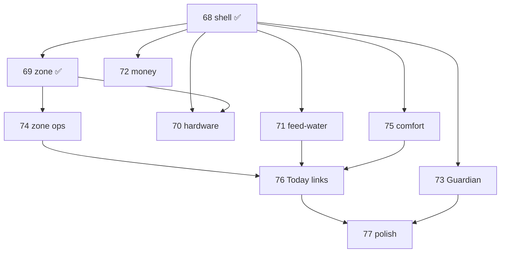

# Phases 68–77 — SPA workspace refactor arc

## Status

**Arc complete through Phase 81 (UI polish).** Phases **68–69, 70–71, 74–81 shipped**; **72–73** remain planned (money unification, Guardian PR discoverability).

Operator feedback (2026-06): *sidebar too deep, pages overlap, zone detail requires too much jumping.*

> **Numbering:** Continues at 68+ after 66/67 capstone shipped. See [retired capstone note](phase_53_59_roadmap.plan.md#-capstone-ordering-rule-retired).

---

## The one job

> **See a whole job on one screen — zone, Pi, feed, money, comfort — with a sidebar that fits without scrolling.**

---

## Arc structure

| Act | Phases | Focus |
|-----|--------|-------|
| **A — Shell & workspaces** | 68–73 | Workspace SPAs + backend for Pi & Guardian |
| **B — Zone & ops** | 74 | Tasks, Alerts, Plants in zone |
| **C — Comfort & triage** | 75–76 | Automation domain + Today/mobile links |
| **D — Polish** | 77 | Analytics, Guardian nav, help, farm config |

---

## Target sidebar (after Phase 77)

| Group | Items |
|-------|-------|
| **Today** | Today |
| **Grow & operate** | Zones · Feed & water · Comfort & automation · Hardware · Money |
| **More** | Animals* · Aquaponics* · Help · Settings |

\*Module-gated. Guide/Knowledge/Catalog/Analytics/Guardian absorbed or demoted per Phase 77.

**Retired from sidebar (redirect only):** Tasks, Alerts, Plants, Feeding, Fertigation, Operations/*, Sensors, Controls, Lighting, Schedules, Automations, Setpoints, Costs, Inventory, Pi-setup, …

---

## Workspace map (final)

| Workspace | Route | Absorbs | Phase |
|-----------|-------|---------|-------|
| **Zones** | `/zones`, `/zones/:id` | Rooms, Fleet, Strains; zone ops & plants tabs; inline hardware | 69, 74 |
| **Comfort & automation** | `/comfort-targets` | Comfort bands, schedules, automations, raw setpoints | 75 |
| **Feed & Water** | `/feed-water` | Daily, programs, nutrients, advanced fertigation | 71 |
| **Hardware** | `/hardware` | GPIO board, Pi devices, wiring guide | 70 |
| **Money** | `/money` | Summary, ledger, supplies (+ optional Grows analytics) | 72, 77 |
| **Today** | `/` | Farm-wide triage only — not a workspace shell | 74, 76 |
| **Help** *(optional)* | `/operator-guide` | Guide, Knowledge, Catalog tabs | 77 |

---

## Phase map

| Phase | One job | Backend? | Plan |
|-------|---------|----------|------|
| **68** ✅ | Workspace shell, redirects, wiggle | No | [phase_68](phase_68_workspace_shell_spa_nav.plan.md) |
| **69** ✅ | Zone inline sensors/controls/lighting; Fleet | No | [phase_69](phase_69_zone_workspace_hub.plan.md) |
| **70** | Live GPIO board + export gaps | **Yes** | [phase_70 ✅](phase_70_hardware_pi_control_spa.plan.md) · [`phase-70-closure.md`](phase-70-closure.md) |
| **71** | Feed & Water SPA | No | [phase_71 ✅](phase_71_feed_water_unification.plan.md) · [`phase-71-closure.md`](phase-71-closure.md) |
| **72** | Money SPA | No | [phase_72](phase_72_money_unification.plan.md) |
| **73** | Guardian PR discoverability + read tools | **Yes** | [phase_73](phase_73_guardian_pr_discoverability.plan.md) |
| **74** | Zone ops inbox (Tasks, Alerts, Plants) | No | [phase_74](phase_74_zone_ops_inbox.plan.md) |
| **75** | Automation & comfort workspace | No | [phase_75](phase_75_automation_comfort_workspace.plan.md) |
| **76** | Today dashboard + mobile nav alignment | No | [phase_76](phase_76_today_dashboard_nav_alignment.plan.md) |
| **77** | Analytics, Guardian nav, help, farm config | No* | [phase_77](phase_77_post_arc_ui_polish.plan.md) |

\*Reuses Phase 73 site-coords nudges; no new API required.

---

## Recommended ship order

1. **68–69** ✅ — shell + zone hub (shipped).
2. **70–73** — can parallelize after 68; 70 benefits from 69; 73 independent.
3. **71–72** — parallel UI workspace fills.
4. **74** — after 69; zone ops absorption.
5. **75** — comfort/automation; can parallel 74 if redirects coordinated.
6. **76** — **after 71–75 redirects exist** — dashboard/mobile sweep.
7. **77** — arc capstone polish; verify ~8-item sidebar.

**Boundary:** No route paths deleted. Backend only in 70 and 73.

---

## Plan lifecycle rules

(Same as before — shipped = conditions deprecated; OC lives in arc table + each plan DoD; do not extend Phase 35 closure doc.)

---

## Operational closure (OC rows)

| OC | Phase | Status |
|----|-------|--------|
| OC-68 | 68 workspace shell | ✅ Shipped |
| OC-69 | 69 zone workspace | ✅ Shipped |
| OC-70 | 70 hardware Pi SPA | ✅ Shipped (`phase-70-closure.md`) |
| OC-71 | 71 feed & water | ✅ Shipped (`phase-71-closure.md`) |
| OC-72 | 72 money | Planned |
| OC-73 | 73 guardian PRs | Planned |
| OC-74 | 74 zone ops inbox | ✅ Shipped |
| OC-75 | 75 comfort workspace | ✅ Shipped |
| OC-76 | 76 Today/mobile alignment | ✅ Shipped |
| OC-77 | 77 post-arc polish | ✅ Shipped |
| OC-78 | 78 zone hardware + GPIO alerts | ✅ Shipped (`phase-78-closure.test.js`) |
| OC-79 | 79 tasks/inventory/glossary | ✅ Shipped (`phase-79-closure.test.js`) |
| OC-80 | 80 routing + zones tab labels | ✅ Shipped (`phase-80-closure.test.js`) |
| OC-81 | 81 pi-setup + zone hardware scope | ✅ Shipped (`phase-81-closure.test.js`) |

---

## Related

| Doc | Use |
|-----|-----|
| [phase_74_zone_ops_inbox.plan.md](phase_74_zone_ops_inbox.plan.md) | Zone ops |
| [phase_75_automation_comfort_workspace.plan.md](phase_75_automation_comfort_workspace.plan.md) | Comfort/automation |
| [phase_76_today_dashboard_nav_alignment.plan.md](phase_76_today_dashboard_nav_alignment.plan.md) | Dashboard sweep |
| [phase_77_post_arc_ui_polish.plan.md](phase_77_post_arc_ui_polish.plan.md) | Final polish |

---

## Using this in a new chat

> Read `docs/plans/phase_68_73_spa_workspace_roadmap.plan.md` (covers **68–77**). Implement from the specific phase plan. Never delete routes — redirect. **UI shipped:** 68–69, 70–71, 74–77. **Planned:** 72–73 (money, Guardian PR badge).
