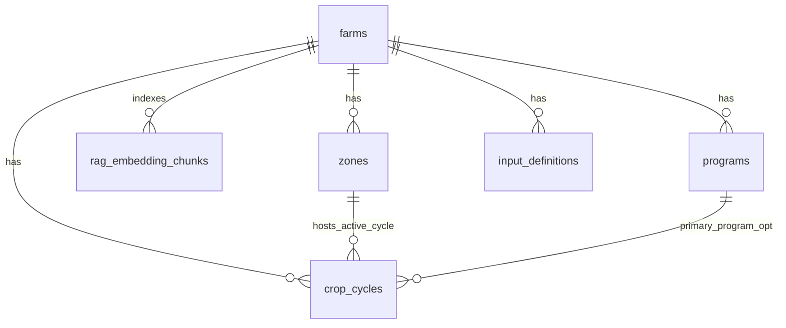

# Schema ERD (text-native)

Human-readable overview of **logical PostgreSQL schemas** and **foreign-key spine** as defined in **`db/schema/gr33n-schema-v2-FINAL.sql`**. If this file disagrees with SQL, **trust the SQL** — refresh this diagram when the baseline or **`db/migrations/`** change meaningfully.

| Field | Value |
|-------|--------|
| **Baseline** | `db/schema/gr33n-schema-v2-FINAL.sql` |
| **Generated** | 2026-04-21 |
| **Extensions (baseline header)** | `postgis`, `timescaledb`, `vector` (enable per env; see INSTALL) |

---

## 1. Schema namespaces (packages)

```
  auth              Supabase-compatible user ids (local bootstrap in baseline)
  gr33ncore         Farms, zones, devices, tasks, automation, costs, RAG chunks, …
  gr33nnaturalfarming   Input definitions, batches, recipes, recipe components
  gr33nfertigation      Reservoirs, EC targets, crop cycles, programs, mixing, fertigation runs
  gr33ncrops        Plants catalog (farm-scoped)
  gr33nanimals      Animal groups, lifecycle events
  gr33naquaponics   Aquaponics loops
```

---

## 2. Tenancy spine (everything hangs off `farms`)

ASCII “pipes” view — **`gr33ncore.farms`** is the isolation anchor for dashboard / RAG.

```
                         ┌─────────────────┐
                         │   auth.users    │
                         └────────┬────────┘
                                  │
                         ┌────────▼────────┐
                         │ gr33ncore.      │
                         │ profiles        │
                         └────────┬────────┘
                                  │
         ┌────────────────────────┼────────────────────────┐
         │                        │                        │
 ┌───────▼────────┐    ┌──────────▼──────────┐   ┌────────▼─────────┐
 │ organizations  │    │ farm_memberships    │   │ farm_active_    │
 │ + org_members  │    │ (farm ↔ profile)    │   │ modules         │
 └────────────────┘    └─────────────────────┘   └──────────────────┘
                                  │
                         ┌────────▼────────┐
                         │ gr33ncore.farms │
                         └────────┬────────┘
                                  │
       ┌──────────────────────────┼──────────────────────────┐
       │                          │                          │
┌──────▼──────┐           ┌────────▼────────┐        ┌────────▼──────────────┐
│ zones       │           │ devices         │        │ rag_embedding_chunks   │
│ (tree via   │           │ sensors         │        │ (farm_id; vectors)     │
│ parent_zone)│           │ actuators       │        └────────────────────────┘
└─────────────┘           └─────────────────┘
```

**RAG:** `gr33ncore.rag_embedding_chunks.farm_id` → `farms`. Rows do **not** FK to source tables — `source_type` + `source_id` are application-defined labels.

---

## 3. Ops & automation (core)

```
                         farms
                           │
           ┌───────────────┼───────────────┐
           │               │               │
      schedules       tasks           automation_rules
           │               │               │
           │        task_labor_log        executable_actions
           │               │               │
           └───────┬───────┴───────┬───────┘
                   │               │
              automation_runs ◄────┘ (rules, schedules, actuators)
```

---

## 4. Notifications, files, costs

```
  farms ─┬─ alerts_notifications ─── notification_templates
         ├─ file_attachments
         ├─ cost_transactions ───┬─ cost_transaction_idempotency
         │                        ├─ farm_energy_prices
         │                        └─ farm_finance_account_mappings (…)
         ├─ weather_data
         └─ user_activity_log / validation_rules / system_logs …
```

(`cost_transactions` may reference `crop_cycles` — see fertigation section.)

---

## 5. Natural farming inputs → tasks

```
                    farms
                      │
          ┌───────────┴───────────┐
          │                         │
 input_definitions            input_batches
          │                         │
          └────────┬────────────────┘
                   │
        application_recipes ─── recipe_input_components
                   │
              tasks ◄──── task_input_consumptions ───► input_batches
```

---

## 6. Fertigation subgraph

```
                              farms
                                │
       ┌────────────────────────┼────────────────────────┐
       │                        │                        │
 reservoirs              crop_cycles ───────────────► zones (required FK)
       │                        ▲
 ec_targets                     │ primary_program_id (optional)
       │                        │
 programs ──────────────────────┘
       │
 mixing_events ── mixing_event_components ──► input_definitions / input_batches
       │
 fertigation_events (zones, actuators, schedules, rules, crop_cycles…)

 zone_setpoints (gr33ncore) ──► crop_cycles | zones   (either scope; same farm)
```

---

## 7. Optional domain modules (thin edges)

```
  farms ──► gr33ncrops.plants
  farms ──► gr33nanimals.animal_groups ──► animal_lifecycle_events
  farms ──► gr33naquaponics.loops
```

---

## 8. Mermaid (same spine — renders on GitHub)

Optional render of the **farm hub** + **RAG**. Entity names shortened for readability.



---

## 9. Maintenance

When you add migrations:

1. Confirm FKs in **`db/migrations/*.sql`** — append new edges to the relevant ASCII section above.
2. Bump the **Generated** date and note the **latest migration filename** you considered (or say “baseline only”).
3. Prefer regenerating **Mermaid** only when the conceptual graph changes — not for every column tweak.

Related: [database-schema-overview.md](database-schema-overview.md), [rag-scope-and-threat-model.md](rag-scope-and-threat-model.md).
