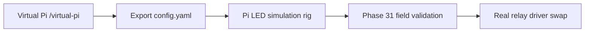

# Virtual Pi → field validation path

**Audience:** Operators standing up edge hardware before live plants.

This doc orders the **already-shipped** pieces into one path. Implementation polish (UI banners, smokes) is [Phase 142](plans/archive/phase_142_virtual_pi_field_validation.plan.md).

---

## Arc overview

| Step | Doc / surface | Exit |
|------|---------------|------|
| 1 | [Phase 120–121 plans](plans/archive/phase_120_virtual_pi_interactive_wiring.plan.md) — `/virtual-pi` | Wiring saved in DB; config export downloads |
| 2 | [Phase 123 push-config](plans/archive/phase_123_virtual_pi_push_config.plan.md) | `config_version` bumped; Pi refetches on LAN |
| 3 | [Phase 125 simulation rig](../pi_client/README-simulation-rig.md) | Demo A moisture loop: pixel + alert + pump blink |
| 4 | [Phase 31 field validation](plans/archive/phase_31_field_validation_and_edge.plan.md) | Live sensor on dashboard; safe actuator story |
| 5 | Swap `simulation:` for relay driver in `config.yaml` | Same platform APIs; no server changes |

---

## Step 1 — Virtual Pi wiring

1. Open **Virtual Pi** (`/virtual-pi`) for `demo-veg-relay-01` (or your device).
2. Assign channels to veg-room pump, light, and soil moisture sensor per [pi-integration-guide.md](pi-integration-guide.md).
3. **Download config.yaml** — this is the same file `pi_client` uses on the bench.

---

## Step 2 — Dry run on the LED rig (no plants)

Follow [pi-light-simulation-runbook.md](pi-light-simulation-runbook.md) **Demo A**:

- Copy [config.simulation.example.yaml](../pi_client/config.simulation.example.yaml) → `config.yaml`
- Merge exported wiring / sensor IDs from step 1
- Run `python3 gr33n_client.py` — watch NeoPixels track comfort bands

**Why:** Abuse automation rules safely before anything alive is on the line ([Phase 125](plans/archive/phase_125_pi_sensor_actuator_light_simulation.plan.md)).

---

## Step 3 — Promote to real hardware

When Demo A passes in UI + on the strip:

1. Remove or disable `simulation:` block in `config.yaml`
2. Enable real GPIO/relay driver (see [README-simulation-rig.md](../pi_client/README-simulation-rig.md) § swap)
3. Run Phase 31 **one-relay safe test** from [pi-integration-guide.md](pi-integration-guide.md)

---

## Guardian (optional)

After field path works, run Guardian smoke + feedback review — see [guardian-feedback-review-runbook.md](guardian-feedback-review-runbook.md). Field validation does not require Ollama.

---

## Related

- [local-operator-bootstrap.md](local-operator-bootstrap.md) § Edge loop in 5 commands
- [connectivity-requirements.md](connectivity-requirements.md) — LAN-only Virtual Pi + Pi client
