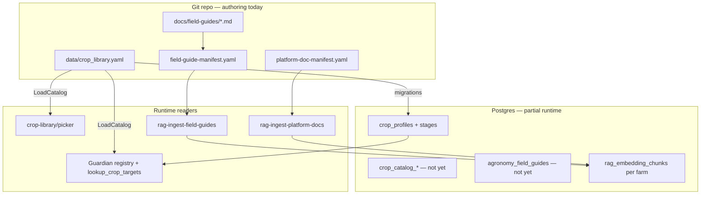
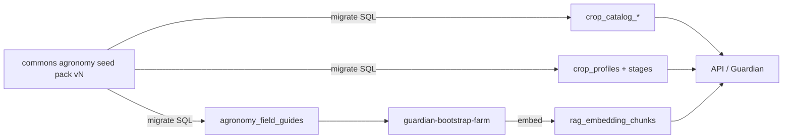

# Sit-in: crop catalog & field guides → enterprise DB

**Status:** WS-B + WS-D shipped (schema, seed, DB catalog loader, Guardian registry via `CROP_CATALOG_SOURCE=db`)  
**Sit-in rule:** Name and lock decisions here **before** migrations or runtime cutover. Calendar phases 82/83 continue; this stream owns **operator-trust plant data** — where EC lives, what unsupported means, how integrators seed production.

**Parent streams:** [sit-in-operator-experience.md](sit-in-operator-experience.md) · [Phase 82](../plans/phase_82_guardian_crop_grounding_hardening.plan.md) · [Phase 83](../plans/phase_83_enterprise_agronomy_seed_pack.plan.md)

**One job:**

> Plant intelligence is **platform data in Postgres**, not repo files at runtime. YAML and markdown remain **authoring/import inputs** until WS-G; after cutover, commons seed packs and APIs are the only production path.

---

## 0. Executive summary

| Question | Answer |
|----------|--------|
| Do unsupported crops have EC targets? | **No — ever.** Honest block + reason only; `cousin_of` is a clone hint, not hidden targets. |
| Where should supported EC/pH/VPD live? | Already correct: `gr33ncrops.crop_profiles` + `crop_profile_stages` (seed via migrations). |
| What's wrong today? | **Dual source:** YAML/MD at runtime for catalog metadata, aliases, unsupported, and guide **text**; DB only for stages + embeddings. |
| Enterprise target? | Three platform tables + existing profile/stage tables; field guides canonical in DB; embeddings derived per farm. |
| Gate for Phase 83 seed pack? | WS-B shipped; runtime reads DB (`catalog_version` contract), not file paths. |

---

## 1. Unsupported registry — EC audit

### 1.1 Rule (non-negotiable)

Unsupported entries must **never** produce EC, pH, VPD, DLI, or photoperiod in:

- `lookup_crop_targets` read-tool output
- Guardian free text (Phase 82 WS1 zero-chunk / grounding guardrails)
- RAG field guides (narrative may explain *why* gr33n doesn't automate — not substitute numbers)

If the model outputs feed targets for ramps or carrot, that is a **grounding failure**, not a missing profile.

**`cousin_of`:** UI/Guardian may suggest *"clone lettuce in Plants and adjust"* — the unsupported key still has **no** structured targets.

### 1.2 Registry matrix (`data/crop_library.yaml` v4 — import source until WS-B)

| `crop_key` | Display name | Aliases | `cousin_of` | EC / stages | Guardian |
|------------|--------------|---------|-------------|-------------|----------|
| `ramps` | Ramps (wild leek) | `wild_leek`, `allium_tricoccum` | — | **None** | Honest block; RAG: `crop-unsupported-woodland` |
| `mushroom` | Mushroom / fungi | `fungi`, `shiitake` | — | **None** | Honest block; husbandry domain |
| `in_ground_root` | In-ground root crops | `carrot`, `potato`, `sweet_potato` | `lettuce` | **None** | Honest block; cousin hint only |
| `ginseng` | Ginseng (woodland medicinal) | `panax` | — | **None** | Honest block; woodland RAG |

**Global aliases (top-level `aliases:`):** `wild_leek→ramps`, `shiitake|fungi→mushroom`, `carrot|potato|sweet_potato→in_ground_root`, `panax→ginseng`.

**Historical note:** Fruit trees (`apple`, `grape`, …) were unsupported in early Phase 82 plans; they are now **supported** nursery profiles with real stage rows — do not treat as unsupported in new DB seed.

### 1.3 Worked example — supported vs unsupported (sit-in script)

Facilitator: *"What EC for zucchini?"* vs *"What EC for ramps?"*

| Crop | Picker | Structured targets | Field narrative | Pass |
|------|--------|-------------------|-----------------|------|
| **Zucchini** | Yes | `crop_profiles` + stages | `crop-zucchini-nutrition` | mS/cm **from tool**, not "~2–3%" |
| **Ramps** | No | No rows | `crop-unsupported-woodland` | **No numeric targets** |

**Zucchini (`early_veg`):** EC 1.80–2.60 mS/cm (target **2.20**); pH 5.5–6.0; VPD 0.80–1.10 kPa; DLI 30; photoperiod 16 h; substrate coco/rockwool · pulse_dryback · runoff 10–20%.

**Ramps:** EC/pH/VPD/DLI/photoperiod **forbidden**; message = woodland ephemeral, not bench fertigation.

### 1.4 Unknown mentions (not in catalog)

Separate from unsupported registry:

| Case | Example | Behaviour |
|------|---------|-----------|
| Typo / novel crop | `kohlrabi` | No profile; no unsupported row → *"No built-in profile — clone nearest cousin or create custom in Plants"* |
| Alias collision | Two crops, same substring | Registry longest-match + boundary rules (existing `Registry`) |
| Supported key, no DB migrate yet | New crop in catalog, migration not applied | Picker shows catalog-only (`has_targets=false`); Guardian must not invent EC |

Document new unsupported keys via **catalog import**, not ad-hoc YAML on one server.

---

## 2. Current architecture (dual source)

| Data | Authoritative today | Runtime path | Enterprise gap |
|------|---------------------|--------------|----------------|
| Stage EC/pH/VPD/DLI | DB (after migrate) | `GetCropProfileByKey` | OK; YAML duplicates |
| Substrate, watering, moisture | YAML only | Picker; WS8 not wired | Not in `crop_profiles.meta` |
| Aliases | YAML only | `croplibrary.Registry` | No API; no audit |
| Unsupported registry | YAML only | Registry + honest block | Not in DB |
| Field guide **body** | Markdown | Ingest only | Not queryable; 56 files + manifest |
| Platform operator docs | Markdown | Separate ingest | Same smell — see §9.1 |
| Embeddings | DB | kNN at chat | **Keep** — derived layer |

---

## 3. Target enterprise schema

**Schema namespace:** `gr33ncrops` (agronomy domain, same as profiles).

### 3.1 `crop_catalog_entries`

One row per plant key — replaces YAML `crops[]` + `unsupported[]`.

| Column | Supported | Unsupported |
|--------|-----------|-------------|
| `crop_key` PK | `zucchini` | `ramps` |
| `supported` | `true` | `false` |
| `display_name`, `category`, `source` | required | required |
| `substrate`, `watering_style`, `runoff_pct_target`, `moisture_guidance` | optional | null |
| `cousin_of` | optional FK → `crop_key` | optional suggestion |
| `unsupported_reason` | null | required |
| `catalog_version` | pack int | same |
| `meta` JSONB | extensions | extensions |
| `created_at`, `updated_at` | | |

**Join rule:** `supported=true` ⟹ builtin `crop_profiles` row (`farm_id IS NULL`, `is_builtin=true`) **should exist** after migrate. Catalog row = metadata; stages stay in `crop_profile_stages` — **do not duplicate EC in catalog**.

**Integrity checks (CI / smoke):**

- Every supported catalog key has builtin profile + ≥1 stage
- Every `cousin_of` points at supported key
- No unsupported key has stage rows
- `catalog_version` monotonic on platform bump

### 3.2 `crop_catalog_aliases`

| Column | Notes |
|--------|-------|
| `alias` PK | lowercase normalized |
| `crop_key` FK | → `crop_catalog_entries` |

Replaces YAML global `aliases:` + per-crop alias arrays. **One alias → one key**; conflicts fail validation at import.

### 3.3 `agronomy_field_guides`

Canonical narrative text (replaces MD + manifest as source of truth).

| Column | Example |
|--------|---------|
| `id` BIGSERIAL | stable embedding `source_id` after cutover |
| `slug` UNIQUE | `crop-zucchini-nutrition` |
| `title` | Zucchini nutrition (summer squash) |
| `crop_key` nullable FK | `zucchini`; null for trades |
| `guide_kind` enum | `crop_nutrition`, `crop_care`, `trades`, `cross_cutting`, `unsupported` |
| `domain`, `safety_tier` | from frontmatter |
| `body_md` TEXT | markdown body (no frontmatter) |
| `catalog_version` | pack version |
| `published` BOOL | soft hide without delete |
| `sort_order` | manifest ordering |

**Ingest path:** `body_md` → chunk → `gr33ncore.rag_embedding_chunks` (`source_type=field_guide`, `source_id=agronomy_field_guides.id`).

**Breaking change to plan:** Today `source_id` = FNV hash of path; cutover needs **re-ingest all farms** or migration mapping old hash → new id.

### 3.4 Optional v1.1 — `agronomy_catalog_revisions`

Audit trail for pack imports (enterprise compliance):

| Column | Purpose |
|--------|---------|
| `catalog_version`, `imported_at`, `imported_by_user_id` | who applied pack |
| `commons_import_id` | link to existing catalog import row |
| `summary_json` | row counts, diff stats |

### 3.5 Platform vs farm scope

| Artifact | Scope |
|----------|--------|
| `crop_catalog_*`, `agronomy_field_guides` | **Platform** (no `farm_id`) |
| `crop_profiles` builtin | Platform |
| `crop_profiles` override | Per farm (Phase 83 WS2/WS6) |
| `rag_embedding_chunks` | Per farm (bootstrap copies/embeds platform guides) |

---

## 4. Target runtime (after WS-G)

| Reader | After cutover |
|--------|---------------|
| `croplibrary.Registry` | SQL: entries + aliases (cache TTL or startup load) |
| `GET …/crop-library/picker` | Catalog + farm profiles from DB |
| `lookup_crop_targets` | Unchanged: `crop_profiles` / stages |
| `IngestFieldGuides` | Read `agronomy_field_guides WHERE published` |
| `make check-crop-library` | Becomes **DB parity check** OR import validator |

**Env:** `CROP_CATALOG_SOURCE=db|yaml` during WS-D; production default `db`.

---

## 5. API surface (enterprise)

### 5.1 Read (operators + Guardian)

| Method | Path | Purpose |
|--------|------|---------|
| `GET` | `/commons/crop-catalog` | List entries + alias index (metadata) |
| `GET` | `/commons/crop-catalog/{crop_key}` | One entry; link builtin `crop_profile_id` if supported |
| `GET` | `/commons/agronomy-field-guides` | List guides (slug, title, crop_key, kind) |
| `GET` | `/commons/agronomy-field-guides/{slug}` | Full body (admin / export) |

### 5.2 Write (platform admin / import only — not farm members)

| Method | Path | Purpose |
|--------|------|---------|
| `POST` | `/commons/catalog-imports` | Existing pattern — apply agronomy seed pack |
| `POST` | `/farms/{id}/agronomy-overrides/import` | Phase 83 WS2 farm EC deltas |
| `PATCH` | `/farms/{id}/crop-profiles/{id}` | Farm custom profile (exists) |

**Auth:** commons routes = platform admin or signed import script; farm overrides = farm admin. Log to `user_activity_log` (see [audit-events-operator-playbook.md](../audit-events-operator-playbook.md)).

---

## 6. Migration workstreams (ordered)

| WS | Deliverable | Depends on |
|----|-------------|------------|
| **A** | This doc + unsupported matrix signed off | — |
| **B** | Migration: 3 tables + seed from YAML + 56 MD bodies | A |
| **C** | `scripts/generate-crop-catalog-seed.sql.sh` (YAML/MD → SQL) | B pattern |
| **D** | `LoadCatalogFromDB` + `CROP_CATALOG_SOURCE` flag | B |
| **E** | Ingest field guides from DB; deprecate filesystem manifest | B |
| **F** | Phase 83 pack body uses `catalog_version` + row-count smokes | B–E |
| **G** | Remove runtime YAML/MD dependency; CI parity tests | D–E |
| **H** | Re-ingest all farms; document `source_id` migration | E |
| **I** | Populate `crop_profiles.meta` from catalog (substrate, watering) | B |
| **J** | OpenAPI + route parity for `/commons/crop-catalog*` | D |
| **K** | `check-crop-catalog-parity` Make target (catalog ↔ profiles ↔ guides) | G |

---

## 7. Field guide inventory (v1 — 56 manifest rows)

Source: [`docs/rag/field-guide-manifest.yaml`](../rag/field-guide-manifest.yaml).

| Bucket | Count | `guide_kind` |
|--------|-------|--------------|
| Trades / install | 6 | `trades` |
| Per-crop guides | 46 | `crop_nutrition` / `crop_care` |
| Unsupported narrative | 3 | `unsupported` |
| **Total** | **56** | |

**Example row:**

| slug | crop_key | kind | body source |
|------|----------|------|-------------|
| `crop-zucchini-nutrition` | `zucchini` | `crop_nutrition` | [crop-zucchini-nutrition.md](../field-guides/crop-zucchini-nutrition.md) |

**Not yet authored (Phase 82 WS4d — add to DB in same pack, not separate MD forever):**

| slug (planned) | kind | Purpose |
|----------------|------|---------|
| `crop-deficiency-patterns` | `cross_cutting` | Symptom hypotheses by category (WS9) |
| `crop-watering-substrates` | `cross_cutting` | Ties to `watering_style` (WS8) |
| `crop-stage-transitions` | `cross_cutting` | Flip, flush, harvest narrative |

---

## 8. Sit-in validation checklist

Run on dev stack **before WS-B** (YAML era) and **again after WS-G** (DB era). Log: [sit-in-45-session-log-template.md](sit-in-45-session-log-template.md) header **Crop catalog DB**.

| # | Prompt / action | Pass |
|---|-----------------|------|
| 1 | *"What EC for ramps?"* | No mS/cm; unsupported reason |
| 2 | *"What EC for carrot?"* | `in_ground_root`; no EC; optional lettuce cousin |
| 3 | *"What EC for zucchini?"* | mS/cm from tool / builtin profile |
| 4 | *"Compare cucumber vs tomato feed"* | Multi-crop mS/cm |
| 5 | Picker search `aubergine` | Finds eggplant |
| 6 | Picker search `ramps` | Not listed |
| 7 | *"How wet should tomato be?"* | Substrate/watering from catalog meta (after WS-I) — not fake EC% |
| 8 | After field-guide ingest, zucchini wilt question | RAG citation; EC still from tool |
| 9 | Farm override on cannabis EC | Override wins over builtin (Phase 83 WS2) |
| 10 | `make check-crop-catalog-parity` (after WS-K) | Exit 0 |

---

## 9. Later encounters (plan for these now)

Problems we will hit if we only move catalog + guides without addressing adjacent surfaces.

### 9.1 Platform docs (`platform_doc` RAG)

[`docs/rag/platform-doc-manifest.yaml`](../rag/platform-doc-manifest.yaml) has the **same filesystem smell** as field guides. Defer separate table **or** unify:

| Option | Table | Notes |
|--------|-------|-------|
| A | `gr33ncore.platform_doc_pages` | Parallel to `agronomy_field_guides` |
| B | Same table, `guide_kind=platform_doc` | Single ingest pipeline |

Enterprise air-gapped deploys must not require mounting full `docs/` tree on API pods.

### 9.2 Phase 82 workstreams still YAML-shaped

| WS | Needs catalog DB column / guide row |
|----|-------------------------------------|
| **WS8** substrate watering | `substrate`, `watering_style`, `moisture_guidance`, `runoff_pct_target` on catalog entry; read tool quotes catalog |
| **WS9** deficiency | `crop-deficiency-patterns` guide row + symptom intent |
| **WS7** plant context bundle | Registry + profiles from DB; bundle caps unchanged |
| **WS11** target vs actual | Live sensors vs `crop_profile_stages` — no YAML |
| **WS1** zero-chunk guardrail | Smokes: unsupported + 0 chunks → no fake `[n]` citations |

### 9.3 Farm overrides vs builtin (Phase 83 WS2/WS6)

| Scenario | Expected resolution |
|----------|---------------------|
| Farm override for `cannabis` / `late_flower` | `GetCropProfileByKey` returns farm row |
| Override for unsupported key | **Reject** at import — cannot override EC for ramps |
| Override display_name only | Allowed; catalog metadata unchanged |
| Delete override | Fall back to builtin stages |

**Verify:** SQL `ORDER BY` farm-over-builtin — document in override pack spec.

### 9.4 Catalog version bumps & pack upgrades

| Event | Action |
|-------|--------|
| New crop added | Bump `catalog_version`; migration adds catalog + profile + guide rows |
| EC science fix on builtin | New migration OR pack vN+1; consider farm override drift report |
| Guide text fix | Update `agronomy_field_guides.body_md`; **re-ingest affected farms** |
| Alias added | Insert alias row; no re-embed unless guide changes |
| Unsupported added | Catalog + guide rows; **no** profile stages |

**Integrator command:** `guardian-bootstrap-farm.sh --verify-catalog-version N`.

### 9.5 Embedding & RAG lifecycle

| Issue | Mitigation |
|-------|------------|
| `source_id` path hash → guide `id` | One-time re-ingest; bootstrap script default |
| Stale chunks after guide edit | Delete-by-`(farm_id, source_type, source_id)` then upsert (existing behaviour) |
| New farm, no ingest | Readiness smoke fails — Phase 83 WS7 |
| No `EMBEDDING_API_KEY` | Structured tools still work; RAG narrative thin — document in bootstrap |
| Cross-farm leakage | Unchanged — all chunks carry `farm_id` ([rag-scope](../rag-scope-and-threat-model.md)) |

### 9.6 Custom / farm-only crops (not in platform catalog)

| Case | Handling |
|------|----------|
| Operator creates custom profile | `crop_profiles.farm_id` set; appears in picker under "My farm profiles" |
| Guardian mention of custom name | Resolve via plant/cycle assignment, not global alias table |
| Promote custom → platform | Out of scope v1 — manual agronomy review + new catalog row |

### 9.7 Ops, CI, and deployment

| Concern | Plan |
|---------|------|
| API container without repo checkout | `CROP_CATALOG_SOURCE=db` required |
| Drift YAML vs DB | WS-K parity check in CI |
| `sqlc` queries | `db/queries/crop_catalog.sql`, `agronomy_field_guides.sql` |
| Audit | Log commons import + override import to audit events |
| Rollback | Pack vN-1 migration **forward-only**; keep revision table |
| Licensing / commons | Seed pack `readme_md` + attribution; AGPL platform corpus |

### 9.8 Authoring workflow (who edits plant science?)

| Phase | Authoring | Production |
|-------|-----------|------------|
| Now | Edit YAML/MD in git | Migrations + ingest |
| Transition | Generator → SQL | Same |
| Steady state | Agronomist UI **or** signed YAML import pack | DB + audit + version bump |

Do not expose raw SQL to operators; mirror recipe pack promotion (Phase 31).

### 9.9 UI surfaces that consume catalog

| Surface | DB dependency after cutover |
|---------|----------------------------|
| Crop library picker | `crop_catalog_entries` + profiles |
| Start grow wizard | same |
| Plants assign profile | profiles; search terms from aliases table |
| Crop profile detail | stages + catalog meta |
| Settings override UI (Phase 83 WS6) | builtin vs farm diff |
| Guardian chat | registry + tools + RAG |

### 9.10 Testing strategy

| Layer | Tests |
|-------|-------|
| Seed SQL | Idempotent second migrate |
| Catalog load | Registry resolves all global aliases |
| Unsupported | No stage rows; honest block tests |
| Ingest | Dry-run chunk count ≥ minimum (Phase 83) |
| Parity | 46 supported keys = 46 builtin profiles = 46 crop guides (± trades) |
| Smoke | `smoke_phase83` readiness prompts |

---

## 10. Decisions locked

1. **Unsupported never gets EC rows** — catalog, stages, or RAG numbers.
2. **Supported targets stay in `crop_profile_stages`** — single numeric source of truth.
3. **Field guide canonical text in `agronomy_field_guides`** — embeddings derived per farm.
4. **Platform catalog is not farm-scoped** — farm tweaks only via override profiles.
5. **Phase 83 seed pack blocked until WS-B** — `catalog_version` in DB, not file paths in pack JSON.
6. **Re-ingest required** on guide body changes and on `source_id` cutover (WS-H).
7. **Platform docs** get same DB treatment in a follow-on sit-in or unified table (§9.1).

---

## 11. Open questions

| # | Question | Default if unset |
|---|----------|------------------|
| 1 | Unified doc table vs separate platform docs table? | Separate v1, unify v2 |
| 2 | Platform admin UI for catalog edits in v1? | Import pack only; UI Phase 84+ |
| 3 | Keep YAML in repo as export after WS-G? | Yes — generator output for review |
| 4 | Minimum field_guide chunk count in readiness smoke? | Phase 83: min 12 → raise to ~40 after full crop pack |

---

## Changelog

| Date | Note |
|------|------|
| 2026-06-11 | Sit-in opened: unsupported EC audit, zucchini vs ramps example, schema WS A–G |
| 2026-06-11 | Polished: executive summary, 56-guide inventory, WS H–K, §9 later encounters, platform docs, pack upgrades, testing, open questions |
